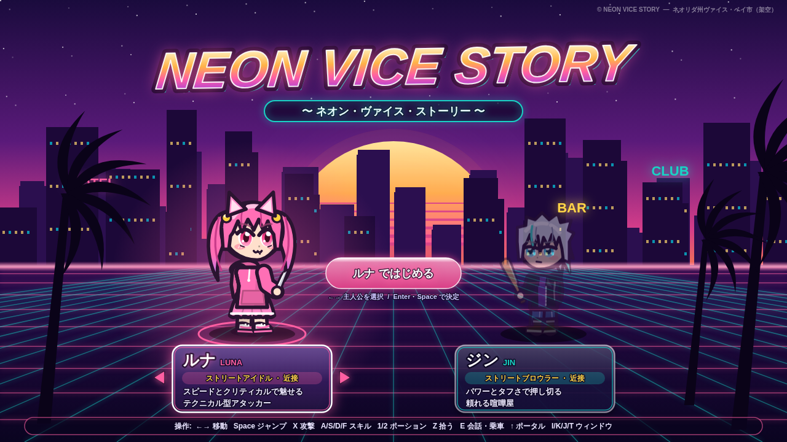
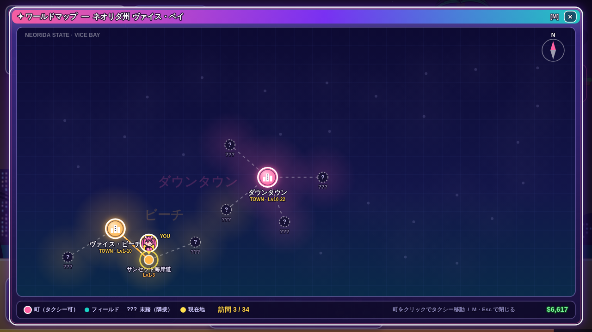
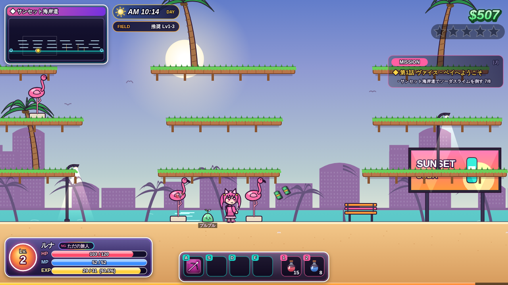
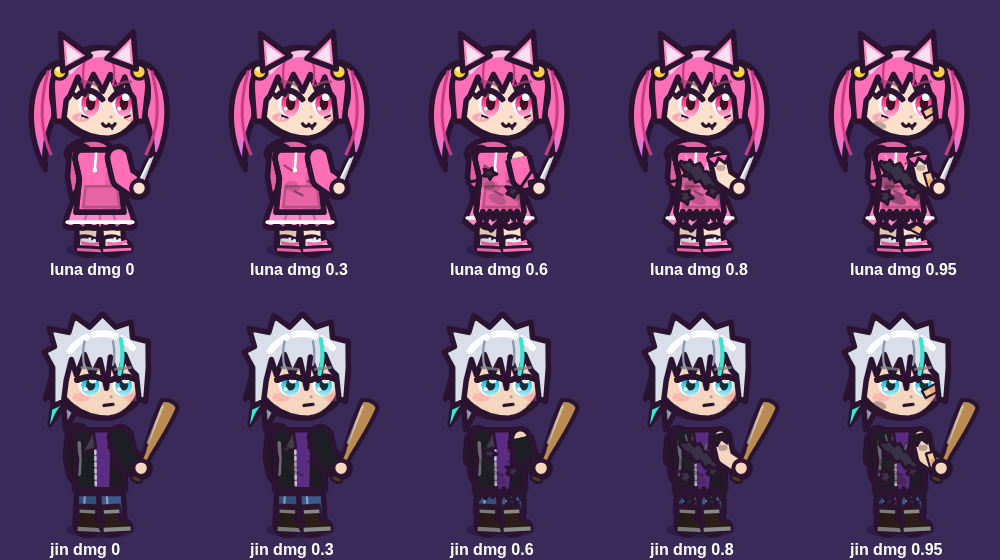
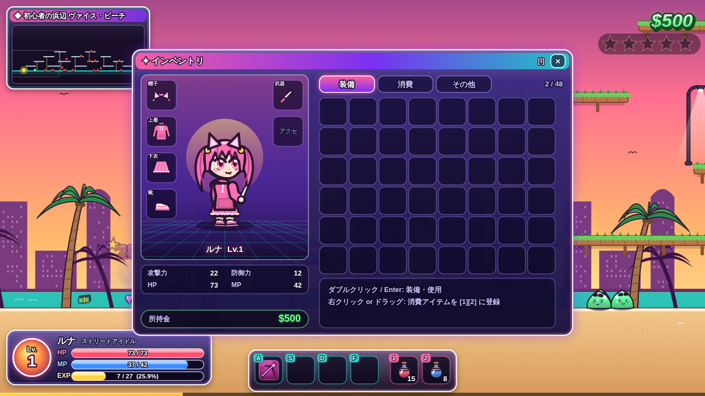
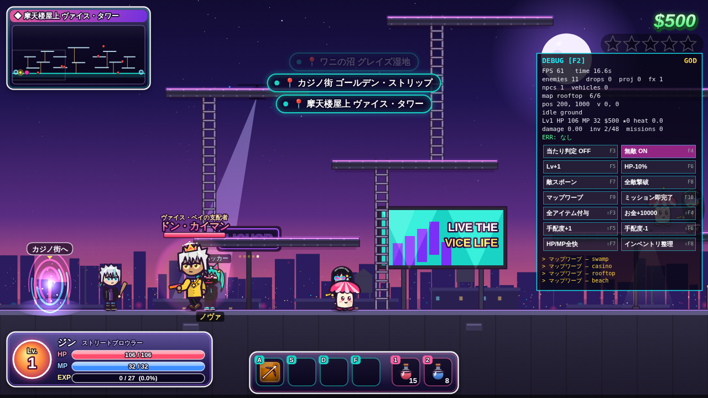

# NEON VICE STORY 🌴🌆

メイプルストーリー風の横スクロールアクションRPG × GTA6風クライムオープンシティ。
架空の「ネオリダ州 ヴァイス・ベイ市」で、2人の主人公 **ルナ**（かわいい＋強気）と **ジン**（クール）がのし上がる。
ブラウザだけで動作（HTML5 Canvas / ES Modules / ビルド不要）。グラフィックは全てコードで描いたオリジナルです（既存ゲームの画像・ロゴ・キャラは使用していません）。



## 遊び方

```bash
npx http-server . -p 8080   # または npm run serve
# → http://localhost:8080 を開く
```

| 操作 | キー |
|---|---|
| 移動 / ロープ | ← → ↑ ↓ |
| ジャンプ（↓+ジャンプで足場から降りる） | Space / Alt / C |
| 攻撃 | X / Ctrl |
| スキル | A S D F |
| ポーション | 1 / 2 |
| 拾う | Z（近くは自動吸引） |
| 会話 | V / E / Enter |
| ポータル | ↑ |
| 装備 / スキル / 任務 / 能力 | I / K / J / T |
| ワールドマップ（タクシー） / 図鑑 / スマホSNS | M / B / P |
| ミュート | N |
| デバッグパネル | F2 または ` |

スマホではタッチボタンが表示されます。進行は自動で localStorage に保存（タイトルの「つづきから」）。

## v2 アップデート
- **町7つ＋フィールド27＝34マップ**。町から分岐して各地域へ。地域ごとに背景と敵が統一。
- **ワールドマップ（M）**: 訪れたマップを全表示、隣接未訪問は「???」。訪問済みの町へタクシー移動。
- **町ルール**: モンスターなし。町でもスキルが使える（攻撃は空振り）。歩いている住民は攻撃の対象外。※警察（手配度）と乗り物は廃止。
- **敵95種**（ボス7体）＋住民5種。序盤は経験値少なめ、先の地域ほど効率UP。
- **PET**（10種・ドロップ率0.03〜0.08%）: 装備すると追従し、アイテム・お金を自動で拾う。
- **こだわり要素**: モンスター図鑑（永続ボーナス）、昼夜サイクル（夜は経験値+10%）、スマホSNS「NeonGram」（フォロワー報酬）、効果音・地域BGM・カーラジオ3局。




## 主な機能
- **ミッション**: メインストーリー15本の連鎖＋サブ7本＋デイリー7本。NPC頭上の「！」で受注、「？」で報告。
- **装備**: 帽子/上着/下/靴/アクセ/武器 の6枠・64種。**装備するとキャラの見た目が変わる**（近接・銃・魔法の武器種で攻撃方法も変化）。
- **スキル**: 各ヒーロー8種（近接/射撃/範囲/ダッシュ/バフ/パッシブ）。SPで強化、スキルバーに登録。
- **レベルアップ**: メイプル風の経験値曲線、SP/AP（STR/DEX/INT/LUK）振り。
- **敵の自動出現**: 6マップ・28種（ボス4体）。（※手配度・警察の出動は後に廃止）
- **レアドロップ**: ノーマル〜ミシックの5段階。光の柱と豪華バナーで演出、LUKで確率アップ。
- **HP低下で服が破れる**: HP 75/50/25/10% を下回るごとに段階的に破損（全年齢向けにインナーは常に残ります）。
- **GTA要素**: ネオンと夕焼けの街（※手配度・車の運転は後に廃止）。





## 開発体制（担当エージェント）
| 担当 | 成果物 |
|---|---|
| ディレクター/統合 | `src/main.js`, `src/core/`, `docs/ARCHITECTURE.md` |
| リサーチ担当 | `docs/REFERENCE.md`（GTA6・メイプルの比較分析、アート指針） |
| アート担当 | `src/render/`（キャラ・敵・車・背景・エフェクト） |
| ゲームシステム担当 | `src/data/`, `src/systems/`, `docs/NPCS.md` |
| ワールド＆エンティティ担当 | `src/world/`, `src/entities/` |
| UI担当 | `src/ui/` |
| サウンド担当 | `src/audio/` |
| **デバッグ担当** | `src/debug/`, `tests/`, `docs/DEBUG.md`、通しのバグ修正 |

## テスト
```bash
npm run test:unit    # データ整合性・ロジック（40項目）
npm run test:smoke   # Playwright で通しプレイ・全ストーリー・全34マップ（122項目）
```
詳細は [docs/DEBUG.md](docs/DEBUG.md)。
