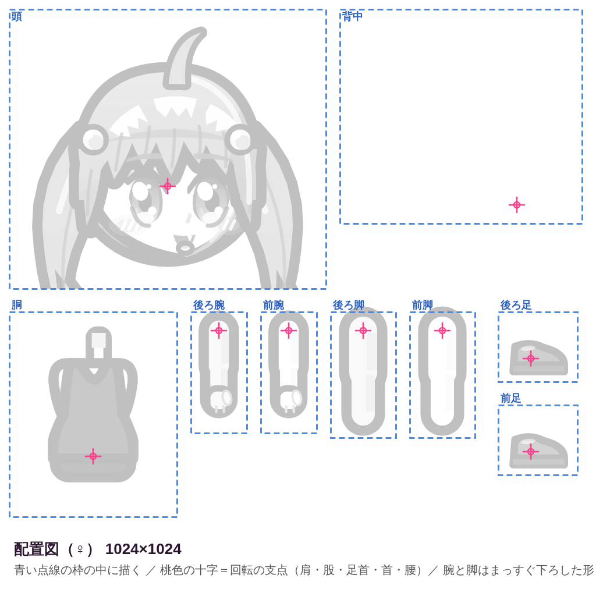
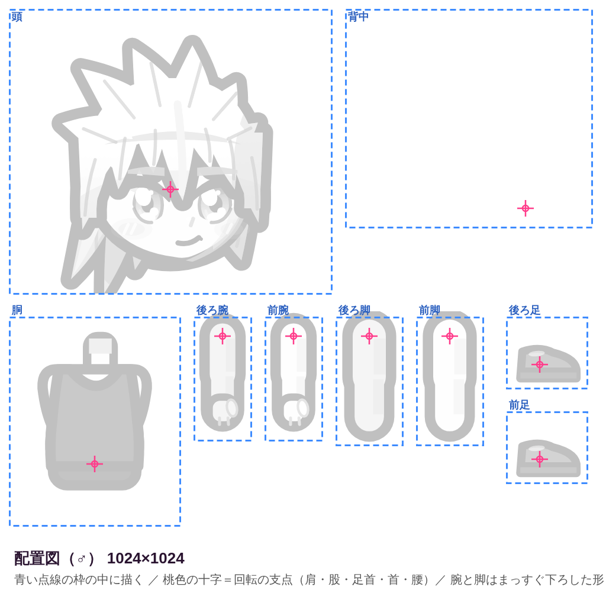
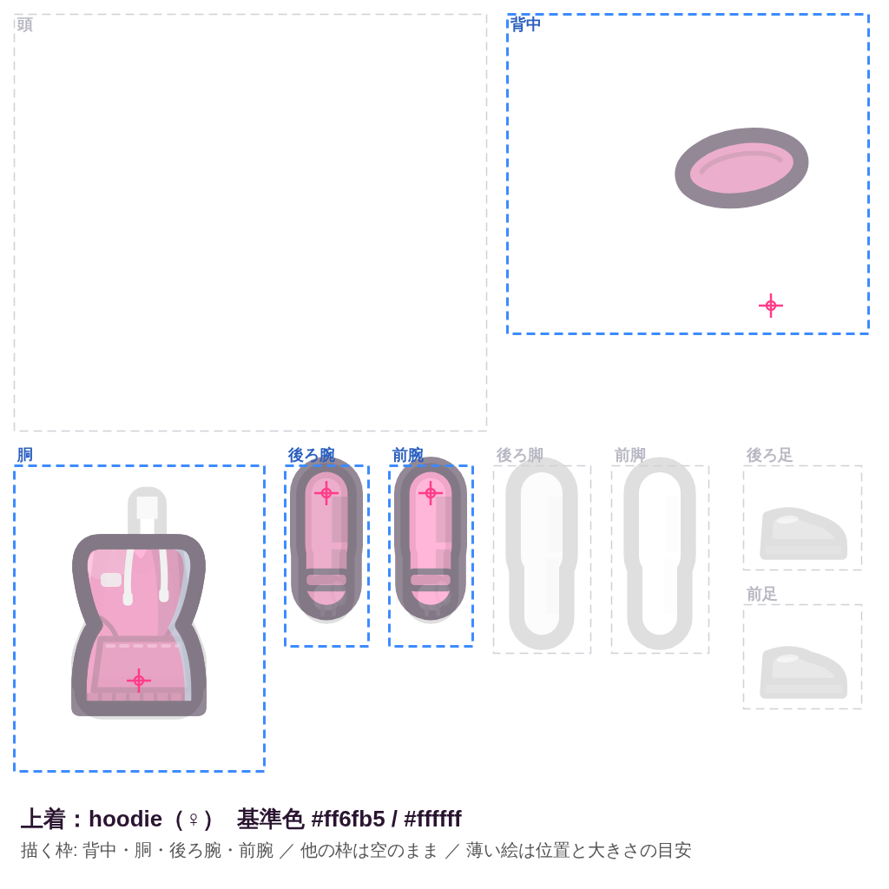
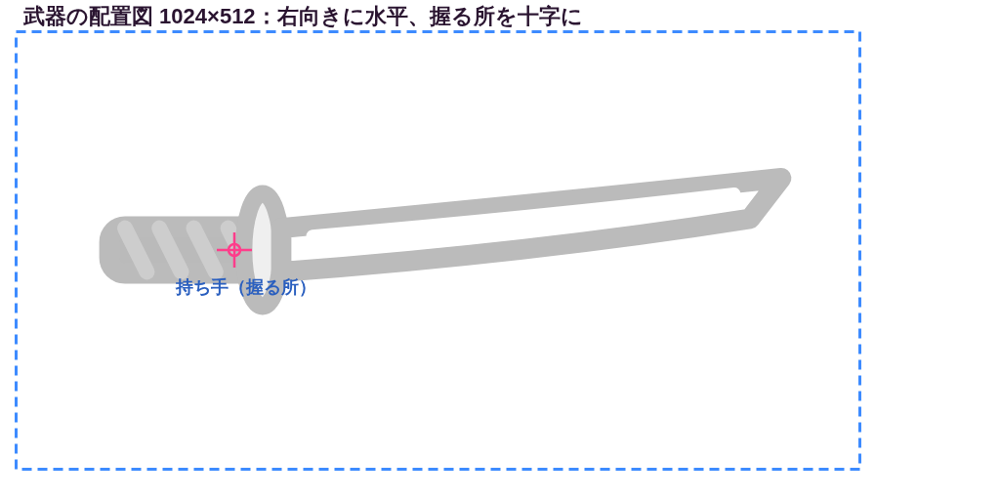

# 主人公のパーツ式（着せ替え人形）— 描く人・画像生成AI向けの指示書

> 自動生成: `node tools/gen_rig_guide.mjs`（`npm run export:rig` で配置図・下絵と一緒に作り直し）。一覧は [`HERO_PARTS_LIST.csv`](HERO_PARTS_LIST.csv)。エンジニア向けの仕様は `docs/SPEC_SPRITES.md` の「リグ（パーツ式）」。

敵・ボス・PET は画像生成AIの1枚絵になりました。主人公だけはコードで描いた絵のままなので、**「素体」「服（装備の種類ごと）」「武器（種類ごと）」をAIに描いてもらい、ゲームがそれを着せ替え人形のように組み立てて動かします**。頭は今ある「頭の絵（heads）」をそのまま使います（無ければコードの頭）。

**作る枚数: 全 90 枚**（S＝最優先 24 枚 / A＝人気の装備 35 枚 / B＝残り 31 枚）。S だけ作れば、3クラス×♀♂の初期装備の主人公が全部AIの絵になります。足りない装備は、その装備だけ今のコードの絵で代わりに表示されます（**一部だけ作ってもゲームは動きます**）。

## 1. しくみ

### 1-1. 配置図（全部の絵の共通の型紙）
どの絵も **1024×1024 の同じ配置図** の上に描きます。配置図には体のパーツごとの **枠**（青い点線）と、パーツを回す **支点**（桃色の十字）があります。

| ♀の配置図 | ♂の配置図 |
|---|---|
|  |  |

| 枠 | 何を描く | 支点（十字） | ゲームでの動き |
|---|---|---|---|
| 頭 | 頭の上に重ねる物だけ（頭そのものは描かない） | 頭の中心 | 首の位置・頭の傾きに合わせて重ねる |
| 背中 | 体の後ろに出る物 | 腰（胴と同じ） | 胴と一緒に傾く（体の後ろ） |
| 胴 | 首〜腰（スカート・ドレスの裾も） | 腰（おへその少し下） | 腰を中心に傾く・上下に弾む |
| 後ろ腕 | 奥側の腕（まっすぐ下ろした形・肩が上の十字） | 肩 | 肩で回る・肘で曲がる |
| 前腕 | 手前の腕（まっすぐ下ろした形・肩が上の十字） | 肩 | 肩で回る・肘で曲がる |
| 後ろ脚 | 奥側の脚（まっすぐ下ろした形・股が上の十字） | 股（脚の付け根） | 股で回る・膝で曲がる |
| 前脚 | 手前の脚（まっすぐ下ろした形・股が上の十字） | 股（脚の付け根） | 股で回る・膝で曲がる |
| 後ろ足 | 奥側の足（右向きの横から見た靴・足首が十字） | 足首 | 足首で回る |
| 前足 | 手前の足（右向きの横から見た靴・足首が十字） | 足首 | 足首で回る |

- **腕と脚は「まっすぐ下ろした形」で描く**。肘・膝はゲームが絵を関節の位置で2つに分けて曲げます（歩く・走る・攻撃・座る・倒れる・はしごを登る、の動きは全部ゲームが付けます）。
- パーツどうしは離して描く（枠の中だけ）。枠から少しはみ出たり、少し大きさ・位置がずれても、ゲームが「枠の中の絵の範囲」を自動で見つけて、下絵の位置と大きさに合わせます（±20% 程度まで）。
- 背景は **透明** か **真っ白などの単色**（四隅の色を自動で透明にします）。
- 頭の枠: 素体や服のシートでは空。帽子・メガネ・マスク・天使の輪のシートだけ、頭の上に重ねる物を描きます（灰色の頭は位置の目安。頭の絵 heads と同じ大きさ・位置）。

### 1-2. 1アイテム＝1枚の「パーツシート」
例: パーカーのシートには「背中（フード）・胴・後ろの腕（袖）・手前の腕（袖）」の枠に描きます。描かない枠は空のまま。各アイテムには、そのアイテムの今のコードの絵を枠に分けて薄く描いた **下絵** があるので、AIにはそれを添付して「この下絵を描き直して」と頼みます。

| 下絵の例（パーカー♀） | 武器の配置図 |
|---|---|
|  |  |

- **素体**（`body_f` / `body_m`）: 肌と、インナー（濃い紫グレーのタンクトップとスパッツ）と室内靴。何も着ていない時と、服の下の肌（半袖の腕・短パンの脚など）に使います。**素体が無いと、リグは使われません**（今まで通りのコードの絵）。
- **服**: 素体の上に重ねます（素体 → 下 → 靴 → 上着 → アクセサリ → 破れ の順）。靴は素体の足と入れ替わります。
- **武器**（性別共通）: 右向きに水平に描き、握る所を十字に合わせます。ゲームが手の位置に持たせて、攻撃の動きに合わせて回します。武器の上に手前の手をもう一度重ねる（握っている見た目）ので、手は描きません。
- 何も装備していない時は、今のゲームと同じく白いTシャツと青い短パンを着ます（`top/tshirt`・`bottom/shorts` の絵を使う。無ければコードの絵）。

### 1-3. 色（色違いは自動）
同じスタイルの色違い（例: ピンクのパーカーと黒っぽい緑のサイバーパーカー）は、**スタイルごとに1枚だけ** 描けばよく、ゲームが「描いた基準色 → アイテムの色」に **色相を回して彩度・明るさを合わせます**（陰影・線・白いハイライト・他の色の部分は残します）。
- 各シートの **基準色（主色・アクセント）ちょうどで塗る**のがコツ（下の各項目・CSV に書いてあります）。基準色はそのスタイルの初期装備の色なので、初期装備は描いた絵のまま表示されます。
- 主色のまわりの色（色相 ±40° くらい）が主色として、アクセント（はっきりした色のときだけ）がアクセントとして変わります。白・黒・灰色・肌色など、主色から遠い色は変わりません。
- 色違いをきれいに見せたい物は **専用の絵** も置けます: `<スロット>/<スタイル>__<色の6桁>_<性別>.png`（例 `top/hoodie__1d2b24_f.png`。武器は `weapon/katana__d8283c.png`）。その色のアイテムでは、色替えより専用の絵が優先されます。
- 素体の肌は、キャラ作成で選んだ肌の色に同じ方法で合わせます（基準 ♀ `#ffe3d3` / ♂ `#f6d5be`）。※頭の絵（heads）は色を変えません。

## 2. 作るもの一覧

| 優先度 | 枚数 | 内容 |
|---|---|---|
| **S** | 24 | 素体♀♂、3クラス×♀♂の初期装備（ルナ: ネコミミ/キャップ・ピンクのパーカー・スカート/ジーンズ・スニーカー・ナイフ、ジン: 革ジャン・ジーンズ・ブーツ・バット、ハッカー: ヘッドホン・サイバーパーカー（色違い専用）・ジョガーパンツ・スニーカー・杖） |
| **A** | 35 | 何も着ていない時の白Tシャツ・短パン、Lv20 までに手に入る装備（序盤の店・ドロップ）、序盤の武器（ピストル・刀・SMG・ギター） |
| **B** | 31 | 残りの装備（中盤以降のレア装備）、ネオンソード、服破れの重ね（任意。無ければコードの破れ） |
| 合計 | 90 | ♀♂で体型が違うので、服は♀用と♂用を別に描きます（武器は共通） |

| 優先度 | 保存ファイル名（`assets/sprites/` の下） | 内容 | 描く枠 | 基準色 |
|---|---|---|---|---|
| S | `rig/body_f.png` | 素体（♀） | 胴・後ろ腕・前腕・後ろ脚・前脚・後ろ足・前足 | `#ffe3d3` |
| S | `rig/body_m.png` | 素体（♂） | 胴・後ろ腕・前腕・後ろ脚・前脚・後ろ足・前足 | `#f6d5be` |
| S | `rig/top/hoodie_f.png` | 上着：パーカー（♀） | 背中・胴・後ろ腕・前腕 | `#ff6fb5` / `#ffffff` |
| S | `rig/top/hoodie_m.png` | 上着：パーカー（♂） | 背中・胴・後ろ腕・前腕 | `#ff6fb5` / `#ffffff` |
| S | `rig/top/leatherJacket_f.png` | 上着：革ジャン（♀） | 胴・後ろ腕・前腕 | `#1d1d24` / `#c0c0c8` |
| S | `rig/top/leatherJacket_m.png` | 上着：革ジャン（♂） | 胴・後ろ腕・前腕 | `#1d1d24` / `#c0c0c8` |
| S | `rig/bottom/skirt_f.png` | 下：プリーツスカート（♀） | 胴・後ろ脚・前脚 | `#ff8ac8` / `#ffffff` |
| S | `rig/bottom/trackPants_f.png` | 下：ジョガーパンツ（♀） | 胴・後ろ脚・前脚 | `#2a2f38` / `#3dff8a` |
| S | `rig/bottom/trackPants_m.png` | 下：ジョガーパンツ（♂） | 胴・後ろ脚・前脚 | `#2a2f38` / `#3dff8a` |
| S | `rig/bottom/jeans_f.png` | 下：ジーンズ（♀） | 胴・後ろ脚・前脚 | `#3a5a8c` / `#c9d6ea` |
| S | `rig/bottom/jeans_m.png` | 下：ジーンズ（♂） | 胴・後ろ脚・前脚 | `#3a5a8c` / `#c9d6ea` |
| S | `rig/shoes/sneakers_f.png` | 靴：スニーカー（♀） | 後ろ足・前足 | `#f4f4f4` / `#ff6fb5` |
| S | `rig/shoes/sneakers_m.png` | 靴：スニーカー（♂） | 後ろ足・前足 | `#f4f4f4` / `#ff6fb5` |
| S | `rig/shoes/boots_f.png` | 靴：エンジニアブーツ（♀） | 後ろ足・前足 | `#2a2018` / `#8a8a8a` |
| S | `rig/shoes/boots_m.png` | 靴：エンジニアブーツ（♂） | 後ろ足・前足 | `#2a2018` / `#8a8a8a` |
| S | `rig/hat/catEars_f.png` | 帽子：ネコミミのカチューシャ（♀） | 頭 | `#ff8ac8` / `#ffe0f0` |
| S | `rig/hat/headphones_f.png` | 帽子：ヘッドホン（♀） | 頭 | `#2b2b38` / `#3dff8a` |
| S | `rig/hat/headphones_m.png` | 帽子：ヘッドホン（♂） | 頭 | `#2b2b38` / `#3dff8a` |
| S | `rig/hat/cap_m.png` | 帽子：キャップ（♂） | 頭 | `#2b2b38` / `#ff3d7f` |
| S | `rig/top/hoodie__1d2b24_f.png` | 上着：サイバーパーカー（ハッカーの初期装備の色違い専用）（♀） | 背中・胴・後ろ腕・前腕 | `#1d2b24` / `#3dff8a` |
| S | `rig/top/hoodie__1d2b24_m.png` | 上着：サイバーパーカー（ハッカーの初期装備の色違い専用）（♂） | 背中・胴・後ろ腕・前腕 | `#1d2b24` / `#3dff8a` |
| S | `rig/weapon/knife.png` | 武器：ポケットナイフ | 武器 | `#c9ccd6` / `#ff6fb5` |
| S | `rig/weapon/bat.png` | 武器：木製バット | 武器 | `#b98a52` / `#5a3a22` |
| S | `rig/weapon/staff.png` | 武器：杖型のデバイス | 武器 | `#3dff8a` / `#1d1d24` |
| A | `rig/top/tshirt_f.png` | 上着：Tシャツ（♀） | 胴・後ろ腕・前腕 | `#f4f4f4` / `#ff3d7f` |
| A | `rig/top/tshirt_m.png` | 上着：Tシャツ（♂） | 胴・後ろ腕・前腕 | `#f4f4f4` / `#ff3d7f` |
| A | `rig/top/tank_f.png` | 上着：タンクトップ（♀） | 胴 | `#222228` / `#ffd23f` |
| A | `rig/top/tank_m.png` | 上着：タンクトップ（♂） | 胴 | `#222228` / `#ffd23f` |
| A | `rig/top/hawaiian_f.png` | 上着：アロハシャツ（♀） | 胴・後ろ腕・前腕 | `#ff8a00` / `#19d3a0` |
| A | `rig/top/hawaiian_m.png` | 上着：アロハシャツ（♂） | 胴・後ろ腕・前腕 | `#ff8a00` / `#19d3a0` |
| A | `rig/top/tracksuit_f.png` | 上着：ジャージの上着（♀） | 胴・後ろ腕・前腕 | `#1fae5b` / `#ffffff` |
| A | `rig/top/tracksuit_m.png` | 上着：ジャージの上着（♂） | 胴・後ろ腕・前腕 | `#1fae5b` / `#ffffff` |
| A | `rig/bottom/skirt_m.png` | 下：プリーツスカート（♂） | 胴・後ろ脚・前脚 | `#ff8ac8` / `#ffffff` |
| A | `rig/bottom/shorts_f.png` | 下：短パン（♀） | 胴・後ろ脚・前脚 | `#4d6fb5` / `#ffffff` |
| A | `rig/bottom/shorts_m.png` | 下：短パン（♂） | 胴・後ろ脚・前脚 | `#4d6fb5` / `#ffffff` |
| A | `rig/bottom/cargo_f.png` | 下：カーゴパンツ（♀） | 胴・後ろ脚・前脚 | `#8a7a52` / `#4a4232` |
| A | `rig/bottom/cargo_m.png` | 下：カーゴパンツ（♂） | 胴・後ろ脚・前脚 | `#8a7a52` / `#4a4232` |
| A | `rig/shoes/sandals_f.png` | 靴：ビーチサンダル（♀） | 後ろ足・前足 | `#ffd23f` / `#19d3a0` |
| A | `rig/shoes/sandals_m.png` | 靴：ビーチサンダル（♂） | 後ろ足・前足 | `#ffd23f` / `#19d3a0` |
| A | `rig/shoes/loafers_f.png` | 靴：ローファー（♀） | 後ろ足・前足 | `#5a3a22` / `#c9a26a` |
| A | `rig/shoes/loafers_m.png` | 靴：ローファー（♂） | 後ろ足・前足 | `#5a3a22` / `#c9a26a` |
| A | `rig/shoes/heels_f.png` | 靴：ヒール（♀） | 後ろ足・前足 | `#d8283c` / `#ffd23f` |
| A | `rig/shoes/heels_m.png` | 靴：ヒール（♂） | 後ろ足・前足 | `#d8283c` / `#ffd23f` |
| A | `rig/hat/catEars_m.png` | 帽子：ネコミミのカチューシャ（♂） | 頭 | `#ff8ac8` / `#ffe0f0` |
| A | `rig/hat/cap_f.png` | 帽子：キャップ（♀） | 頭 | `#2b2b38` / `#ff3d7f` |
| A | `rig/hat/beanie_f.png` | 帽子：ニット帽（♀） | 頭 | `#7a7f8c` / `#c9ccd6` |
| A | `rig/hat/beanie_m.png` | 帽子：ニット帽（♂） | 頭 | `#7a7f8c` / `#c9ccd6` |
| A | `rig/hat/bandana_f.png` | 帽子：バンダナ（♀） | 頭 | `#d8283c` / `#ffffff` |
| A | `rig/hat/bandana_m.png` | 帽子：バンダナ（♂） | 頭 | `#d8283c` / `#ffffff` |
| A | `rig/accessory/sunglasses_f.png` | アクセサリ：サングラス（♀） | 頭 | `#2a2a2a` / `#ffd23f` |
| A | `rig/accessory/sunglasses_m.png` | アクセサリ：サングラス（♂） | 頭 | `#2a2a2a` / `#ffd23f` |
| A | `rig/accessory/scarf_f.png` | アクセサリ：スカーフ（♀） | 胴・背中 | `#d8283c` / `#ffffff` |
| A | `rig/accessory/scarf_m.png` | アクセサリ：スカーフ（♂） | 胴・背中 | `#d8283c` / `#ffffff` |
| A | `rig/accessory/goldChain_f.png` | アクセサリ：金のチェーンネックレス（♀） | 胴 | `#ffd23f` / `#fff4b0` |
| A | `rig/accessory/goldChain_m.png` | アクセサリ：金のチェーンネックレス（♂） | 胴 | `#ffd23f` / `#fff4b0` |
| A | `rig/weapon/pistol.png` | 武器：ピストル | 武器 | `#2a2a30` / `#8a8a8a` |
| A | `rig/weapon/katana.png` | 武器：刀 | 武器 | `#dfe4ee` / `#d8283c` |
| A | `rig/weapon/smg.png` | 武器：サブマシンガン | 武器 | `#1d1d24` / `#ff8a00` |
| A | `rig/weapon/guitar.png` | 武器：エレキギター | 武器 | `#d8283c` / `#f4f4f4` |
| B | `rig/top/police_f.png` | 上着：警官の制服シャツ（♀） | 胴・後ろ腕・前腕 | `#20335c` / `#ffd23f` |
| B | `rig/top/police_m.png` | 上着：警官の制服シャツ（♂） | 胴・後ろ腕・前腕 | `#20335c` / `#ffd23f` |
| B | `rig/top/suit_f.png` | 上着：スーツのジャケット（♀） | 胴・後ろ腕・前腕 | `#15151b` / `#d8283c` |
| B | `rig/top/suit_m.png` | 上着：スーツのジャケット（♂） | 胴・後ろ腕・前腕 | `#15151b` / `#d8283c` |
| B | `rig/top/idolDress_f.png` | 上着：アイドルのステージドレス（♀） | 胴・後ろ腕・前腕 | `#ff6fb5` / `#fff06a` |
| B | `rig/top/idolDress_m.png` | 上着：アイドルのステージドレス（♂） | 胴・後ろ腕・前腕 | `#ff6fb5` / `#fff06a` |
| B | `rig/top/armorVest_f.png` | 上着：タクティカルベスト（♀） | 胴・後ろ腕・前腕 | `#3b4231` / `#9aa07a` |
| B | `rig/top/armorVest_m.png` | 上着：タクティカルベスト（♂） | 胴・後ろ腕・前腕 | `#3b4231` / `#9aa07a` |
| B | `rig/bottom/suitPants_f.png` | 下：スーツのズボン（♀） | 胴・後ろ脚・前脚 | `#15151b` / `#5a5a66` |
| B | `rig/bottom/suitPants_m.png` | 下：スーツのズボン（♂） | 胴・後ろ脚・前脚 | `#15151b` / `#5a5a66` |
| B | `rig/bottom/armorPants_f.png` | 下：タクティカルパンツ（♀） | 胴・後ろ脚・前脚 | `#3b4231` / `#9aa07a` |
| B | `rig/bottom/armorPants_m.png` | 下：タクティカルパンツ（♂） | 胴・後ろ脚・前脚 | `#3b4231` / `#9aa07a` |
| B | `rig/hat/cowboy_f.png` | 帽子：カウボーイハット（♀） | 頭 | `#8a5a2b` / `#e8c27a` |
| B | `rig/hat/cowboy_m.png` | 帽子：カウボーイハット（♂） | 頭 | `#8a5a2b` / `#e8c27a` |
| B | `rig/hat/helmet_f.png` | 帽子：バイクのヘルメット（♀） | 頭 | `#16161e` / `#ff8a00` |
| B | `rig/hat/helmet_m.png` | 帽子：バイクのヘルメット（♂） | 頭 | `#16161e` / `#ff8a00` |
| B | `rig/hat/crown_f.png` | 帽子：王冠（♀） | 頭 | `#ffd23f` / `#ff3d7f` |
| B | `rig/hat/crown_m.png` | 帽子：王冠（♂） | 頭 | `#ffd23f` / `#ff3d7f` |
| B | `rig/accessory/mask_f.png` | アクセサリ：スカルのフェイスマスク（♀） | 頭 | `#e8e8e8` / `#16161e` |
| B | `rig/accessory/mask_m.png` | アクセサリ：スカルのフェイスマスク（♂） | 頭 | `#e8e8e8` / `#16161e` |
| B | `rig/accessory/wings_f.png` | アクセサリ：天使の翼（♀） | 背中 | `#ffffff` / `#bff6ff` |
| B | `rig/accessory/wings_m.png` | アクセサリ：天使の翼（♂） | 背中 | `#ffffff` / `#bff6ff` |
| B | `rig/accessory/halo_f.png` | アクセサリ：天使の輪（♀） | 頭 | `#fff06a` / `#ffffff` |
| B | `rig/accessory/halo_m.png` | アクセサリ：天使の輪（♂） | 頭 | `#fff06a` / `#ffffff` |
| B | `rig/weapon/neonSword.png` | 武器：ネオンソード | 武器 | `#19f0ff` / `#ffffff` |
| B | `rig/tear/1_f.png` | 服破れ 1（♀） | 胴・後ろ腕・前腕・後ろ脚・前脚 | `#3a3346` |
| B | `rig/tear/1_m.png` | 服破れ 1（♂） | 胴・後ろ腕・前腕・後ろ脚・前脚 | `#3a3346` |
| B | `rig/tear/2_f.png` | 服破れ 2（♀） | 胴・後ろ腕・前腕・後ろ脚・前脚 | `#3a3346` |
| B | `rig/tear/2_m.png` | 服破れ 2（♂） | 胴・後ろ腕・前腕・後ろ脚・前脚 | `#3a3346` |
| B | `rig/tear/3_f.png` | 服破れ 3（♀） | 胴・後ろ腕・前腕・後ろ脚・前脚 | `#3a3346` |
| B | `rig/tear/3_m.png` | 服破れ 3（♂） | 胴・後ろ腕・前腕・後ろ脚・前脚 | `#3a3346` |

## 3. 作業の流れ

1. **素体♀** を作る（添付1: `rig/templates/body/body_f.png`、あれば頭の絵も添付して絵柄と肌の色をそろえる）。気に入るまで作り直す（これが全部の絵柄の基準になります）。
2. **素体♂** を作る（添付2に素体♀を付けて「同じ絵柄で」）。
3. S の服・武器を作る。**毎回、添付2に最初の素体を付けます**（絵柄・線の太さ・体の位置がそろう）。
4. できた PNG を `assets/sprites/rig/` の下に、一覧の「保存ファイル名」で置く（フォルダ `top/` `bottom/` `shoes/` `hat/` `accessory/` `weapon/` `tear/`）。
5. `npm run rig:manifest` を実行（置いたファイルを `assets/sprites/manifest.json` の `"rig"` に自動で書き込む）。手で書く場合は次の形:
   ```json
   "rig": { "enabled": true, "parts": ["body_f", "body_m", "top/hoodie_f", "weapon/knife"] }
   ```
   基準色と違う色で描いてしまった時は `"parts": { "top/hoodie_f": { "base": "#ff5aa0" } }` のように、実際に塗った色を書くと色替えが合います。位置合わせを止めるなら `"fit": false`、色替えを止めるなら `"recolor": false`。
6. 確認（§6）。

## 4. 絵柄をそろえるコツ

- **最初に作った素体を、毎回「添付2」として付ける**。「添付2と同じ絵柄・同じ線の太さで」と書く（指示文に入っています）。
- 頭の絵（`assets/sprites/heads/<クラス>_<性別>.png`）がある場合は、素体を作る時に添付して「この頭に合う体で」と頼むと、線・塗り・肌の色が頭とそろいます。
- AIが枠を無視して1人のキャラを描いてしまう時は、画像編集（下絵の上に描き直し）モードを使うか、「添付1の画像をそのまま下敷きにして、各枠の中の薄い絵だけを塗り直して」と強めに頼む。
- 1枚目がうまくいった指示文を、同じ会話の中で「次は○○を同じやり方で」と続けると安定します。
- 線の色は濃い紫（#2A1430）でそろえる（色替えで線の色が変わらないように、線は主色と違う色に）。
- 基準色は「ちょうどその色」で塗る。違う色で塗ると、色違いの色が少しずれます（その時は manifest に `base` を書く）。

## 5. 全年齢の線引き

- 素体は **インナー（タンクトップ・ひざ上のスパッツ）を着た状態**（スポーツウェアのイメージ）。肌を出しすぎない。下着・水着のような描き方はしない。
- 服破れは **穴の中が必ずインナー**（肌は見せない）。血・傷口は描かない（すり傷・すす・汚れまで）。
- 武器は架空のデザイン（実在の銃・製品に似せない）。

## 6. 確認方法

1. 置いて `npm run rig:manifest` → ブラウザでゲームを開く（`npm run serve` → http://localhost:8080 、公開ページなら再公開）。
2. 主人公が新しい絵で動く。**F2**（デバッグパネル）の「見た目: スプライト / コード描画」ボタンで、今のコードの絵と切り替えて見比べられる。パネルの `rig` の行に読み込んだ枚数・失敗・代用（コードの絵で代わりに出している装備の数）が出ます。
3. よくある失敗:
   - **何も変わらない** → 素体（`body_f`/`body_m`）が無い・名前が違う・manifest に無い（`npm run rig:manifest`）。主人公だけに使われます（敵・NPC・市民には使われません）。
   - **パーツがずれる・小さい/大きい** → 枠の位置を守っていない。下絵を添付し直して描き直す。少しのずれは自動で直ります。
   - **背景が残る** → 背景を真っ白（または透明）にする。四隅が同じ色でないと透明にできません。
   - **色違いの色が変** → 基準色ちょうどで塗っていない（manifest の `base` に実際の色）、または色違い専用の絵を置く。
   - **関節に隙間** → 腕・脚が曲がっていたり、肩・股の十字から離れている。まっすぐ下ろした形で、上の端を十字に合わせる。

## 7. 1枚ごとの指示（コピペ用）

各項目の「添付」の画像を付けて、指示文をそのままAIに貼り付けます。

### 優先度 S

#### S｜素体（♀） → `assets/sprites/rig/body_f.png`

- 描く枠: 胴・後ろ腕・前腕・後ろ脚・前脚・後ろ足・前足（他の枠は空）
- 基準色: `#ffe3d3`
- 添付: 添付1: docs/art_handoff/rig/templates/body/body_f.png ／ （あれば）添付2: 頭の絵 assets/sprites/heads/<クラス>_f.png（絵柄・肌の色をそろえる）

```
ゲームのキャラクター（主人公）の着せ替え人形の「素体」を描いてください。添付1は配置図の下絵（♀）です。
描くもの：女の子の体型（小顔・細い首・くびれ・脚長め）の素体。服の下に着るインナー（濃い紫グレーのタンクトップ #3A3346 と、ひざ上の黒いスパッツ #2A2633）を着た状態。足には濃いグレーのシンプルな室内靴（#5B5266）。
描く枠：胴（首〜腰（スカート・ドレスの裾も））、後ろ腕（奥側の腕（まっすぐ下ろした形・肩が上の十字））、前腕（手前の腕（まっすぐ下ろした形・肩が上の十字））、後ろ脚（奥側の脚（まっすぐ下ろした形・股が上の十字））、前脚（手前の脚（まっすぐ下ろした形・股が上の十字））、後ろ足（奥側の足（右向きの横から見た靴・足首が十字））、前足（手前の足（右向きの横から見た靴・足首が十字））。
肌の色：#ffe3d3（この色ちょうどで。陰影は同じ肌色の濃淡）。奥側の腕・脚は少し暗めの肌色に。手は軽く握ったグー。首は胴の枠の上の方に短く。
頭は描かない（頭の枠は空のまま。頭は別の絵を使います）。
画風：ちびアニメ調（ゲーム中は2.5頭身・高さ約80px）、太めの濃い紫（#2A1430）の輪郭線、セル塗り2段＋ツヤのハイライト、かわいい・かっこいい。世界観はネオン×夕焼けのリゾート都市のストリート系。
画像は添付1と同じ 1024×1024（正方形）。添付1の「青い点線の枠」の位置と大きさをそのまま守り、枠の中の薄い下絵を、同じ位置・同じ大きさで描き直してください。
使わない枠・枠の外には何も描かない。青い点線の枠・桃色の十字・文字・灰色の参考シルエットは描かない（完成画像には残さない）。
腕と脚は「まっすぐ下に下ろした形」のまま（曲げない。ゲームが関節で曲げます）。各パーツは離ればなれのままにする（つなげない）。
向きは右向き（体はやや右を向いた斜め前）。背景は真っ白（#FFFFFF）か透明。影・地面・枠線なし。
全年齢向け。既存のゲームやキャラクターに似せない。
```

#### S｜素体（♂） → `assets/sprites/rig/body_m.png`

- 描く枠: 胴・後ろ腕・前腕・後ろ脚・前脚・後ろ足・前足（他の枠は空）
- 基準色: `#f6d5be`
- 添付: 添付1: docs/art_handoff/rig/templates/body/body_m.png ／ （あれば）添付2: 頭の絵 assets/sprites/heads/<クラス>_m.png（絵柄・肌の色をそろえる）

```
ゲームのキャラクター（主人公）の着せ替え人形の「素体」を描いてください。添付1は配置図の下絵（♂）です。
描くもの：男の子の体型（肩幅が広い・胸板・がっしり）の素体。服の下に着るインナー（濃い紫グレーのタンクトップ #3A3346 と、ひざ上の黒いスパッツ #2A2633）を着た状態。足には濃いグレーのシンプルな室内靴（#5B5266）。
描く枠：胴（首〜腰（スカート・ドレスの裾も））、後ろ腕（奥側の腕（まっすぐ下ろした形・肩が上の十字））、前腕（手前の腕（まっすぐ下ろした形・肩が上の十字））、後ろ脚（奥側の脚（まっすぐ下ろした形・股が上の十字））、前脚（手前の脚（まっすぐ下ろした形・股が上の十字））、後ろ足（奥側の足（右向きの横から見た靴・足首が十字））、前足（手前の足（右向きの横から見た靴・足首が十字））。
肌の色：#f6d5be（この色ちょうどで。陰影は同じ肌色の濃淡）。奥側の腕・脚は少し暗めの肌色に。手は軽く握ったグー。首は胴の枠の上の方に短く。
頭は描かない（頭の枠は空のまま。頭は別の絵を使います）。
画風：ちびアニメ調（ゲーム中は2.5頭身・高さ約80px）、太めの濃い紫（#2A1430）の輪郭線、セル塗り2段＋ツヤのハイライト、かわいい・かっこいい。世界観はネオン×夕焼けのリゾート都市のストリート系。
画像は添付1と同じ 1024×1024（正方形）。添付1の「青い点線の枠」の位置と大きさをそのまま守り、枠の中の薄い下絵を、同じ位置・同じ大きさで描き直してください。
使わない枠・枠の外には何も描かない。青い点線の枠・桃色の十字・文字・灰色の参考シルエットは描かない（完成画像には残さない）。
腕と脚は「まっすぐ下に下ろした形」のまま（曲げない。ゲームが関節で曲げます）。各パーツは離ればなれのままにする（つなげない）。
向きは右向き（体はやや右を向いた斜め前）。背景は真っ白（#FFFFFF）か透明。影・地面・枠線なし。
全年齢向け。既存のゲームやキャラクターに似せない。
```

#### S｜上着：パーカー（♀） → `assets/sprites/rig/top/hoodie_f.png`

- 描く枠: 背中・胴・後ろ腕・前腕（他の枠は空）
- 基準色: `#ff6fb5` / `#ffffff`　使うアイテム: サイバーパーカー・ピンクのパーカー
- 添付: 添付1: docs/art_handoff/rig/templates/top/hoodie_f.png ／ 添付2: 最初に作った素体 assets/sprites/rig/body_f.png（絵柄・体の位置をそろえる）

```
ゲームのキャラクター（主人公）の着せ替えパーツを1枚描いてください。添付1は配置図の下絵（♀用）です。
描くもの：パーカー（長袖・前にひも・お腹のポケット。フードは首の後ろ＝背中の枠）。女の子の体型（小顔・細い首・くびれ・脚長め）に合う形。
描く枠：背中（体の後ろに出る物）、胴（首〜腰（スカート・ドレスの裾も））、後ろ腕（奥側の腕（まっすぐ下ろした形・肩が上の十字））、前腕（手前の腕（まっすぐ下ろした形・肩が上の十字））。
色：主色 #ff6fb5、アクセント #ffffff（主色はこの色ちょうどで塗る。陰影は同じ色の濃淡。ゲームが色違いを自動で作ります）。
服だけを描く（肌・頭・手は描かない）。腕の枠には袖だけ、脚の枠にはズボンの脚だけ。素体（添付2）の上に重ねてぴったり合う形と位置に。
画風：ちびアニメ調（ゲーム中は2.5頭身・高さ約80px）、太めの濃い紫（#2A1430）の輪郭線、セル塗り2段＋ツヤのハイライト、かわいい・かっこいい。世界観はネオン×夕焼けのリゾート都市のストリート系。
画像は添付1と同じ 1024×1024（正方形）。添付1の「青い点線の枠」の位置と大きさをそのまま守り、枠の中の薄い下絵を、同じ位置・同じ大きさで描き直してください。
使わない枠・枠の外には何も描かない。青い点線の枠・桃色の十字・文字・灰色の参考シルエットは描かない（完成画像には残さない）。
腕と脚は「まっすぐ下に下ろした形」のまま（曲げない。ゲームが関節で曲げます）。各パーツは離ればなれのままにする（つなげない）。
向きは右向き（体はやや右を向いた斜め前）。背景は真っ白（#FFFFFF）か透明。影・地面・枠線なし。
全年齢向け。既存のゲームやキャラクターに似せない。
※添付2（素体）と同じ絵柄・同じ線の太さで。
```

#### S｜上着：パーカー（♂） → `assets/sprites/rig/top/hoodie_m.png`

- 描く枠: 背中・胴・後ろ腕・前腕（他の枠は空）
- 基準色: `#ff6fb5` / `#ffffff`　使うアイテム: サイバーパーカー・ピンクのパーカー
- 添付: 添付1: docs/art_handoff/rig/templates/top/hoodie_m.png ／ 添付2: 最初に作った素体 assets/sprites/rig/body_m.png（絵柄・体の位置をそろえる）

```
ゲームのキャラクター（主人公）の着せ替えパーツを1枚描いてください。添付1は配置図の下絵（♂用）です。
描くもの：パーカー（長袖・前にひも・お腹のポケット。フードは首の後ろ＝背中の枠）。男の子の体型（肩幅が広い・胸板・がっしり）に合う形。
描く枠：背中（体の後ろに出る物）、胴（首〜腰（スカート・ドレスの裾も））、後ろ腕（奥側の腕（まっすぐ下ろした形・肩が上の十字））、前腕（手前の腕（まっすぐ下ろした形・肩が上の十字））。
色：主色 #ff6fb5、アクセント #ffffff（主色はこの色ちょうどで塗る。陰影は同じ色の濃淡。ゲームが色違いを自動で作ります）。
服だけを描く（肌・頭・手は描かない）。腕の枠には袖だけ、脚の枠にはズボンの脚だけ。素体（添付2）の上に重ねてぴったり合う形と位置に。
画風：ちびアニメ調（ゲーム中は2.5頭身・高さ約80px）、太めの濃い紫（#2A1430）の輪郭線、セル塗り2段＋ツヤのハイライト、かわいい・かっこいい。世界観はネオン×夕焼けのリゾート都市のストリート系。
画像は添付1と同じ 1024×1024（正方形）。添付1の「青い点線の枠」の位置と大きさをそのまま守り、枠の中の薄い下絵を、同じ位置・同じ大きさで描き直してください。
使わない枠・枠の外には何も描かない。青い点線の枠・桃色の十字・文字・灰色の参考シルエットは描かない（完成画像には残さない）。
腕と脚は「まっすぐ下に下ろした形」のまま（曲げない。ゲームが関節で曲げます）。各パーツは離ればなれのままにする（つなげない）。
向きは右向き（体はやや右を向いた斜め前）。背景は真っ白（#FFFFFF）か透明。影・地面・枠線なし。
全年齢向け。既存のゲームやキャラクターに似せない。
※添付2（素体）と同じ絵柄・同じ線の太さで。
```

#### S｜上着：革ジャン（♀） → `assets/sprites/rig/top/leatherJacket_f.png`

- 描く枠: 胴・後ろ腕・前腕（他の枠は空）
- 基準色: `#1d1d24` / `#c0c0c8`　使うアイテム: ブラックレザージャケット・ネビュラ・レザー
- 添付: 添付1: docs/art_handoff/rig/templates/top/leatherJacket_f.png ／ 添付2: 最初に作った素体 assets/sprites/rig/body_f.png（絵柄・体の位置をそろえる）

```
ゲームのキャラクター（主人公）の着せ替えパーツを1枚描いてください。添付1は配置図の下絵（♀用）です。
描くもの：革ジャン（長袖・ジッパー・襟）。女の子の体型（小顔・細い首・くびれ・脚長め）に合う形。
描く枠：胴（首〜腰（スカート・ドレスの裾も））、後ろ腕（奥側の腕（まっすぐ下ろした形・肩が上の十字））、前腕（手前の腕（まっすぐ下ろした形・肩が上の十字））。
色：主色 #1d1d24、アクセント #c0c0c8（主色はこの色ちょうどで塗る。陰影は同じ色の濃淡。ゲームが色違いを自動で作ります）。
服だけを描く（肌・頭・手は描かない）。腕の枠には袖だけ、脚の枠にはズボンの脚だけ。素体（添付2）の上に重ねてぴったり合う形と位置に。
画風：ちびアニメ調（ゲーム中は2.5頭身・高さ約80px）、太めの濃い紫（#2A1430）の輪郭線、セル塗り2段＋ツヤのハイライト、かわいい・かっこいい。世界観はネオン×夕焼けのリゾート都市のストリート系。
画像は添付1と同じ 1024×1024（正方形）。添付1の「青い点線の枠」の位置と大きさをそのまま守り、枠の中の薄い下絵を、同じ位置・同じ大きさで描き直してください。
使わない枠・枠の外には何も描かない。青い点線の枠・桃色の十字・文字・灰色の参考シルエットは描かない（完成画像には残さない）。
腕と脚は「まっすぐ下に下ろした形」のまま（曲げない。ゲームが関節で曲げます）。各パーツは離ればなれのままにする（つなげない）。
向きは右向き（体はやや右を向いた斜め前）。背景は真っ白（#FFFFFF）か透明。影・地面・枠線なし。
全年齢向け。既存のゲームやキャラクターに似せない。
※添付2（素体）と同じ絵柄・同じ線の太さで。
```

#### S｜上着：革ジャン（♂） → `assets/sprites/rig/top/leatherJacket_m.png`

- 描く枠: 胴・後ろ腕・前腕（他の枠は空）
- 基準色: `#1d1d24` / `#c0c0c8`　使うアイテム: ブラックレザージャケット・ネビュラ・レザー
- 添付: 添付1: docs/art_handoff/rig/templates/top/leatherJacket_m.png ／ 添付2: 最初に作った素体 assets/sprites/rig/body_m.png（絵柄・体の位置をそろえる）

```
ゲームのキャラクター（主人公）の着せ替えパーツを1枚描いてください。添付1は配置図の下絵（♂用）です。
描くもの：革ジャン（長袖・ジッパー・襟）。男の子の体型（肩幅が広い・胸板・がっしり）に合う形。
描く枠：胴（首〜腰（スカート・ドレスの裾も））、後ろ腕（奥側の腕（まっすぐ下ろした形・肩が上の十字））、前腕（手前の腕（まっすぐ下ろした形・肩が上の十字））。
色：主色 #1d1d24、アクセント #c0c0c8（主色はこの色ちょうどで塗る。陰影は同じ色の濃淡。ゲームが色違いを自動で作ります）。
服だけを描く（肌・頭・手は描かない）。腕の枠には袖だけ、脚の枠にはズボンの脚だけ。素体（添付2）の上に重ねてぴったり合う形と位置に。
画風：ちびアニメ調（ゲーム中は2.5頭身・高さ約80px）、太めの濃い紫（#2A1430）の輪郭線、セル塗り2段＋ツヤのハイライト、かわいい・かっこいい。世界観はネオン×夕焼けのリゾート都市のストリート系。
画像は添付1と同じ 1024×1024（正方形）。添付1の「青い点線の枠」の位置と大きさをそのまま守り、枠の中の薄い下絵を、同じ位置・同じ大きさで描き直してください。
使わない枠・枠の外には何も描かない。青い点線の枠・桃色の十字・文字・灰色の参考シルエットは描かない（完成画像には残さない）。
腕と脚は「まっすぐ下に下ろした形」のまま（曲げない。ゲームが関節で曲げます）。各パーツは離ればなれのままにする（つなげない）。
向きは右向き（体はやや右を向いた斜め前）。背景は真っ白（#FFFFFF）か透明。影・地面・枠線なし。
全年齢向け。既存のゲームやキャラクターに似せない。
※添付2（素体）と同じ絵柄・同じ線の太さで。
```

#### S｜下：プリーツスカート（♀） → `assets/sprites/rig/bottom/skirt_f.png`

- 描く枠: 胴・後ろ脚・前脚（他の枠は空）
- 基準色: `#ff8ac8` / `#ffffff`　使うアイテム: プリーツスカート・スターダストスカート
- 添付: 添付1: docs/art_handoff/rig/templates/bottom/skirt_f.png ／ 添付2: 最初に作った素体 assets/sprites/rig/body_f.png（絵柄・体の位置をそろえる）

```
ゲームのキャラクター（主人公）の着せ替えパーツを1枚描いてください。添付1は配置図の下絵（♀用）です。
描くもの：プリーツスカート（下に黒いスパッツ。脚の枠にはスパッツの太もも部分）。女の子の体型（小顔・細い首・くびれ・脚長め）に合う形。
描く枠：胴（首〜腰（スカート・ドレスの裾も））、後ろ脚（奥側の脚（まっすぐ下ろした形・股が上の十字））、前脚（手前の脚（まっすぐ下ろした形・股が上の十字））。
色：主色 #ff8ac8、アクセント #ffffff（主色はこの色ちょうどで塗る。陰影は同じ色の濃淡。ゲームが色違いを自動で作ります）。
服だけを描く（肌・頭・手は描かない）。腕の枠には袖だけ、脚の枠にはズボンの脚だけ。素体（添付2）の上に重ねてぴったり合う形と位置に。
画風：ちびアニメ調（ゲーム中は2.5頭身・高さ約80px）、太めの濃い紫（#2A1430）の輪郭線、セル塗り2段＋ツヤのハイライト、かわいい・かっこいい。世界観はネオン×夕焼けのリゾート都市のストリート系。
画像は添付1と同じ 1024×1024（正方形）。添付1の「青い点線の枠」の位置と大きさをそのまま守り、枠の中の薄い下絵を、同じ位置・同じ大きさで描き直してください。
使わない枠・枠の外には何も描かない。青い点線の枠・桃色の十字・文字・灰色の参考シルエットは描かない（完成画像には残さない）。
腕と脚は「まっすぐ下に下ろした形」のまま（曲げない。ゲームが関節で曲げます）。各パーツは離ればなれのままにする（つなげない）。
向きは右向き（体はやや右を向いた斜め前）。背景は真っ白（#FFFFFF）か透明。影・地面・枠線なし。
全年齢向け。既存のゲームやキャラクターに似せない。
※添付2（素体）と同じ絵柄・同じ線の太さで。
```

#### S｜下：ジョガーパンツ（♀） → `assets/sprites/rig/bottom/trackPants_f.png`

- 描く枠: 胴・後ろ脚・前脚（他の枠は空）
- 基準色: `#2a2f38` / `#3dff8a`　使うアイテム: カーゴ・ジョガー・トラックパンツ
- 添付: 添付1: docs/art_handoff/rig/templates/bottom/trackPants_f.png ／ 添付2: 最初に作った素体 assets/sprites/rig/body_f.png（絵柄・体の位置をそろえる）

```
ゲームのキャラクター（主人公）の着せ替えパーツを1枚描いてください。添付1は配置図の下絵（♀用）です。
描くもの：ジョガーパンツ（長ズボン・側面にライン・裾がしぼってある）。女の子の体型（小顔・細い首・くびれ・脚長め）に合う形。
描く枠：胴（首〜腰（スカート・ドレスの裾も））、後ろ脚（奥側の脚（まっすぐ下ろした形・股が上の十字））、前脚（手前の脚（まっすぐ下ろした形・股が上の十字））。
色：主色 #2a2f38、アクセント #3dff8a（主色はこの色ちょうどで塗る。陰影は同じ色の濃淡。ゲームが色違いを自動で作ります）。
服だけを描く（肌・頭・手は描かない）。腕の枠には袖だけ、脚の枠にはズボンの脚だけ。素体（添付2）の上に重ねてぴったり合う形と位置に。
画風：ちびアニメ調（ゲーム中は2.5頭身・高さ約80px）、太めの濃い紫（#2A1430）の輪郭線、セル塗り2段＋ツヤのハイライト、かわいい・かっこいい。世界観はネオン×夕焼けのリゾート都市のストリート系。
画像は添付1と同じ 1024×1024（正方形）。添付1の「青い点線の枠」の位置と大きさをそのまま守り、枠の中の薄い下絵を、同じ位置・同じ大きさで描き直してください。
使わない枠・枠の外には何も描かない。青い点線の枠・桃色の十字・文字・灰色の参考シルエットは描かない（完成画像には残さない）。
腕と脚は「まっすぐ下に下ろした形」のまま（曲げない。ゲームが関節で曲げます）。各パーツは離ればなれのままにする（つなげない）。
向きは右向き（体はやや右を向いた斜め前）。背景は真っ白（#FFFFFF）か透明。影・地面・枠線なし。
全年齢向け。既存のゲームやキャラクターに似せない。
※添付2（素体）と同じ絵柄・同じ線の太さで。
```

#### S｜下：ジョガーパンツ（♂） → `assets/sprites/rig/bottom/trackPants_m.png`

- 描く枠: 胴・後ろ脚・前脚（他の枠は空）
- 基準色: `#2a2f38` / `#3dff8a`　使うアイテム: カーゴ・ジョガー・トラックパンツ
- 添付: 添付1: docs/art_handoff/rig/templates/bottom/trackPants_m.png ／ 添付2: 最初に作った素体 assets/sprites/rig/body_m.png（絵柄・体の位置をそろえる）

```
ゲームのキャラクター（主人公）の着せ替えパーツを1枚描いてください。添付1は配置図の下絵（♂用）です。
描くもの：ジョガーパンツ（長ズボン・側面にライン・裾がしぼってある）。男の子の体型（肩幅が広い・胸板・がっしり）に合う形。
描く枠：胴（首〜腰（スカート・ドレスの裾も））、後ろ脚（奥側の脚（まっすぐ下ろした形・股が上の十字））、前脚（手前の脚（まっすぐ下ろした形・股が上の十字））。
色：主色 #2a2f38、アクセント #3dff8a（主色はこの色ちょうどで塗る。陰影は同じ色の濃淡。ゲームが色違いを自動で作ります）。
服だけを描く（肌・頭・手は描かない）。腕の枠には袖だけ、脚の枠にはズボンの脚だけ。素体（添付2）の上に重ねてぴったり合う形と位置に。
画風：ちびアニメ調（ゲーム中は2.5頭身・高さ約80px）、太めの濃い紫（#2A1430）の輪郭線、セル塗り2段＋ツヤのハイライト、かわいい・かっこいい。世界観はネオン×夕焼けのリゾート都市のストリート系。
画像は添付1と同じ 1024×1024（正方形）。添付1の「青い点線の枠」の位置と大きさをそのまま守り、枠の中の薄い下絵を、同じ位置・同じ大きさで描き直してください。
使わない枠・枠の外には何も描かない。青い点線の枠・桃色の十字・文字・灰色の参考シルエットは描かない（完成画像には残さない）。
腕と脚は「まっすぐ下に下ろした形」のまま（曲げない。ゲームが関節で曲げます）。各パーツは離ればなれのままにする（つなげない）。
向きは右向き（体はやや右を向いた斜め前）。背景は真っ白（#FFFFFF）か透明。影・地面・枠線なし。
全年齢向け。既存のゲームやキャラクターに似せない。
※添付2（素体）と同じ絵柄・同じ線の太さで。
```

#### S｜下：ジーンズ（♀） → `assets/sprites/rig/bottom/jeans_f.png`

- 描く枠: 胴・後ろ脚・前脚（他の枠は空）
- 基準色: `#3a5a8c` / `#c9d6ea`　使うアイテム: ダメージジーンズ
- 添付: 添付1: docs/art_handoff/rig/templates/bottom/jeans_f.png ／ 添付2: 最初に作った素体 assets/sprites/rig/body_f.png（絵柄・体の位置をそろえる）

```
ゲームのキャラクター（主人公）の着せ替えパーツを1枚描いてください。添付1は配置図の下絵（♀用）です。
描くもの：ジーンズ（長ズボン・裾の折り返し）。女の子の体型（小顔・細い首・くびれ・脚長め）に合う形。
描く枠：胴（首〜腰（スカート・ドレスの裾も））、後ろ脚（奥側の脚（まっすぐ下ろした形・股が上の十字））、前脚（手前の脚（まっすぐ下ろした形・股が上の十字））。
色：主色 #3a5a8c、アクセント #c9d6ea（主色はこの色ちょうどで塗る。陰影は同じ色の濃淡。ゲームが色違いを自動で作ります）。
服だけを描く（肌・頭・手は描かない）。腕の枠には袖だけ、脚の枠にはズボンの脚だけ。素体（添付2）の上に重ねてぴったり合う形と位置に。
画風：ちびアニメ調（ゲーム中は2.5頭身・高さ約80px）、太めの濃い紫（#2A1430）の輪郭線、セル塗り2段＋ツヤのハイライト、かわいい・かっこいい。世界観はネオン×夕焼けのリゾート都市のストリート系。
画像は添付1と同じ 1024×1024（正方形）。添付1の「青い点線の枠」の位置と大きさをそのまま守り、枠の中の薄い下絵を、同じ位置・同じ大きさで描き直してください。
使わない枠・枠の外には何も描かない。青い点線の枠・桃色の十字・文字・灰色の参考シルエットは描かない（完成画像には残さない）。
腕と脚は「まっすぐ下に下ろした形」のまま（曲げない。ゲームが関節で曲げます）。各パーツは離ればなれのままにする（つなげない）。
向きは右向き（体はやや右を向いた斜め前）。背景は真っ白（#FFFFFF）か透明。影・地面・枠線なし。
全年齢向け。既存のゲームやキャラクターに似せない。
※添付2（素体）と同じ絵柄・同じ線の太さで。
```

#### S｜下：ジーンズ（♂） → `assets/sprites/rig/bottom/jeans_m.png`

- 描く枠: 胴・後ろ脚・前脚（他の枠は空）
- 基準色: `#3a5a8c` / `#c9d6ea`　使うアイテム: ダメージジーンズ
- 添付: 添付1: docs/art_handoff/rig/templates/bottom/jeans_m.png ／ 添付2: 最初に作った素体 assets/sprites/rig/body_m.png（絵柄・体の位置をそろえる）

```
ゲームのキャラクター（主人公）の着せ替えパーツを1枚描いてください。添付1は配置図の下絵（♂用）です。
描くもの：ジーンズ（長ズボン・裾の折り返し）。男の子の体型（肩幅が広い・胸板・がっしり）に合う形。
描く枠：胴（首〜腰（スカート・ドレスの裾も））、後ろ脚（奥側の脚（まっすぐ下ろした形・股が上の十字））、前脚（手前の脚（まっすぐ下ろした形・股が上の十字））。
色：主色 #3a5a8c、アクセント #c9d6ea（主色はこの色ちょうどで塗る。陰影は同じ色の濃淡。ゲームが色違いを自動で作ります）。
服だけを描く（肌・頭・手は描かない）。腕の枠には袖だけ、脚の枠にはズボンの脚だけ。素体（添付2）の上に重ねてぴったり合う形と位置に。
画風：ちびアニメ調（ゲーム中は2.5頭身・高さ約80px）、太めの濃い紫（#2A1430）の輪郭線、セル塗り2段＋ツヤのハイライト、かわいい・かっこいい。世界観はネオン×夕焼けのリゾート都市のストリート系。
画像は添付1と同じ 1024×1024（正方形）。添付1の「青い点線の枠」の位置と大きさをそのまま守り、枠の中の薄い下絵を、同じ位置・同じ大きさで描き直してください。
使わない枠・枠の外には何も描かない。青い点線の枠・桃色の十字・文字・灰色の参考シルエットは描かない（完成画像には残さない）。
腕と脚は「まっすぐ下に下ろした形」のまま（曲げない。ゲームが関節で曲げます）。各パーツは離ればなれのままにする（つなげない）。
向きは右向き（体はやや右を向いた斜め前）。背景は真っ白（#FFFFFF）か透明。影・地面・枠線なし。
全年齢向け。既存のゲームやキャラクターに似せない。
※添付2（素体）と同じ絵柄・同じ線の太さで。
```

#### S｜靴：スニーカー（♀） → `assets/sprites/rig/shoes/sneakers_f.png`

- 描く枠: 後ろ足・前足（他の枠は空）
- 基準色: `#f4f4f4` / `#ff6fb5`　使うアイテム: ホワイトスニーカー・ネオン・エアスニーカー
- 添付: 添付1: docs/art_handoff/rig/templates/shoes/sneakers_f.png ／ 添付2: 最初に作った素体 assets/sprites/rig/body_f.png（絵柄・体の位置をそろえる）

```
ゲームのキャラクター（主人公）の着せ替えパーツを1枚描いてください。添付1は配置図の下絵（♀用）です。
描くもの：スニーカー（白い靴底・ひも）。女の子の体型（小顔・細い首・くびれ・脚長め）に合う形。
描く枠：後ろ足（奥側の足（右向きの横から見た靴・足首が十字））、前足（手前の足（右向きの横から見た靴・足首が十字））。
色：主色 #f4f4f4、アクセント #ff6fb5（主色はこの色ちょうどで塗る。陰影は同じ色の濃淡。ゲームが色違いを自動で作ります）。
靴だけを描く（脚は描かない）。右向きの横から見た形、かかとが左・つま先が右。
画風：ちびアニメ調（ゲーム中は2.5頭身・高さ約80px）、太めの濃い紫（#2A1430）の輪郭線、セル塗り2段＋ツヤのハイライト、かわいい・かっこいい。世界観はネオン×夕焼けのリゾート都市のストリート系。
画像は添付1と同じ 1024×1024（正方形）。添付1の「青い点線の枠」の位置と大きさをそのまま守り、枠の中の薄い下絵を、同じ位置・同じ大きさで描き直してください。
使わない枠・枠の外には何も描かない。青い点線の枠・桃色の十字・文字・灰色の参考シルエットは描かない（完成画像には残さない）。
腕と脚は「まっすぐ下に下ろした形」のまま（曲げない。ゲームが関節で曲げます）。各パーツは離ればなれのままにする（つなげない）。
向きは右向き（体はやや右を向いた斜め前）。背景は真っ白（#FFFFFF）か透明。影・地面・枠線なし。
全年齢向け。既存のゲームやキャラクターに似せない。
※添付2（素体）と同じ絵柄・同じ線の太さで。
```

#### S｜靴：スニーカー（♂） → `assets/sprites/rig/shoes/sneakers_m.png`

- 描く枠: 後ろ足・前足（他の枠は空）
- 基準色: `#f4f4f4` / `#ff6fb5`　使うアイテム: ホワイトスニーカー・ネオン・エアスニーカー
- 添付: 添付1: docs/art_handoff/rig/templates/shoes/sneakers_m.png ／ 添付2: 最初に作った素体 assets/sprites/rig/body_m.png（絵柄・体の位置をそろえる）

```
ゲームのキャラクター（主人公）の着せ替えパーツを1枚描いてください。添付1は配置図の下絵（♂用）です。
描くもの：スニーカー（白い靴底・ひも）。男の子の体型（肩幅が広い・胸板・がっしり）に合う形。
描く枠：後ろ足（奥側の足（右向きの横から見た靴・足首が十字））、前足（手前の足（右向きの横から見た靴・足首が十字））。
色：主色 #f4f4f4、アクセント #ff6fb5（主色はこの色ちょうどで塗る。陰影は同じ色の濃淡。ゲームが色違いを自動で作ります）。
靴だけを描く（脚は描かない）。右向きの横から見た形、かかとが左・つま先が右。
画風：ちびアニメ調（ゲーム中は2.5頭身・高さ約80px）、太めの濃い紫（#2A1430）の輪郭線、セル塗り2段＋ツヤのハイライト、かわいい・かっこいい。世界観はネオン×夕焼けのリゾート都市のストリート系。
画像は添付1と同じ 1024×1024（正方形）。添付1の「青い点線の枠」の位置と大きさをそのまま守り、枠の中の薄い下絵を、同じ位置・同じ大きさで描き直してください。
使わない枠・枠の外には何も描かない。青い点線の枠・桃色の十字・文字・灰色の参考シルエットは描かない（完成画像には残さない）。
腕と脚は「まっすぐ下に下ろした形」のまま（曲げない。ゲームが関節で曲げます）。各パーツは離ればなれのままにする（つなげない）。
向きは右向き（体はやや右を向いた斜め前）。背景は真っ白（#FFFFFF）か透明。影・地面・枠線なし。
全年齢向け。既存のゲームやキャラクターに似せない。
※添付2（素体）と同じ絵柄・同じ線の太さで。
```

#### S｜靴：エンジニアブーツ（♀） → `assets/sprites/rig/shoes/boots_f.png`

- 描く枠: 後ろ足・前足（他の枠は空）
- 基準色: `#2a2018` / `#8a8a8a`　使うアイテム: エンジニアブーツ・ニトロブーツ・ムーンウォーカー
- 添付: 添付1: docs/art_handoff/rig/templates/shoes/boots_f.png ／ 添付2: 最初に作った素体 assets/sprites/rig/body_f.png（絵柄・体の位置をそろえる）

```
ゲームのキャラクター（主人公）の着せ替えパーツを1枚描いてください。添付1は配置図の下絵（♀用）です。
描くもの：エンジニアブーツ（足首より上まで・ベルト）。女の子の体型（小顔・細い首・くびれ・脚長め）に合う形。
描く枠：後ろ足（奥側の足（右向きの横から見た靴・足首が十字））、前足（手前の足（右向きの横から見た靴・足首が十字））。
色：主色 #2a2018、アクセント #8a8a8a（主色はこの色ちょうどで塗る。陰影は同じ色の濃淡。ゲームが色違いを自動で作ります）。
靴だけを描く（脚は描かない）。右向きの横から見た形、かかとが左・つま先が右。
画風：ちびアニメ調（ゲーム中は2.5頭身・高さ約80px）、太めの濃い紫（#2A1430）の輪郭線、セル塗り2段＋ツヤのハイライト、かわいい・かっこいい。世界観はネオン×夕焼けのリゾート都市のストリート系。
画像は添付1と同じ 1024×1024（正方形）。添付1の「青い点線の枠」の位置と大きさをそのまま守り、枠の中の薄い下絵を、同じ位置・同じ大きさで描き直してください。
使わない枠・枠の外には何も描かない。青い点線の枠・桃色の十字・文字・灰色の参考シルエットは描かない（完成画像には残さない）。
腕と脚は「まっすぐ下に下ろした形」のまま（曲げない。ゲームが関節で曲げます）。各パーツは離ればなれのままにする（つなげない）。
向きは右向き（体はやや右を向いた斜め前）。背景は真っ白（#FFFFFF）か透明。影・地面・枠線なし。
全年齢向け。既存のゲームやキャラクターに似せない。
※添付2（素体）と同じ絵柄・同じ線の太さで。
```

#### S｜靴：エンジニアブーツ（♂） → `assets/sprites/rig/shoes/boots_m.png`

- 描く枠: 後ろ足・前足（他の枠は空）
- 基準色: `#2a2018` / `#8a8a8a`　使うアイテム: エンジニアブーツ・ニトロブーツ・ムーンウォーカー
- 添付: 添付1: docs/art_handoff/rig/templates/shoes/boots_m.png ／ 添付2: 最初に作った素体 assets/sprites/rig/body_m.png（絵柄・体の位置をそろえる）

```
ゲームのキャラクター（主人公）の着せ替えパーツを1枚描いてください。添付1は配置図の下絵（♂用）です。
描くもの：エンジニアブーツ（足首より上まで・ベルト）。男の子の体型（肩幅が広い・胸板・がっしり）に合う形。
描く枠：後ろ足（奥側の足（右向きの横から見た靴・足首が十字））、前足（手前の足（右向きの横から見た靴・足首が十字））。
色：主色 #2a2018、アクセント #8a8a8a（主色はこの色ちょうどで塗る。陰影は同じ色の濃淡。ゲームが色違いを自動で作ります）。
靴だけを描く（脚は描かない）。右向きの横から見た形、かかとが左・つま先が右。
画風：ちびアニメ調（ゲーム中は2.5頭身・高さ約80px）、太めの濃い紫（#2A1430）の輪郭線、セル塗り2段＋ツヤのハイライト、かわいい・かっこいい。世界観はネオン×夕焼けのリゾート都市のストリート系。
画像は添付1と同じ 1024×1024（正方形）。添付1の「青い点線の枠」の位置と大きさをそのまま守り、枠の中の薄い下絵を、同じ位置・同じ大きさで描き直してください。
使わない枠・枠の外には何も描かない。青い点線の枠・桃色の十字・文字・灰色の参考シルエットは描かない（完成画像には残さない）。
腕と脚は「まっすぐ下に下ろした形」のまま（曲げない。ゲームが関節で曲げます）。各パーツは離ればなれのままにする（つなげない）。
向きは右向き（体はやや右を向いた斜め前）。背景は真っ白（#FFFFFF）か透明。影・地面・枠線なし。
全年齢向け。既存のゲームやキャラクターに似せない。
※添付2（素体）と同じ絵柄・同じ線の太さで。
```

#### S｜帽子：ネコミミのカチューシャ（♀） → `assets/sprites/rig/hat/catEars_f.png`

- 描く枠: 頭（他の枠は空）
- 基準色: `#ff8ac8` / `#ffe0f0`　使うアイテム: ピンクのネコミミ・サイバーネコミミ・コズミック・ネコミミ
- 添付: 添付1: docs/art_handoff/rig/templates/hat/catEars_f.png ／ 添付2: 最初に作った素体 assets/sprites/rig/body_f.png（絵柄・体の位置をそろえる）

```
ゲームのキャラクター（主人公）の着せ替えパーツを1枚描いてください。添付1は配置図の下絵（♀用）です。
描くもの：ネコミミのカチューシャ（三角の耳が2つ、耳の内側はアクセント色）。女の子の体型（小顔・細い首・くびれ・脚長め）に合う形。
描く枠：頭（頭の上に重ねる物だけ（頭そのものは描かない））。
色：主色 #ff8ac8、アクセント #ffe0f0（主色はこの色ちょうどで塗る。陰影は同じ色の濃淡。ゲームが色違いを自動で作ります）。
頭・顔・髪は描かない（薄い灰色の頭は位置の目安。帽子・アクセサリだけ）。
画風：ちびアニメ調（ゲーム中は2.5頭身・高さ約80px）、太めの濃い紫（#2A1430）の輪郭線、セル塗り2段＋ツヤのハイライト、かわいい・かっこいい。世界観はネオン×夕焼けのリゾート都市のストリート系。
画像は添付1と同じ 1024×1024（正方形）。添付1の「青い点線の枠」の位置と大きさをそのまま守り、枠の中の薄い下絵を、同じ位置・同じ大きさで描き直してください。
使わない枠・枠の外には何も描かない。青い点線の枠・桃色の十字・文字・灰色の参考シルエットは描かない（完成画像には残さない）。
腕と脚は「まっすぐ下に下ろした形」のまま（曲げない。ゲームが関節で曲げます）。各パーツは離ればなれのままにする（つなげない）。
向きは右向き（体はやや右を向いた斜め前）。背景は真っ白（#FFFFFF）か透明。影・地面・枠線なし。
全年齢向け。既存のゲームやキャラクターに似せない。
※添付2（素体）と同じ絵柄・同じ線の太さで。
```

#### S｜帽子：ヘッドホン（♀） → `assets/sprites/rig/hat/headphones_f.png`

- 描く枠: 頭（他の枠は空）
- 基準色: `#2b2b38` / `#3dff8a`　使うアイテム: ジャンク・ヘッドセット・ネオンヘッドホン
- 添付: 添付1: docs/art_handoff/rig/templates/hat/headphones_f.png ／ 添付2: 最初に作った素体 assets/sprites/rig/body_f.png（絵柄・体の位置をそろえる）

```
ゲームのキャラクター（主人公）の着せ替えパーツを1枚描いてください。添付1は配置図の下絵（♀用）です。
描くもの：ヘッドホン（頭の上を通るバンドと、耳あて。片側にマイク付きでも可）。女の子の体型（小顔・細い首・くびれ・脚長め）に合う形。
描く枠：頭（頭の上に重ねる物だけ（頭そのものは描かない））。
色：主色 #2b2b38、アクセント #3dff8a（主色はこの色ちょうどで塗る。陰影は同じ色の濃淡。ゲームが色違いを自動で作ります）。
頭・顔・髪は描かない（薄い灰色の頭は位置の目安。帽子・アクセサリだけ）。
画風：ちびアニメ調（ゲーム中は2.5頭身・高さ約80px）、太めの濃い紫（#2A1430）の輪郭線、セル塗り2段＋ツヤのハイライト、かわいい・かっこいい。世界観はネオン×夕焼けのリゾート都市のストリート系。
画像は添付1と同じ 1024×1024（正方形）。添付1の「青い点線の枠」の位置と大きさをそのまま守り、枠の中の薄い下絵を、同じ位置・同じ大きさで描き直してください。
使わない枠・枠の外には何も描かない。青い点線の枠・桃色の十字・文字・灰色の参考シルエットは描かない（完成画像には残さない）。
腕と脚は「まっすぐ下に下ろした形」のまま（曲げない。ゲームが関節で曲げます）。各パーツは離ればなれのままにする（つなげない）。
向きは右向き（体はやや右を向いた斜め前）。背景は真っ白（#FFFFFF）か透明。影・地面・枠線なし。
全年齢向け。既存のゲームやキャラクターに似せない。
※添付2（素体）と同じ絵柄・同じ線の太さで。
```

#### S｜帽子：ヘッドホン（♂） → `assets/sprites/rig/hat/headphones_m.png`

- 描く枠: 頭（他の枠は空）
- 基準色: `#2b2b38` / `#3dff8a`　使うアイテム: ジャンク・ヘッドセット・ネオンヘッドホン
- 添付: 添付1: docs/art_handoff/rig/templates/hat/headphones_m.png ／ 添付2: 最初に作った素体 assets/sprites/rig/body_m.png（絵柄・体の位置をそろえる）

```
ゲームのキャラクター（主人公）の着せ替えパーツを1枚描いてください。添付1は配置図の下絵（♂用）です。
描くもの：ヘッドホン（頭の上を通るバンドと、耳あて。片側にマイク付きでも可）。男の子の体型（肩幅が広い・胸板・がっしり）に合う形。
描く枠：頭（頭の上に重ねる物だけ（頭そのものは描かない））。
色：主色 #2b2b38、アクセント #3dff8a（主色はこの色ちょうどで塗る。陰影は同じ色の濃淡。ゲームが色違いを自動で作ります）。
頭・顔・髪は描かない（薄い灰色の頭は位置の目安。帽子・アクセサリだけ）。
画風：ちびアニメ調（ゲーム中は2.5頭身・高さ約80px）、太めの濃い紫（#2A1430）の輪郭線、セル塗り2段＋ツヤのハイライト、かわいい・かっこいい。世界観はネオン×夕焼けのリゾート都市のストリート系。
画像は添付1と同じ 1024×1024（正方形）。添付1の「青い点線の枠」の位置と大きさをそのまま守り、枠の中の薄い下絵を、同じ位置・同じ大きさで描き直してください。
使わない枠・枠の外には何も描かない。青い点線の枠・桃色の十字・文字・灰色の参考シルエットは描かない（完成画像には残さない）。
腕と脚は「まっすぐ下に下ろした形」のまま（曲げない。ゲームが関節で曲げます）。各パーツは離ればなれのままにする（つなげない）。
向きは右向き（体はやや右を向いた斜め前）。背景は真っ白（#FFFFFF）か透明。影・地面・枠線なし。
全年齢向け。既存のゲームやキャラクターに似せない。
※添付2（素体）と同じ絵柄・同じ線の太さで。
```

#### S｜帽子：キャップ（♂） → `assets/sprites/rig/hat/cap_m.png`

- 描く枠: 頭（他の枠は空）
- 基準色: `#2b2b38` / `#ff3d7f`　使うアイテム: ストリートキャップ
- 添付: 添付1: docs/art_handoff/rig/templates/hat/cap_m.png ／ 添付2: 最初に作った素体 assets/sprites/rig/body_m.png（絵柄・体の位置をそろえる）

```
ゲームのキャラクター（主人公）の着せ替えパーツを1枚描いてください。添付1は配置図の下絵（♂用）です。
描くもの：キャップ（つばが右＝前向き、正面にワッペン）。男の子の体型（肩幅が広い・胸板・がっしり）に合う形。
描く枠：頭（頭の上に重ねる物だけ（頭そのものは描かない））。
色：主色 #2b2b38、アクセント #ff3d7f（主色はこの色ちょうどで塗る。陰影は同じ色の濃淡。ゲームが色違いを自動で作ります）。
頭・顔・髪は描かない（薄い灰色の頭は位置の目安。帽子・アクセサリだけ）。
画風：ちびアニメ調（ゲーム中は2.5頭身・高さ約80px）、太めの濃い紫（#2A1430）の輪郭線、セル塗り2段＋ツヤのハイライト、かわいい・かっこいい。世界観はネオン×夕焼けのリゾート都市のストリート系。
画像は添付1と同じ 1024×1024（正方形）。添付1の「青い点線の枠」の位置と大きさをそのまま守り、枠の中の薄い下絵を、同じ位置・同じ大きさで描き直してください。
使わない枠・枠の外には何も描かない。青い点線の枠・桃色の十字・文字・灰色の参考シルエットは描かない（完成画像には残さない）。
腕と脚は「まっすぐ下に下ろした形」のまま（曲げない。ゲームが関節で曲げます）。各パーツは離ればなれのままにする（つなげない）。
向きは右向き（体はやや右を向いた斜め前）。背景は真っ白（#FFFFFF）か透明。影・地面・枠線なし。
全年齢向け。既存のゲームやキャラクターに似せない。
※添付2（素体）と同じ絵柄・同じ線の太さで。
```

#### S｜上着：サイバーパーカー（ハッカーの初期装備の色違い専用）（♀） → `assets/sprites/rig/top/hoodie__1d2b24_f.png`

- 描く枠: 背中・胴・後ろ腕・前腕（他の枠は空）
- 基準色: `#1d2b24` / `#3dff8a`　使うアイテム: サイバーパーカー・ピンクのパーカー
- 添付: 添付1: docs/art_handoff/rig/templates/top/hoodie_f.png ／ 添付2: 最初に作った素体 assets/sprites/rig/body_f.png（絵柄・体の位置をそろえる）

```
ゲームのキャラクター（主人公）の着せ替えパーツを1枚描いてください。添付1は配置図の下絵（♀用）です。
描くもの：サイバーパーカー（ハッカーの初期装備の色違い専用）：パーカー（長袖・前にひも・お腹のポケット。フードは首の後ろ＝背中の枠）。女の子の体型（小顔・細い首・くびれ・脚長め）に合う形。
描く枠：背中（体の後ろに出る物）、胴（首〜腰（スカート・ドレスの裾も））、後ろ腕（奥側の腕（まっすぐ下ろした形・肩が上の十字））、前腕（手前の腕（まっすぐ下ろした形・肩が上の十字））。
色：主色 #1d2b24、アクセント #3dff8a（主色はこの色ちょうどで塗る。陰影は同じ色の濃淡。ゲームが色違いを自動で作ります）。
服だけを描く（肌・頭・手は描かない）。腕の枠には袖だけ、脚の枠にはズボンの脚だけ。素体（添付2）の上に重ねてぴったり合う形と位置に。
画風：ちびアニメ調（ゲーム中は2.5頭身・高さ約80px）、太めの濃い紫（#2A1430）の輪郭線、セル塗り2段＋ツヤのハイライト、かわいい・かっこいい。世界観はネオン×夕焼けのリゾート都市のストリート系。
画像は添付1と同じ 1024×1024（正方形）。添付1の「青い点線の枠」の位置と大きさをそのまま守り、枠の中の薄い下絵を、同じ位置・同じ大きさで描き直してください。
使わない枠・枠の外には何も描かない。青い点線の枠・桃色の十字・文字・灰色の参考シルエットは描かない（完成画像には残さない）。
腕と脚は「まっすぐ下に下ろした形」のまま（曲げない。ゲームが関節で曲げます）。各パーツは離ればなれのままにする（つなげない）。
向きは右向き（体はやや右を向いた斜め前）。背景は真っ白（#FFFFFF）か透明。影・地面・枠線なし。
全年齢向け。既存のゲームやキャラクターに似せない。
※添付2（素体）と同じ絵柄・同じ線の太さで。
```

#### S｜上着：サイバーパーカー（ハッカーの初期装備の色違い専用）（♂） → `assets/sprites/rig/top/hoodie__1d2b24_m.png`

- 描く枠: 背中・胴・後ろ腕・前腕（他の枠は空）
- 基準色: `#1d2b24` / `#3dff8a`　使うアイテム: サイバーパーカー・ピンクのパーカー
- 添付: 添付1: docs/art_handoff/rig/templates/top/hoodie_m.png ／ 添付2: 最初に作った素体 assets/sprites/rig/body_m.png（絵柄・体の位置をそろえる）

```
ゲームのキャラクター（主人公）の着せ替えパーツを1枚描いてください。添付1は配置図の下絵（♂用）です。
描くもの：サイバーパーカー（ハッカーの初期装備の色違い専用）：パーカー（長袖・前にひも・お腹のポケット。フードは首の後ろ＝背中の枠）。男の子の体型（肩幅が広い・胸板・がっしり）に合う形。
描く枠：背中（体の後ろに出る物）、胴（首〜腰（スカート・ドレスの裾も））、後ろ腕（奥側の腕（まっすぐ下ろした形・肩が上の十字））、前腕（手前の腕（まっすぐ下ろした形・肩が上の十字））。
色：主色 #1d2b24、アクセント #3dff8a（主色はこの色ちょうどで塗る。陰影は同じ色の濃淡。ゲームが色違いを自動で作ります）。
服だけを描く（肌・頭・手は描かない）。腕の枠には袖だけ、脚の枠にはズボンの脚だけ。素体（添付2）の上に重ねてぴったり合う形と位置に。
画風：ちびアニメ調（ゲーム中は2.5頭身・高さ約80px）、太めの濃い紫（#2A1430）の輪郭線、セル塗り2段＋ツヤのハイライト、かわいい・かっこいい。世界観はネオン×夕焼けのリゾート都市のストリート系。
画像は添付1と同じ 1024×1024（正方形）。添付1の「青い点線の枠」の位置と大きさをそのまま守り、枠の中の薄い下絵を、同じ位置・同じ大きさで描き直してください。
使わない枠・枠の外には何も描かない。青い点線の枠・桃色の十字・文字・灰色の参考シルエットは描かない（完成画像には残さない）。
腕と脚は「まっすぐ下に下ろした形」のまま（曲げない。ゲームが関節で曲げます）。各パーツは離ればなれのままにする（つなげない）。
向きは右向き（体はやや右を向いた斜め前）。背景は真っ白（#FFFFFF）か透明。影・地面・枠線なし。
全年齢向け。既存のゲームやキャラクターに似せない。
※添付2（素体）と同じ絵柄・同じ線の太さで。
```

#### S｜武器：ポケットナイフ → `assets/sprites/rig/weapon/knife.png`

- 基準色: `#c9ccd6` / `#ff6fb5`　使うアイテム: ポケットナイフ・バタフライナイフ
- 添付: 添付1: docs/art_handoff/rig/templates/weapon/knife.png ／ 添付2: 最初に作った素体 assets/sprites/rig/body_f.png（絵柄をそろえる）

```
ゲームのキャラクターが手に持つ武器の画像を1枚描いてください（着せ替えパーツ）。添付1は配置図の下絵です。
描くもの：ポケットナイフ（短い刃・持ち手）。
色：主色 #c9ccd6、アクセント #ff6fb5（主色はこの色ちょうどで。陰影は同じ色の濃淡）。
画像は添付1と同じ 1024×512（横長）。武器は右向きに水平（刃・銃口が右）。握る所（手で持つ所）を桃色の十字の位置に、大きさは薄い下絵と同じに。
（できれば）握る所の真ん中にマゼンタ（#FF00FF）の小さな丸（直径10px程度）を1つ描く。ゲームが持ち手の位置として使って消します。武器の他の部分にマゼンタは使わない。
手・腕・キャラクターは描かない（武器だけ）。青い点線の枠・十字・文字は描かない。背景は真っ白（#FFFFFF）か透明。影なし。
画風：ちびアニメ調（ゲーム中は2.5頭身・高さ約80px）、太めの濃い紫（#2A1430）の輪郭線、セル塗り2段＋ツヤのハイライト、かわいい・かっこいい。世界観はネオン×夕焼けのリゾート都市のストリート系。
全年齢向け。実在の銃・製品に似せない。
```

#### S｜武器：木製バット → `assets/sprites/rig/weapon/bat.png`

- 基準色: `#b98a52` / `#5a3a22`　使うアイテム: ウッドバット・釘バット
- 添付: 添付1: docs/art_handoff/rig/templates/weapon/bat.png ／ 添付2: 最初に作った素体 assets/sprites/rig/body_f.png（絵柄をそろえる）

```
ゲームのキャラクターが手に持つ武器の画像を1枚描いてください（着せ替えパーツ）。添付1は配置図の下絵です。
描くもの：木製バット（持ち手にグリップテープ）。
色：主色 #b98a52、アクセント #5a3a22（主色はこの色ちょうどで。陰影は同じ色の濃淡）。
画像は添付1と同じ 1024×512（横長）。武器は右向きに水平（刃・銃口が右）。握る所（手で持つ所）を桃色の十字の位置に、大きさは薄い下絵と同じに。
（できれば）握る所の真ん中にマゼンタ（#FF00FF）の小さな丸（直径10px程度）を1つ描く。ゲームが持ち手の位置として使って消します。武器の他の部分にマゼンタは使わない。
手・腕・キャラクターは描かない（武器だけ）。青い点線の枠・十字・文字は描かない。背景は真っ白（#FFFFFF）か透明。影なし。
画風：ちびアニメ調（ゲーム中は2.5頭身・高さ約80px）、太めの濃い紫（#2A1430）の輪郭線、セル塗り2段＋ツヤのハイライト、かわいい・かっこいい。世界観はネオン×夕焼けのリゾート都市のストリート系。
全年齢向け。実在の銃・製品に似せない。
```

#### S｜武器：杖型のデバイス → `assets/sprites/rig/weapon/staff.png`

- 基準色: `#3dff8a` / `#1d1d24`　使うアイテム: グリッチ・ワンド・ネオンスタッフ・ムーンライト・ワンド・スターゲイザー・スパイア・オラクル
- 添付: 添付1: docs/art_handoff/rig/templates/weapon/staff.png ／ 添付2: 最初に作った素体 assets/sprites/rig/body_f.png（絵柄をそろえる）

```
ゲームのキャラクターが手に持つ武器の画像を1枚描いてください（着せ替えパーツ）。添付1は配置図の下絵です。
描くもの：杖型のデバイス（長い柄、先に光る六角形のコアと爪）。
色：主色 #3dff8a、アクセント #1d1d24（主色はこの色ちょうどで。陰影は同じ色の濃淡）。
画像は添付1と同じ 1024×512（横長）。武器は右向きに水平（刃・銃口が右）。握る所（手で持つ所）を桃色の十字の位置に、大きさは薄い下絵と同じに。
（できれば）握る所の真ん中にマゼンタ（#FF00FF）の小さな丸（直径10px程度）を1つ描く。ゲームが持ち手の位置として使って消します。武器の他の部分にマゼンタは使わない。
手・腕・キャラクターは描かない（武器だけ）。青い点線の枠・十字・文字は描かない。背景は真っ白（#FFFFFF）か透明。影なし。
画風：ちびアニメ調（ゲーム中は2.5頭身・高さ約80px）、太めの濃い紫（#2A1430）の輪郭線、セル塗り2段＋ツヤのハイライト、かわいい・かっこいい。世界観はネオン×夕焼けのリゾート都市のストリート系。
全年齢向け。実在の銃・製品に似せない。
```

### 優先度 A

#### A｜上着：Tシャツ（♀） → `assets/sprites/rig/top/tshirt_f.png`

- 描く枠: 胴・後ろ腕・前腕（他の枠は空）
- 基準色: `#f4f4f4` / `#ff3d7f`　使うアイテム: ホワイトTシャツ
- 添付: 添付1: docs/art_handoff/rig/templates/top/tshirt_f.png ／ 添付2: 最初に作った素体 assets/sprites/rig/body_f.png（絵柄・体の位置をそろえる）

```
ゲームのキャラクター（主人公）の着せ替えパーツを1枚描いてください。添付1は配置図の下絵（♀用）です。
描くもの：Tシャツ（半袖・丸首・胸にハートのロゴ）。女の子の体型（小顔・細い首・くびれ・脚長め）に合う形。
描く枠：胴（首〜腰（スカート・ドレスの裾も））、後ろ腕（奥側の腕（まっすぐ下ろした形・肩が上の十字））、前腕（手前の腕（まっすぐ下ろした形・肩が上の十字））。
色：主色 #f4f4f4、アクセント #ff3d7f（主色はこの色ちょうどで塗る。陰影は同じ色の濃淡。ゲームが色違いを自動で作ります）。
服だけを描く（肌・頭・手は描かない）。腕の枠には袖だけ、脚の枠にはズボンの脚だけ。素体（添付2）の上に重ねてぴったり合う形と位置に。
画風：ちびアニメ調（ゲーム中は2.5頭身・高さ約80px）、太めの濃い紫（#2A1430）の輪郭線、セル塗り2段＋ツヤのハイライト、かわいい・かっこいい。世界観はネオン×夕焼けのリゾート都市のストリート系。
画像は添付1と同じ 1024×1024（正方形）。添付1の「青い点線の枠」の位置と大きさをそのまま守り、枠の中の薄い下絵を、同じ位置・同じ大きさで描き直してください。
使わない枠・枠の外には何も描かない。青い点線の枠・桃色の十字・文字・灰色の参考シルエットは描かない（完成画像には残さない）。
腕と脚は「まっすぐ下に下ろした形」のまま（曲げない。ゲームが関節で曲げます）。各パーツは離ればなれのままにする（つなげない）。
向きは右向き（体はやや右を向いた斜め前）。背景は真っ白（#FFFFFF）か透明。影・地面・枠線なし。
全年齢向け。既存のゲームやキャラクターに似せない。
※添付2（素体）と同じ絵柄・同じ線の太さで。
```

#### A｜上着：Tシャツ（♂） → `assets/sprites/rig/top/tshirt_m.png`

- 描く枠: 胴・後ろ腕・前腕（他の枠は空）
- 基準色: `#f4f4f4` / `#ff3d7f`　使うアイテム: ホワイトTシャツ
- 添付: 添付1: docs/art_handoff/rig/templates/top/tshirt_m.png ／ 添付2: 最初に作った素体 assets/sprites/rig/body_m.png（絵柄・体の位置をそろえる）

```
ゲームのキャラクター（主人公）の着せ替えパーツを1枚描いてください。添付1は配置図の下絵（♂用）です。
描くもの：Tシャツ（半袖・丸首・胸にハートのロゴ）。男の子の体型（肩幅が広い・胸板・がっしり）に合う形。
描く枠：胴（首〜腰（スカート・ドレスの裾も））、後ろ腕（奥側の腕（まっすぐ下ろした形・肩が上の十字））、前腕（手前の腕（まっすぐ下ろした形・肩が上の十字））。
色：主色 #f4f4f4、アクセント #ff3d7f（主色はこの色ちょうどで塗る。陰影は同じ色の濃淡。ゲームが色違いを自動で作ります）。
服だけを描く（肌・頭・手は描かない）。腕の枠には袖だけ、脚の枠にはズボンの脚だけ。素体（添付2）の上に重ねてぴったり合う形と位置に。
画風：ちびアニメ調（ゲーム中は2.5頭身・高さ約80px）、太めの濃い紫（#2A1430）の輪郭線、セル塗り2段＋ツヤのハイライト、かわいい・かっこいい。世界観はネオン×夕焼けのリゾート都市のストリート系。
画像は添付1と同じ 1024×1024（正方形）。添付1の「青い点線の枠」の位置と大きさをそのまま守り、枠の中の薄い下絵を、同じ位置・同じ大きさで描き直してください。
使わない枠・枠の外には何も描かない。青い点線の枠・桃色の十字・文字・灰色の参考シルエットは描かない（完成画像には残さない）。
腕と脚は「まっすぐ下に下ろした形」のまま（曲げない。ゲームが関節で曲げます）。各パーツは離ればなれのままにする（つなげない）。
向きは右向き（体はやや右を向いた斜め前）。背景は真っ白（#FFFFFF）か透明。影・地面・枠線なし。
全年齢向け。既存のゲームやキャラクターに似せない。
※添付2（素体）と同じ絵柄・同じ線の太さで。
```

#### A｜上着：タンクトップ（♀） → `assets/sprites/rig/top/tank_f.png`

- 描く枠: 胴（他の枠は空）
- 基準色: `#222228` / `#ffd23f`　使うアイテム: ブラックタンクトップ
- 添付: 添付1: docs/art_handoff/rig/templates/top/tank_f.png ／ 添付2: 最初に作った素体 assets/sprites/rig/body_f.png（絵柄・体の位置をそろえる）

```
ゲームのキャラクター（主人公）の着せ替えパーツを1枚描いてください。添付1は配置図の下絵（♀用）です。
描くもの：タンクトップ（袖なし）。女の子の体型（小顔・細い首・くびれ・脚長め）に合う形。
描く枠：胴（首〜腰（スカート・ドレスの裾も））。
色：主色 #222228、アクセント #ffd23f（主色はこの色ちょうどで塗る。陰影は同じ色の濃淡。ゲームが色違いを自動で作ります）。
服だけを描く（肌・頭・手は描かない）。腕の枠には袖だけ、脚の枠にはズボンの脚だけ。素体（添付2）の上に重ねてぴったり合う形と位置に。
画風：ちびアニメ調（ゲーム中は2.5頭身・高さ約80px）、太めの濃い紫（#2A1430）の輪郭線、セル塗り2段＋ツヤのハイライト、かわいい・かっこいい。世界観はネオン×夕焼けのリゾート都市のストリート系。
画像は添付1と同じ 1024×1024（正方形）。添付1の「青い点線の枠」の位置と大きさをそのまま守り、枠の中の薄い下絵を、同じ位置・同じ大きさで描き直してください。
使わない枠・枠の外には何も描かない。青い点線の枠・桃色の十字・文字・灰色の参考シルエットは描かない（完成画像には残さない）。
腕と脚は「まっすぐ下に下ろした形」のまま（曲げない。ゲームが関節で曲げます）。各パーツは離ればなれのままにする（つなげない）。
向きは右向き（体はやや右を向いた斜め前）。背景は真っ白（#FFFFFF）か透明。影・地面・枠線なし。
全年齢向け。既存のゲームやキャラクターに似せない。
※添付2（素体）と同じ絵柄・同じ線の太さで。
```

#### A｜上着：タンクトップ（♂） → `assets/sprites/rig/top/tank_m.png`

- 描く枠: 胴（他の枠は空）
- 基準色: `#222228` / `#ffd23f`　使うアイテム: ブラックタンクトップ
- 添付: 添付1: docs/art_handoff/rig/templates/top/tank_m.png ／ 添付2: 最初に作った素体 assets/sprites/rig/body_m.png（絵柄・体の位置をそろえる）

```
ゲームのキャラクター（主人公）の着せ替えパーツを1枚描いてください。添付1は配置図の下絵（♂用）です。
描くもの：タンクトップ（袖なし）。男の子の体型（肩幅が広い・胸板・がっしり）に合う形。
描く枠：胴（首〜腰（スカート・ドレスの裾も））。
色：主色 #222228、アクセント #ffd23f（主色はこの色ちょうどで塗る。陰影は同じ色の濃淡。ゲームが色違いを自動で作ります）。
服だけを描く（肌・頭・手は描かない）。腕の枠には袖だけ、脚の枠にはズボンの脚だけ。素体（添付2）の上に重ねてぴったり合う形と位置に。
画風：ちびアニメ調（ゲーム中は2.5頭身・高さ約80px）、太めの濃い紫（#2A1430）の輪郭線、セル塗り2段＋ツヤのハイライト、かわいい・かっこいい。世界観はネオン×夕焼けのリゾート都市のストリート系。
画像は添付1と同じ 1024×1024（正方形）。添付1の「青い点線の枠」の位置と大きさをそのまま守り、枠の中の薄い下絵を、同じ位置・同じ大きさで描き直してください。
使わない枠・枠の外には何も描かない。青い点線の枠・桃色の十字・文字・灰色の参考シルエットは描かない（完成画像には残さない）。
腕と脚は「まっすぐ下に下ろした形」のまま（曲げない。ゲームが関節で曲げます）。各パーツは離ればなれのままにする（つなげない）。
向きは右向き（体はやや右を向いた斜め前）。背景は真っ白（#FFFFFF）か透明。影・地面・枠線なし。
全年齢向け。既存のゲームやキャラクターに似せない。
※添付2（素体）と同じ絵柄・同じ線の太さで。
```

#### A｜上着：アロハシャツ（♀） → `assets/sprites/rig/top/hawaiian_f.png`

- 描く枠: 胴・後ろ腕・前腕（他の枠は空）
- 基準色: `#ff8a00` / `#19d3a0`　使うアイテム: サンセット・アロハ
- 添付: 添付1: docs/art_handoff/rig/templates/top/hawaiian_f.png ／ 添付2: 最初に作った素体 assets/sprites/rig/body_f.png（絵柄・体の位置をそろえる）

```
ゲームのキャラクター（主人公）の着せ替えパーツを1枚描いてください。添付1は配置図の下絵（♀用）です。
描くもの：アロハシャツ（半袖・開襟・花柄）。女の子の体型（小顔・細い首・くびれ・脚長め）に合う形。
描く枠：胴（首〜腰（スカート・ドレスの裾も））、後ろ腕（奥側の腕（まっすぐ下ろした形・肩が上の十字））、前腕（手前の腕（まっすぐ下ろした形・肩が上の十字））。
色：主色 #ff8a00、アクセント #19d3a0（主色はこの色ちょうどで塗る。陰影は同じ色の濃淡。ゲームが色違いを自動で作ります）。
服だけを描く（肌・頭・手は描かない）。腕の枠には袖だけ、脚の枠にはズボンの脚だけ。素体（添付2）の上に重ねてぴったり合う形と位置に。
画風：ちびアニメ調（ゲーム中は2.5頭身・高さ約80px）、太めの濃い紫（#2A1430）の輪郭線、セル塗り2段＋ツヤのハイライト、かわいい・かっこいい。世界観はネオン×夕焼けのリゾート都市のストリート系。
画像は添付1と同じ 1024×1024（正方形）。添付1の「青い点線の枠」の位置と大きさをそのまま守り、枠の中の薄い下絵を、同じ位置・同じ大きさで描き直してください。
使わない枠・枠の外には何も描かない。青い点線の枠・桃色の十字・文字・灰色の参考シルエットは描かない（完成画像には残さない）。
腕と脚は「まっすぐ下に下ろした形」のまま（曲げない。ゲームが関節で曲げます）。各パーツは離ればなれのままにする（つなげない）。
向きは右向き（体はやや右を向いた斜め前）。背景は真っ白（#FFFFFF）か透明。影・地面・枠線なし。
全年齢向け。既存のゲームやキャラクターに似せない。
※添付2（素体）と同じ絵柄・同じ線の太さで。
```

#### A｜上着：アロハシャツ（♂） → `assets/sprites/rig/top/hawaiian_m.png`

- 描く枠: 胴・後ろ腕・前腕（他の枠は空）
- 基準色: `#ff8a00` / `#19d3a0`　使うアイテム: サンセット・アロハ
- 添付: 添付1: docs/art_handoff/rig/templates/top/hawaiian_m.png ／ 添付2: 最初に作った素体 assets/sprites/rig/body_m.png（絵柄・体の位置をそろえる）

```
ゲームのキャラクター（主人公）の着せ替えパーツを1枚描いてください。添付1は配置図の下絵（♂用）です。
描くもの：アロハシャツ（半袖・開襟・花柄）。男の子の体型（肩幅が広い・胸板・がっしり）に合う形。
描く枠：胴（首〜腰（スカート・ドレスの裾も））、後ろ腕（奥側の腕（まっすぐ下ろした形・肩が上の十字））、前腕（手前の腕（まっすぐ下ろした形・肩が上の十字））。
色：主色 #ff8a00、アクセント #19d3a0（主色はこの色ちょうどで塗る。陰影は同じ色の濃淡。ゲームが色違いを自動で作ります）。
服だけを描く（肌・頭・手は描かない）。腕の枠には袖だけ、脚の枠にはズボンの脚だけ。素体（添付2）の上に重ねてぴったり合う形と位置に。
画風：ちびアニメ調（ゲーム中は2.5頭身・高さ約80px）、太めの濃い紫（#2A1430）の輪郭線、セル塗り2段＋ツヤのハイライト、かわいい・かっこいい。世界観はネオン×夕焼けのリゾート都市のストリート系。
画像は添付1と同じ 1024×1024（正方形）。添付1の「青い点線の枠」の位置と大きさをそのまま守り、枠の中の薄い下絵を、同じ位置・同じ大きさで描き直してください。
使わない枠・枠の外には何も描かない。青い点線の枠・桃色の十字・文字・灰色の参考シルエットは描かない（完成画像には残さない）。
腕と脚は「まっすぐ下に下ろした形」のまま（曲げない。ゲームが関節で曲げます）。各パーツは離ればなれのままにする（つなげない）。
向きは右向き（体はやや右を向いた斜め前）。背景は真っ白（#FFFFFF）か透明。影・地面・枠線なし。
全年齢向け。既存のゲームやキャラクターに似せない。
※添付2（素体）と同じ絵柄・同じ線の太さで。
```

#### A｜上着：ジャージの上着（♀） → `assets/sprites/rig/top/tracksuit_f.png`

- 描く枠: 胴・後ろ腕・前腕（他の枠は空）
- 基準色: `#1fae5b` / `#ffffff`　使うアイテム: グリーンジャージ
- 添付: 添付1: docs/art_handoff/rig/templates/top/tracksuit_f.png ／ 添付2: 最初に作った素体 assets/sprites/rig/body_f.png（絵柄・体の位置をそろえる）

```
ゲームのキャラクター（主人公）の着せ替えパーツを1枚描いてください。添付1は配置図の下絵（♀用）です。
描くもの：ジャージの上着（長袖・ジッパー・袖に2本線）。女の子の体型（小顔・細い首・くびれ・脚長め）に合う形。
描く枠：胴（首〜腰（スカート・ドレスの裾も））、後ろ腕（奥側の腕（まっすぐ下ろした形・肩が上の十字））、前腕（手前の腕（まっすぐ下ろした形・肩が上の十字））。
色：主色 #1fae5b、アクセント #ffffff（主色はこの色ちょうどで塗る。陰影は同じ色の濃淡。ゲームが色違いを自動で作ります）。
服だけを描く（肌・頭・手は描かない）。腕の枠には袖だけ、脚の枠にはズボンの脚だけ。素体（添付2）の上に重ねてぴったり合う形と位置に。
画風：ちびアニメ調（ゲーム中は2.5頭身・高さ約80px）、太めの濃い紫（#2A1430）の輪郭線、セル塗り2段＋ツヤのハイライト、かわいい・かっこいい。世界観はネオン×夕焼けのリゾート都市のストリート系。
画像は添付1と同じ 1024×1024（正方形）。添付1の「青い点線の枠」の位置と大きさをそのまま守り、枠の中の薄い下絵を、同じ位置・同じ大きさで描き直してください。
使わない枠・枠の外には何も描かない。青い点線の枠・桃色の十字・文字・灰色の参考シルエットは描かない（完成画像には残さない）。
腕と脚は「まっすぐ下に下ろした形」のまま（曲げない。ゲームが関節で曲げます）。各パーツは離ればなれのままにする（つなげない）。
向きは右向き（体はやや右を向いた斜め前）。背景は真っ白（#FFFFFF）か透明。影・地面・枠線なし。
全年齢向け。既存のゲームやキャラクターに似せない。
※添付2（素体）と同じ絵柄・同じ線の太さで。
```

#### A｜上着：ジャージの上着（♂） → `assets/sprites/rig/top/tracksuit_m.png`

- 描く枠: 胴・後ろ腕・前腕（他の枠は空）
- 基準色: `#1fae5b` / `#ffffff`　使うアイテム: グリーンジャージ
- 添付: 添付1: docs/art_handoff/rig/templates/top/tracksuit_m.png ／ 添付2: 最初に作った素体 assets/sprites/rig/body_m.png（絵柄・体の位置をそろえる）

```
ゲームのキャラクター（主人公）の着せ替えパーツを1枚描いてください。添付1は配置図の下絵（♂用）です。
描くもの：ジャージの上着（長袖・ジッパー・袖に2本線）。男の子の体型（肩幅が広い・胸板・がっしり）に合う形。
描く枠：胴（首〜腰（スカート・ドレスの裾も））、後ろ腕（奥側の腕（まっすぐ下ろした形・肩が上の十字））、前腕（手前の腕（まっすぐ下ろした形・肩が上の十字））。
色：主色 #1fae5b、アクセント #ffffff（主色はこの色ちょうどで塗る。陰影は同じ色の濃淡。ゲームが色違いを自動で作ります）。
服だけを描く（肌・頭・手は描かない）。腕の枠には袖だけ、脚の枠にはズボンの脚だけ。素体（添付2）の上に重ねてぴったり合う形と位置に。
画風：ちびアニメ調（ゲーム中は2.5頭身・高さ約80px）、太めの濃い紫（#2A1430）の輪郭線、セル塗り2段＋ツヤのハイライト、かわいい・かっこいい。世界観はネオン×夕焼けのリゾート都市のストリート系。
画像は添付1と同じ 1024×1024（正方形）。添付1の「青い点線の枠」の位置と大きさをそのまま守り、枠の中の薄い下絵を、同じ位置・同じ大きさで描き直してください。
使わない枠・枠の外には何も描かない。青い点線の枠・桃色の十字・文字・灰色の参考シルエットは描かない（完成画像には残さない）。
腕と脚は「まっすぐ下に下ろした形」のまま（曲げない。ゲームが関節で曲げます）。各パーツは離ればなれのままにする（つなげない）。
向きは右向き（体はやや右を向いた斜め前）。背景は真っ白（#FFFFFF）か透明。影・地面・枠線なし。
全年齢向け。既存のゲームやキャラクターに似せない。
※添付2（素体）と同じ絵柄・同じ線の太さで。
```

#### A｜下：プリーツスカート（♂） → `assets/sprites/rig/bottom/skirt_m.png`

- 描く枠: 胴・後ろ脚・前脚（他の枠は空）
- 基準色: `#ff8ac8` / `#ffffff`　使うアイテム: プリーツスカート・スターダストスカート
- 添付: 添付1: docs/art_handoff/rig/templates/bottom/skirt_m.png ／ 添付2: 最初に作った素体 assets/sprites/rig/body_m.png（絵柄・体の位置をそろえる）

```
ゲームのキャラクター（主人公）の着せ替えパーツを1枚描いてください。添付1は配置図の下絵（♂用）です。
描くもの：プリーツスカート（下に黒いスパッツ。脚の枠にはスパッツの太もも部分）。男の子の体型（肩幅が広い・胸板・がっしり）に合う形。
描く枠：胴（首〜腰（スカート・ドレスの裾も））、後ろ脚（奥側の脚（まっすぐ下ろした形・股が上の十字））、前脚（手前の脚（まっすぐ下ろした形・股が上の十字））。
色：主色 #ff8ac8、アクセント #ffffff（主色はこの色ちょうどで塗る。陰影は同じ色の濃淡。ゲームが色違いを自動で作ります）。
服だけを描く（肌・頭・手は描かない）。腕の枠には袖だけ、脚の枠にはズボンの脚だけ。素体（添付2）の上に重ねてぴったり合う形と位置に。
画風：ちびアニメ調（ゲーム中は2.5頭身・高さ約80px）、太めの濃い紫（#2A1430）の輪郭線、セル塗り2段＋ツヤのハイライト、かわいい・かっこいい。世界観はネオン×夕焼けのリゾート都市のストリート系。
画像は添付1と同じ 1024×1024（正方形）。添付1の「青い点線の枠」の位置と大きさをそのまま守り、枠の中の薄い下絵を、同じ位置・同じ大きさで描き直してください。
使わない枠・枠の外には何も描かない。青い点線の枠・桃色の十字・文字・灰色の参考シルエットは描かない（完成画像には残さない）。
腕と脚は「まっすぐ下に下ろした形」のまま（曲げない。ゲームが関節で曲げます）。各パーツは離ればなれのままにする（つなげない）。
向きは右向き（体はやや右を向いた斜め前）。背景は真っ白（#FFFFFF）か透明。影・地面・枠線なし。
全年齢向け。既存のゲームやキャラクターに似せない。
※添付2（素体）と同じ絵柄・同じ線の太さで。
```

#### A｜下：短パン（♀） → `assets/sprites/rig/bottom/shorts_f.png`

- 描く枠: 胴・後ろ脚・前脚（他の枠は空）
- 基準色: `#4d6fb5` / `#ffffff`　使うアイテム: ビーチショーツ
- 添付: 添付1: docs/art_handoff/rig/templates/bottom/shorts_f.png ／ 添付2: 最初に作った素体 assets/sprites/rig/body_f.png（絵柄・体の位置をそろえる）

```
ゲームのキャラクター（主人公）の着せ替えパーツを1枚描いてください。添付1は配置図の下絵（♀用）です。
描くもの：短パン（ひざ上まで）。女の子の体型（小顔・細い首・くびれ・脚長め）に合う形。
描く枠：胴（首〜腰（スカート・ドレスの裾も））、後ろ脚（奥側の脚（まっすぐ下ろした形・股が上の十字））、前脚（手前の脚（まっすぐ下ろした形・股が上の十字））。
色：主色 #4d6fb5、アクセント #ffffff（主色はこの色ちょうどで塗る。陰影は同じ色の濃淡。ゲームが色違いを自動で作ります）。
服だけを描く（肌・頭・手は描かない）。腕の枠には袖だけ、脚の枠にはズボンの脚だけ。素体（添付2）の上に重ねてぴったり合う形と位置に。
画風：ちびアニメ調（ゲーム中は2.5頭身・高さ約80px）、太めの濃い紫（#2A1430）の輪郭線、セル塗り2段＋ツヤのハイライト、かわいい・かっこいい。世界観はネオン×夕焼けのリゾート都市のストリート系。
画像は添付1と同じ 1024×1024（正方形）。添付1の「青い点線の枠」の位置と大きさをそのまま守り、枠の中の薄い下絵を、同じ位置・同じ大きさで描き直してください。
使わない枠・枠の外には何も描かない。青い点線の枠・桃色の十字・文字・灰色の参考シルエットは描かない（完成画像には残さない）。
腕と脚は「まっすぐ下に下ろした形」のまま（曲げない。ゲームが関節で曲げます）。各パーツは離ればなれのままにする（つなげない）。
向きは右向き（体はやや右を向いた斜め前）。背景は真っ白（#FFFFFF）か透明。影・地面・枠線なし。
全年齢向け。既存のゲームやキャラクターに似せない。
※添付2（素体）と同じ絵柄・同じ線の太さで。
```

#### A｜下：短パン（♂） → `assets/sprites/rig/bottom/shorts_m.png`

- 描く枠: 胴・後ろ脚・前脚（他の枠は空）
- 基準色: `#4d6fb5` / `#ffffff`　使うアイテム: ビーチショーツ
- 添付: 添付1: docs/art_handoff/rig/templates/bottom/shorts_m.png ／ 添付2: 最初に作った素体 assets/sprites/rig/body_m.png（絵柄・体の位置をそろえる）

```
ゲームのキャラクター（主人公）の着せ替えパーツを1枚描いてください。添付1は配置図の下絵（♂用）です。
描くもの：短パン（ひざ上まで）。男の子の体型（肩幅が広い・胸板・がっしり）に合う形。
描く枠：胴（首〜腰（スカート・ドレスの裾も））、後ろ脚（奥側の脚（まっすぐ下ろした形・股が上の十字））、前脚（手前の脚（まっすぐ下ろした形・股が上の十字））。
色：主色 #4d6fb5、アクセント #ffffff（主色はこの色ちょうどで塗る。陰影は同じ色の濃淡。ゲームが色違いを自動で作ります）。
服だけを描く（肌・頭・手は描かない）。腕の枠には袖だけ、脚の枠にはズボンの脚だけ。素体（添付2）の上に重ねてぴったり合う形と位置に。
画風：ちびアニメ調（ゲーム中は2.5頭身・高さ約80px）、太めの濃い紫（#2A1430）の輪郭線、セル塗り2段＋ツヤのハイライト、かわいい・かっこいい。世界観はネオン×夕焼けのリゾート都市のストリート系。
画像は添付1と同じ 1024×1024（正方形）。添付1の「青い点線の枠」の位置と大きさをそのまま守り、枠の中の薄い下絵を、同じ位置・同じ大きさで描き直してください。
使わない枠・枠の外には何も描かない。青い点線の枠・桃色の十字・文字・灰色の参考シルエットは描かない（完成画像には残さない）。
腕と脚は「まっすぐ下に下ろした形」のまま（曲げない。ゲームが関節で曲げます）。各パーツは離ればなれのままにする（つなげない）。
向きは右向き（体はやや右を向いた斜め前）。背景は真っ白（#FFFFFF）か透明。影・地面・枠線なし。
全年齢向け。既存のゲームやキャラクターに似せない。
※添付2（素体）と同じ絵柄・同じ線の太さで。
```

#### A｜下：カーゴパンツ（♀） → `assets/sprites/rig/bottom/cargo_f.png`

- 描く枠: 胴・後ろ脚・前脚（他の枠は空）
- 基準色: `#8a7a52` / `#4a4232`　使うアイテム: カーゴパンツ
- 添付: 添付1: docs/art_handoff/rig/templates/bottom/cargo_f.png ／ 添付2: 最初に作った素体 assets/sprites/rig/body_f.png（絵柄・体の位置をそろえる）

```
ゲームのキャラクター（主人公）の着せ替えパーツを1枚描いてください。添付1は配置図の下絵（♀用）です。
描くもの：カーゴパンツ（長ズボン・太ももにポケット）。女の子の体型（小顔・細い首・くびれ・脚長め）に合う形。
描く枠：胴（首〜腰（スカート・ドレスの裾も））、後ろ脚（奥側の脚（まっすぐ下ろした形・股が上の十字））、前脚（手前の脚（まっすぐ下ろした形・股が上の十字））。
色：主色 #8a7a52、アクセント #4a4232（主色はこの色ちょうどで塗る。陰影は同じ色の濃淡。ゲームが色違いを自動で作ります）。
服だけを描く（肌・頭・手は描かない）。腕の枠には袖だけ、脚の枠にはズボンの脚だけ。素体（添付2）の上に重ねてぴったり合う形と位置に。
画風：ちびアニメ調（ゲーム中は2.5頭身・高さ約80px）、太めの濃い紫（#2A1430）の輪郭線、セル塗り2段＋ツヤのハイライト、かわいい・かっこいい。世界観はネオン×夕焼けのリゾート都市のストリート系。
画像は添付1と同じ 1024×1024（正方形）。添付1の「青い点線の枠」の位置と大きさをそのまま守り、枠の中の薄い下絵を、同じ位置・同じ大きさで描き直してください。
使わない枠・枠の外には何も描かない。青い点線の枠・桃色の十字・文字・灰色の参考シルエットは描かない（完成画像には残さない）。
腕と脚は「まっすぐ下に下ろした形」のまま（曲げない。ゲームが関節で曲げます）。各パーツは離ればなれのままにする（つなげない）。
向きは右向き（体はやや右を向いた斜め前）。背景は真っ白（#FFFFFF）か透明。影・地面・枠線なし。
全年齢向け。既存のゲームやキャラクターに似せない。
※添付2（素体）と同じ絵柄・同じ線の太さで。
```

#### A｜下：カーゴパンツ（♂） → `assets/sprites/rig/bottom/cargo_m.png`

- 描く枠: 胴・後ろ脚・前脚（他の枠は空）
- 基準色: `#8a7a52` / `#4a4232`　使うアイテム: カーゴパンツ
- 添付: 添付1: docs/art_handoff/rig/templates/bottom/cargo_m.png ／ 添付2: 最初に作った素体 assets/sprites/rig/body_m.png（絵柄・体の位置をそろえる）

```
ゲームのキャラクター（主人公）の着せ替えパーツを1枚描いてください。添付1は配置図の下絵（♂用）です。
描くもの：カーゴパンツ（長ズボン・太ももにポケット）。男の子の体型（肩幅が広い・胸板・がっしり）に合う形。
描く枠：胴（首〜腰（スカート・ドレスの裾も））、後ろ脚（奥側の脚（まっすぐ下ろした形・股が上の十字））、前脚（手前の脚（まっすぐ下ろした形・股が上の十字））。
色：主色 #8a7a52、アクセント #4a4232（主色はこの色ちょうどで塗る。陰影は同じ色の濃淡。ゲームが色違いを自動で作ります）。
服だけを描く（肌・頭・手は描かない）。腕の枠には袖だけ、脚の枠にはズボンの脚だけ。素体（添付2）の上に重ねてぴったり合う形と位置に。
画風：ちびアニメ調（ゲーム中は2.5頭身・高さ約80px）、太めの濃い紫（#2A1430）の輪郭線、セル塗り2段＋ツヤのハイライト、かわいい・かっこいい。世界観はネオン×夕焼けのリゾート都市のストリート系。
画像は添付1と同じ 1024×1024（正方形）。添付1の「青い点線の枠」の位置と大きさをそのまま守り、枠の中の薄い下絵を、同じ位置・同じ大きさで描き直してください。
使わない枠・枠の外には何も描かない。青い点線の枠・桃色の十字・文字・灰色の参考シルエットは描かない（完成画像には残さない）。
腕と脚は「まっすぐ下に下ろした形」のまま（曲げない。ゲームが関節で曲げます）。各パーツは離ればなれのままにする（つなげない）。
向きは右向き（体はやや右を向いた斜め前）。背景は真っ白（#FFFFFF）か透明。影・地面・枠線なし。
全年齢向け。既存のゲームやキャラクターに似せない。
※添付2（素体）と同じ絵柄・同じ線の太さで。
```

#### A｜靴：ビーチサンダル（♀） → `assets/sprites/rig/shoes/sandals_f.png`

- 描く枠: 後ろ足・前足（他の枠は空）
- 基準色: `#ffd23f` / `#19d3a0`　使うアイテム: ビーチサンダル
- 添付: 添付1: docs/art_handoff/rig/templates/shoes/sandals_f.png ／ 添付2: 最初に作った素体 assets/sprites/rig/body_f.png（絵柄・体の位置をそろえる）

```
ゲームのキャラクター（主人公）の着せ替えパーツを1枚描いてください。添付1は配置図の下絵（♀用）です。
描くもの：ビーチサンダル（素足が見える・鼻緒）。女の子の体型（小顔・細い首・くびれ・脚長め）に合う形。
描く枠：後ろ足（奥側の足（右向きの横から見た靴・足首が十字））、前足（手前の足（右向きの横から見た靴・足首が十字））。
色：主色 #ffd23f、アクセント #19d3a0（主色はこの色ちょうどで塗る。陰影は同じ色の濃淡。ゲームが色違いを自動で作ります）。
靴だけを描く（脚は描かない）。右向きの横から見た形、かかとが左・つま先が右。
画風：ちびアニメ調（ゲーム中は2.5頭身・高さ約80px）、太めの濃い紫（#2A1430）の輪郭線、セル塗り2段＋ツヤのハイライト、かわいい・かっこいい。世界観はネオン×夕焼けのリゾート都市のストリート系。
画像は添付1と同じ 1024×1024（正方形）。添付1の「青い点線の枠」の位置と大きさをそのまま守り、枠の中の薄い下絵を、同じ位置・同じ大きさで描き直してください。
使わない枠・枠の外には何も描かない。青い点線の枠・桃色の十字・文字・灰色の参考シルエットは描かない（完成画像には残さない）。
腕と脚は「まっすぐ下に下ろした形」のまま（曲げない。ゲームが関節で曲げます）。各パーツは離ればなれのままにする（つなげない）。
向きは右向き（体はやや右を向いた斜め前）。背景は真っ白（#FFFFFF）か透明。影・地面・枠線なし。
全年齢向け。既存のゲームやキャラクターに似せない。
※添付2（素体）と同じ絵柄・同じ線の太さで。
```

#### A｜靴：ビーチサンダル（♂） → `assets/sprites/rig/shoes/sandals_m.png`

- 描く枠: 後ろ足・前足（他の枠は空）
- 基準色: `#ffd23f` / `#19d3a0`　使うアイテム: ビーチサンダル
- 添付: 添付1: docs/art_handoff/rig/templates/shoes/sandals_m.png ／ 添付2: 最初に作った素体 assets/sprites/rig/body_m.png（絵柄・体の位置をそろえる）

```
ゲームのキャラクター（主人公）の着せ替えパーツを1枚描いてください。添付1は配置図の下絵（♂用）です。
描くもの：ビーチサンダル（素足が見える・鼻緒）。男の子の体型（肩幅が広い・胸板・がっしり）に合う形。
描く枠：後ろ足（奥側の足（右向きの横から見た靴・足首が十字））、前足（手前の足（右向きの横から見た靴・足首が十字））。
色：主色 #ffd23f、アクセント #19d3a0（主色はこの色ちょうどで塗る。陰影は同じ色の濃淡。ゲームが色違いを自動で作ります）。
靴だけを描く（脚は描かない）。右向きの横から見た形、かかとが左・つま先が右。
画風：ちびアニメ調（ゲーム中は2.5頭身・高さ約80px）、太めの濃い紫（#2A1430）の輪郭線、セル塗り2段＋ツヤのハイライト、かわいい・かっこいい。世界観はネオン×夕焼けのリゾート都市のストリート系。
画像は添付1と同じ 1024×1024（正方形）。添付1の「青い点線の枠」の位置と大きさをそのまま守り、枠の中の薄い下絵を、同じ位置・同じ大きさで描き直してください。
使わない枠・枠の外には何も描かない。青い点線の枠・桃色の十字・文字・灰色の参考シルエットは描かない（完成画像には残さない）。
腕と脚は「まっすぐ下に下ろした形」のまま（曲げない。ゲームが関節で曲げます）。各パーツは離ればなれのままにする（つなげない）。
向きは右向き（体はやや右を向いた斜め前）。背景は真っ白（#FFFFFF）か透明。影・地面・枠線なし。
全年齢向け。既存のゲームやキャラクターに似せない。
※添付2（素体）と同じ絵柄・同じ線の太さで。
```

#### A｜靴：ローファー（♀） → `assets/sprites/rig/shoes/loafers_f.png`

- 描く枠: 後ろ足・前足（他の枠は空）
- 基準色: `#5a3a22` / `#c9a26a`　使うアイテム: ブラウンローファー
- 添付: 添付1: docs/art_handoff/rig/templates/shoes/loafers_f.png ／ 添付2: 最初に作った素体 assets/sprites/rig/body_f.png（絵柄・体の位置をそろえる）

```
ゲームのキャラクター（主人公）の着せ替えパーツを1枚描いてください。添付1は配置図の下絵（♀用）です。
描くもの：ローファー（革靴・甲に飾り）。女の子の体型（小顔・細い首・くびれ・脚長め）に合う形。
描く枠：後ろ足（奥側の足（右向きの横から見た靴・足首が十字））、前足（手前の足（右向きの横から見た靴・足首が十字））。
色：主色 #5a3a22、アクセント #c9a26a（主色はこの色ちょうどで塗る。陰影は同じ色の濃淡。ゲームが色違いを自動で作ります）。
靴だけを描く（脚は描かない）。右向きの横から見た形、かかとが左・つま先が右。
画風：ちびアニメ調（ゲーム中は2.5頭身・高さ約80px）、太めの濃い紫（#2A1430）の輪郭線、セル塗り2段＋ツヤのハイライト、かわいい・かっこいい。世界観はネオン×夕焼けのリゾート都市のストリート系。
画像は添付1と同じ 1024×1024（正方形）。添付1の「青い点線の枠」の位置と大きさをそのまま守り、枠の中の薄い下絵を、同じ位置・同じ大きさで描き直してください。
使わない枠・枠の外には何も描かない。青い点線の枠・桃色の十字・文字・灰色の参考シルエットは描かない（完成画像には残さない）。
腕と脚は「まっすぐ下に下ろした形」のまま（曲げない。ゲームが関節で曲げます）。各パーツは離ればなれのままにする（つなげない）。
向きは右向き（体はやや右を向いた斜め前）。背景は真っ白（#FFFFFF）か透明。影・地面・枠線なし。
全年齢向け。既存のゲームやキャラクターに似せない。
※添付2（素体）と同じ絵柄・同じ線の太さで。
```

#### A｜靴：ローファー（♂） → `assets/sprites/rig/shoes/loafers_m.png`

- 描く枠: 後ろ足・前足（他の枠は空）
- 基準色: `#5a3a22` / `#c9a26a`　使うアイテム: ブラウンローファー
- 添付: 添付1: docs/art_handoff/rig/templates/shoes/loafers_m.png ／ 添付2: 最初に作った素体 assets/sprites/rig/body_m.png（絵柄・体の位置をそろえる）

```
ゲームのキャラクター（主人公）の着せ替えパーツを1枚描いてください。添付1は配置図の下絵（♂用）です。
描くもの：ローファー（革靴・甲に飾り）。男の子の体型（肩幅が広い・胸板・がっしり）に合う形。
描く枠：後ろ足（奥側の足（右向きの横から見た靴・足首が十字））、前足（手前の足（右向きの横から見た靴・足首が十字））。
色：主色 #5a3a22、アクセント #c9a26a（主色はこの色ちょうどで塗る。陰影は同じ色の濃淡。ゲームが色違いを自動で作ります）。
靴だけを描く（脚は描かない）。右向きの横から見た形、かかとが左・つま先が右。
画風：ちびアニメ調（ゲーム中は2.5頭身・高さ約80px）、太めの濃い紫（#2A1430）の輪郭線、セル塗り2段＋ツヤのハイライト、かわいい・かっこいい。世界観はネオン×夕焼けのリゾート都市のストリート系。
画像は添付1と同じ 1024×1024（正方形）。添付1の「青い点線の枠」の位置と大きさをそのまま守り、枠の中の薄い下絵を、同じ位置・同じ大きさで描き直してください。
使わない枠・枠の外には何も描かない。青い点線の枠・桃色の十字・文字・灰色の参考シルエットは描かない（完成画像には残さない）。
腕と脚は「まっすぐ下に下ろした形」のまま（曲げない。ゲームが関節で曲げます）。各パーツは離ればなれのままにする（つなげない）。
向きは右向き（体はやや右を向いた斜め前）。背景は真っ白（#FFFFFF）か透明。影・地面・枠線なし。
全年齢向け。既存のゲームやキャラクターに似せない。
※添付2（素体）と同じ絵柄・同じ線の太さで。
```

#### A｜靴：ヒール（♀） → `assets/sprites/rig/shoes/heels_f.png`

- 描く枠: 後ろ足・前足（他の枠は空）
- 基準色: `#d8283c` / `#ffd23f`　使うアイテム: レッドヒール・ガラスのヒール
- 添付: 添付1: docs/art_handoff/rig/templates/shoes/heels_f.png ／ 添付2: 最初に作った素体 assets/sprites/rig/body_f.png（絵柄・体の位置をそろえる）

```
ゲームのキャラクター（主人公）の着せ替えパーツを1枚描いてください。添付1は配置図の下絵（♀用）です。
描くもの：ヒール（パンプス・細いかかと）。女の子の体型（小顔・細い首・くびれ・脚長め）に合う形。
描く枠：後ろ足（奥側の足（右向きの横から見た靴・足首が十字））、前足（手前の足（右向きの横から見た靴・足首が十字））。
色：主色 #d8283c、アクセント #ffd23f（主色はこの色ちょうどで塗る。陰影は同じ色の濃淡。ゲームが色違いを自動で作ります）。
靴だけを描く（脚は描かない）。右向きの横から見た形、かかとが左・つま先が右。
画風：ちびアニメ調（ゲーム中は2.5頭身・高さ約80px）、太めの濃い紫（#2A1430）の輪郭線、セル塗り2段＋ツヤのハイライト、かわいい・かっこいい。世界観はネオン×夕焼けのリゾート都市のストリート系。
画像は添付1と同じ 1024×1024（正方形）。添付1の「青い点線の枠」の位置と大きさをそのまま守り、枠の中の薄い下絵を、同じ位置・同じ大きさで描き直してください。
使わない枠・枠の外には何も描かない。青い点線の枠・桃色の十字・文字・灰色の参考シルエットは描かない（完成画像には残さない）。
腕と脚は「まっすぐ下に下ろした形」のまま（曲げない。ゲームが関節で曲げます）。各パーツは離ればなれのままにする（つなげない）。
向きは右向き（体はやや右を向いた斜め前）。背景は真っ白（#FFFFFF）か透明。影・地面・枠線なし。
全年齢向け。既存のゲームやキャラクターに似せない。
※添付2（素体）と同じ絵柄・同じ線の太さで。
```

#### A｜靴：ヒール（♂） → `assets/sprites/rig/shoes/heels_m.png`

- 描く枠: 後ろ足・前足（他の枠は空）
- 基準色: `#d8283c` / `#ffd23f`　使うアイテム: レッドヒール・ガラスのヒール
- 添付: 添付1: docs/art_handoff/rig/templates/shoes/heels_m.png ／ 添付2: 最初に作った素体 assets/sprites/rig/body_m.png（絵柄・体の位置をそろえる）

```
ゲームのキャラクター（主人公）の着せ替えパーツを1枚描いてください。添付1は配置図の下絵（♂用）です。
描くもの：ヒール（パンプス・細いかかと）。男の子の体型（肩幅が広い・胸板・がっしり）に合う形。
描く枠：後ろ足（奥側の足（右向きの横から見た靴・足首が十字））、前足（手前の足（右向きの横から見た靴・足首が十字））。
色：主色 #d8283c、アクセント #ffd23f（主色はこの色ちょうどで塗る。陰影は同じ色の濃淡。ゲームが色違いを自動で作ります）。
靴だけを描く（脚は描かない）。右向きの横から見た形、かかとが左・つま先が右。
画風：ちびアニメ調（ゲーム中は2.5頭身・高さ約80px）、太めの濃い紫（#2A1430）の輪郭線、セル塗り2段＋ツヤのハイライト、かわいい・かっこいい。世界観はネオン×夕焼けのリゾート都市のストリート系。
画像は添付1と同じ 1024×1024（正方形）。添付1の「青い点線の枠」の位置と大きさをそのまま守り、枠の中の薄い下絵を、同じ位置・同じ大きさで描き直してください。
使わない枠・枠の外には何も描かない。青い点線の枠・桃色の十字・文字・灰色の参考シルエットは描かない（完成画像には残さない）。
腕と脚は「まっすぐ下に下ろした形」のまま（曲げない。ゲームが関節で曲げます）。各パーツは離ればなれのままにする（つなげない）。
向きは右向き（体はやや右を向いた斜め前）。背景は真っ白（#FFFFFF）か透明。影・地面・枠線なし。
全年齢向け。既存のゲームやキャラクターに似せない。
※添付2（素体）と同じ絵柄・同じ線の太さで。
```

#### A｜帽子：ネコミミのカチューシャ（♂） → `assets/sprites/rig/hat/catEars_m.png`

- 描く枠: 頭（他の枠は空）
- 基準色: `#ff8ac8` / `#ffe0f0`　使うアイテム: ピンクのネコミミ・サイバーネコミミ・コズミック・ネコミミ
- 添付: 添付1: docs/art_handoff/rig/templates/hat/catEars_m.png ／ 添付2: 最初に作った素体 assets/sprites/rig/body_m.png（絵柄・体の位置をそろえる）

```
ゲームのキャラクター（主人公）の着せ替えパーツを1枚描いてください。添付1は配置図の下絵（♂用）です。
描くもの：ネコミミのカチューシャ（三角の耳が2つ、耳の内側はアクセント色）。男の子の体型（肩幅が広い・胸板・がっしり）に合う形。
描く枠：頭（頭の上に重ねる物だけ（頭そのものは描かない））。
色：主色 #ff8ac8、アクセント #ffe0f0（主色はこの色ちょうどで塗る。陰影は同じ色の濃淡。ゲームが色違いを自動で作ります）。
頭・顔・髪は描かない（薄い灰色の頭は位置の目安。帽子・アクセサリだけ）。
画風：ちびアニメ調（ゲーム中は2.5頭身・高さ約80px）、太めの濃い紫（#2A1430）の輪郭線、セル塗り2段＋ツヤのハイライト、かわいい・かっこいい。世界観はネオン×夕焼けのリゾート都市のストリート系。
画像は添付1と同じ 1024×1024（正方形）。添付1の「青い点線の枠」の位置と大きさをそのまま守り、枠の中の薄い下絵を、同じ位置・同じ大きさで描き直してください。
使わない枠・枠の外には何も描かない。青い点線の枠・桃色の十字・文字・灰色の参考シルエットは描かない（完成画像には残さない）。
腕と脚は「まっすぐ下に下ろした形」のまま（曲げない。ゲームが関節で曲げます）。各パーツは離ればなれのままにする（つなげない）。
向きは右向き（体はやや右を向いた斜め前）。背景は真っ白（#FFFFFF）か透明。影・地面・枠線なし。
全年齢向け。既存のゲームやキャラクターに似せない。
※添付2（素体）と同じ絵柄・同じ線の太さで。
```

#### A｜帽子：キャップ（♀） → `assets/sprites/rig/hat/cap_f.png`

- 描く枠: 頭（他の枠は空）
- 基準色: `#2b2b38` / `#ff3d7f`　使うアイテム: ストリートキャップ
- 添付: 添付1: docs/art_handoff/rig/templates/hat/cap_f.png ／ 添付2: 最初に作った素体 assets/sprites/rig/body_f.png（絵柄・体の位置をそろえる）

```
ゲームのキャラクター（主人公）の着せ替えパーツを1枚描いてください。添付1は配置図の下絵（♀用）です。
描くもの：キャップ（つばが右＝前向き、正面にワッペン）。女の子の体型（小顔・細い首・くびれ・脚長め）に合う形。
描く枠：頭（頭の上に重ねる物だけ（頭そのものは描かない））。
色：主色 #2b2b38、アクセント #ff3d7f（主色はこの色ちょうどで塗る。陰影は同じ色の濃淡。ゲームが色違いを自動で作ります）。
頭・顔・髪は描かない（薄い灰色の頭は位置の目安。帽子・アクセサリだけ）。
画風：ちびアニメ調（ゲーム中は2.5頭身・高さ約80px）、太めの濃い紫（#2A1430）の輪郭線、セル塗り2段＋ツヤのハイライト、かわいい・かっこいい。世界観はネオン×夕焼けのリゾート都市のストリート系。
画像は添付1と同じ 1024×1024（正方形）。添付1の「青い点線の枠」の位置と大きさをそのまま守り、枠の中の薄い下絵を、同じ位置・同じ大きさで描き直してください。
使わない枠・枠の外には何も描かない。青い点線の枠・桃色の十字・文字・灰色の参考シルエットは描かない（完成画像には残さない）。
腕と脚は「まっすぐ下に下ろした形」のまま（曲げない。ゲームが関節で曲げます）。各パーツは離ればなれのままにする（つなげない）。
向きは右向き（体はやや右を向いた斜め前）。背景は真っ白（#FFFFFF）か透明。影・地面・枠線なし。
全年齢向け。既存のゲームやキャラクターに似せない。
※添付2（素体）と同じ絵柄・同じ線の太さで。
```

#### A｜帽子：ニット帽（♀） → `assets/sprites/rig/hat/beanie_f.png`

- 描く枠: 頭（他の枠は空）
- 基準色: `#7a7f8c` / `#c9ccd6`　使うアイテム: グレーのビーニー
- 添付: 添付1: docs/art_handoff/rig/templates/hat/beanie_f.png ／ 添付2: 最初に作った素体 assets/sprites/rig/body_f.png（絵柄・体の位置をそろえる）

```
ゲームのキャラクター（主人公）の着せ替えパーツを1枚描いてください。添付1は配置図の下絵（♀用）です。
描くもの：ニット帽（ビーニー。折り返しのリブとてっぺんのポンポン）。女の子の体型（小顔・細い首・くびれ・脚長め）に合う形。
描く枠：頭（頭の上に重ねる物だけ（頭そのものは描かない））。
色：主色 #7a7f8c、アクセント #c9ccd6（主色はこの色ちょうどで塗る。陰影は同じ色の濃淡。ゲームが色違いを自動で作ります）。
頭・顔・髪は描かない（薄い灰色の頭は位置の目安。帽子・アクセサリだけ）。
画風：ちびアニメ調（ゲーム中は2.5頭身・高さ約80px）、太めの濃い紫（#2A1430）の輪郭線、セル塗り2段＋ツヤのハイライト、かわいい・かっこいい。世界観はネオン×夕焼けのリゾート都市のストリート系。
画像は添付1と同じ 1024×1024（正方形）。添付1の「青い点線の枠」の位置と大きさをそのまま守り、枠の中の薄い下絵を、同じ位置・同じ大きさで描き直してください。
使わない枠・枠の外には何も描かない。青い点線の枠・桃色の十字・文字・灰色の参考シルエットは描かない（完成画像には残さない）。
腕と脚は「まっすぐ下に下ろした形」のまま（曲げない。ゲームが関節で曲げます）。各パーツは離ればなれのままにする（つなげない）。
向きは右向き（体はやや右を向いた斜め前）。背景は真っ白（#FFFFFF）か透明。影・地面・枠線なし。
全年齢向け。既存のゲームやキャラクターに似せない。
※添付2（素体）と同じ絵柄・同じ線の太さで。
```

#### A｜帽子：ニット帽（♂） → `assets/sprites/rig/hat/beanie_m.png`

- 描く枠: 頭（他の枠は空）
- 基準色: `#7a7f8c` / `#c9ccd6`　使うアイテム: グレーのビーニー
- 添付: 添付1: docs/art_handoff/rig/templates/hat/beanie_m.png ／ 添付2: 最初に作った素体 assets/sprites/rig/body_m.png（絵柄・体の位置をそろえる）

```
ゲームのキャラクター（主人公）の着せ替えパーツを1枚描いてください。添付1は配置図の下絵（♂用）です。
描くもの：ニット帽（ビーニー。折り返しのリブとてっぺんのポンポン）。男の子の体型（肩幅が広い・胸板・がっしり）に合う形。
描く枠：頭（頭の上に重ねる物だけ（頭そのものは描かない））。
色：主色 #7a7f8c、アクセント #c9ccd6（主色はこの色ちょうどで塗る。陰影は同じ色の濃淡。ゲームが色違いを自動で作ります）。
頭・顔・髪は描かない（薄い灰色の頭は位置の目安。帽子・アクセサリだけ）。
画風：ちびアニメ調（ゲーム中は2.5頭身・高さ約80px）、太めの濃い紫（#2A1430）の輪郭線、セル塗り2段＋ツヤのハイライト、かわいい・かっこいい。世界観はネオン×夕焼けのリゾート都市のストリート系。
画像は添付1と同じ 1024×1024（正方形）。添付1の「青い点線の枠」の位置と大きさをそのまま守り、枠の中の薄い下絵を、同じ位置・同じ大きさで描き直してください。
使わない枠・枠の外には何も描かない。青い点線の枠・桃色の十字・文字・灰色の参考シルエットは描かない（完成画像には残さない）。
腕と脚は「まっすぐ下に下ろした形」のまま（曲げない。ゲームが関節で曲げます）。各パーツは離ればなれのままにする（つなげない）。
向きは右向き（体はやや右を向いた斜め前）。背景は真っ白（#FFFFFF）か透明。影・地面・枠線なし。
全年齢向け。既存のゲームやキャラクターに似せない。
※添付2（素体）と同じ絵柄・同じ線の太さで。
```

#### A｜帽子：バンダナ（♀） → `assets/sprites/rig/hat/bandana_f.png`

- 描く枠: 頭（他の枠は空）
- 基準色: `#d8283c` / `#ffffff`　使うアイテム: レッドバンダナ
- 添付: 添付1: docs/art_handoff/rig/templates/hat/bandana_f.png ／ 添付2: 最初に作った素体 assets/sprites/rig/body_f.png（絵柄・体の位置をそろえる）

```
ゲームのキャラクター（主人公）の着せ替えパーツを1枚描いてください。添付1は配置図の下絵（♀用）です。
描くもの：バンダナ（頭に巻き、後ろで結んだ端が2本）。女の子の体型（小顔・細い首・くびれ・脚長め）に合う形。
描く枠：頭（頭の上に重ねる物だけ（頭そのものは描かない））。
色：主色 #d8283c、アクセント #ffffff（主色はこの色ちょうどで塗る。陰影は同じ色の濃淡。ゲームが色違いを自動で作ります）。
頭・顔・髪は描かない（薄い灰色の頭は位置の目安。帽子・アクセサリだけ）。
画風：ちびアニメ調（ゲーム中は2.5頭身・高さ約80px）、太めの濃い紫（#2A1430）の輪郭線、セル塗り2段＋ツヤのハイライト、かわいい・かっこいい。世界観はネオン×夕焼けのリゾート都市のストリート系。
画像は添付1と同じ 1024×1024（正方形）。添付1の「青い点線の枠」の位置と大きさをそのまま守り、枠の中の薄い下絵を、同じ位置・同じ大きさで描き直してください。
使わない枠・枠の外には何も描かない。青い点線の枠・桃色の十字・文字・灰色の参考シルエットは描かない（完成画像には残さない）。
腕と脚は「まっすぐ下に下ろした形」のまま（曲げない。ゲームが関節で曲げます）。各パーツは離ればなれのままにする（つなげない）。
向きは右向き（体はやや右を向いた斜め前）。背景は真っ白（#FFFFFF）か透明。影・地面・枠線なし。
全年齢向け。既存のゲームやキャラクターに似せない。
※添付2（素体）と同じ絵柄・同じ線の太さで。
```

#### A｜帽子：バンダナ（♂） → `assets/sprites/rig/hat/bandana_m.png`

- 描く枠: 頭（他の枠は空）
- 基準色: `#d8283c` / `#ffffff`　使うアイテム: レッドバンダナ
- 添付: 添付1: docs/art_handoff/rig/templates/hat/bandana_m.png ／ 添付2: 最初に作った素体 assets/sprites/rig/body_m.png（絵柄・体の位置をそろえる）

```
ゲームのキャラクター（主人公）の着せ替えパーツを1枚描いてください。添付1は配置図の下絵（♂用）です。
描くもの：バンダナ（頭に巻き、後ろで結んだ端が2本）。男の子の体型（肩幅が広い・胸板・がっしり）に合う形。
描く枠：頭（頭の上に重ねる物だけ（頭そのものは描かない））。
色：主色 #d8283c、アクセント #ffffff（主色はこの色ちょうどで塗る。陰影は同じ色の濃淡。ゲームが色違いを自動で作ります）。
頭・顔・髪は描かない（薄い灰色の頭は位置の目安。帽子・アクセサリだけ）。
画風：ちびアニメ調（ゲーム中は2.5頭身・高さ約80px）、太めの濃い紫（#2A1430）の輪郭線、セル塗り2段＋ツヤのハイライト、かわいい・かっこいい。世界観はネオン×夕焼けのリゾート都市のストリート系。
画像は添付1と同じ 1024×1024（正方形）。添付1の「青い点線の枠」の位置と大きさをそのまま守り、枠の中の薄い下絵を、同じ位置・同じ大きさで描き直してください。
使わない枠・枠の外には何も描かない。青い点線の枠・桃色の十字・文字・灰色の参考シルエットは描かない（完成画像には残さない）。
腕と脚は「まっすぐ下に下ろした形」のまま（曲げない。ゲームが関節で曲げます）。各パーツは離ればなれのままにする（つなげない）。
向きは右向き（体はやや右を向いた斜め前）。背景は真っ白（#FFFFFF）か透明。影・地面・枠線なし。
全年齢向け。既存のゲームやキャラクターに似せない。
※添付2（素体）と同じ絵柄・同じ線の太さで。
```

#### A｜アクセサリ：サングラス（♀） → `assets/sprites/rig/accessory/sunglasses_f.png`

- 描く枠: 頭（他の枠は空）
- 基準色: `#2a2a2a` / `#ffd23f`　使うアイテム: アビエーターサングラス・ネオンシェード
- 添付: 添付1: docs/art_handoff/rig/templates/accessory/sunglasses_f.png ／ 添付2: 最初に作った素体 assets/sprites/rig/body_f.png（絵柄・体の位置をそろえる）

```
ゲームのキャラクター（主人公）の着せ替えパーツを1枚描いてください。添付1は配置図の下絵（♀用）です。
描くもの：サングラス（顔の目の位置。頭の枠）。女の子の体型（小顔・細い首・くびれ・脚長め）に合う形。
描く枠：頭（頭の上に重ねる物だけ（頭そのものは描かない））。
色：主色 #2a2a2a、アクセント #ffd23f（主色はこの色ちょうどで塗る。陰影は同じ色の濃淡。ゲームが色違いを自動で作ります）。
頭・顔・髪は描かない（薄い灰色の頭は位置の目安。帽子・アクセサリだけ）。
画風：ちびアニメ調（ゲーム中は2.5頭身・高さ約80px）、太めの濃い紫（#2A1430）の輪郭線、セル塗り2段＋ツヤのハイライト、かわいい・かっこいい。世界観はネオン×夕焼けのリゾート都市のストリート系。
画像は添付1と同じ 1024×1024（正方形）。添付1の「青い点線の枠」の位置と大きさをそのまま守り、枠の中の薄い下絵を、同じ位置・同じ大きさで描き直してください。
使わない枠・枠の外には何も描かない。青い点線の枠・桃色の十字・文字・灰色の参考シルエットは描かない（完成画像には残さない）。
腕と脚は「まっすぐ下に下ろした形」のまま（曲げない。ゲームが関節で曲げます）。各パーツは離ればなれのままにする（つなげない）。
向きは右向き（体はやや右を向いた斜め前）。背景は真っ白（#FFFFFF）か透明。影・地面・枠線なし。
全年齢向け。既存のゲームやキャラクターに似せない。
※添付2（素体）と同じ絵柄・同じ線の太さで。
```

#### A｜アクセサリ：サングラス（♂） → `assets/sprites/rig/accessory/sunglasses_m.png`

- 描く枠: 頭（他の枠は空）
- 基準色: `#2a2a2a` / `#ffd23f`　使うアイテム: アビエーターサングラス・ネオンシェード
- 添付: 添付1: docs/art_handoff/rig/templates/accessory/sunglasses_m.png ／ 添付2: 最初に作った素体 assets/sprites/rig/body_m.png（絵柄・体の位置をそろえる）

```
ゲームのキャラクター（主人公）の着せ替えパーツを1枚描いてください。添付1は配置図の下絵（♂用）です。
描くもの：サングラス（顔の目の位置。頭の枠）。男の子の体型（肩幅が広い・胸板・がっしり）に合う形。
描く枠：頭（頭の上に重ねる物だけ（頭そのものは描かない））。
色：主色 #2a2a2a、アクセント #ffd23f（主色はこの色ちょうどで塗る。陰影は同じ色の濃淡。ゲームが色違いを自動で作ります）。
頭・顔・髪は描かない（薄い灰色の頭は位置の目安。帽子・アクセサリだけ）。
画風：ちびアニメ調（ゲーム中は2.5頭身・高さ約80px）、太めの濃い紫（#2A1430）の輪郭線、セル塗り2段＋ツヤのハイライト、かわいい・かっこいい。世界観はネオン×夕焼けのリゾート都市のストリート系。
画像は添付1と同じ 1024×1024（正方形）。添付1の「青い点線の枠」の位置と大きさをそのまま守り、枠の中の薄い下絵を、同じ位置・同じ大きさで描き直してください。
使わない枠・枠の外には何も描かない。青い点線の枠・桃色の十字・文字・灰色の参考シルエットは描かない（完成画像には残さない）。
腕と脚は「まっすぐ下に下ろした形」のまま（曲げない。ゲームが関節で曲げます）。各パーツは離ればなれのままにする（つなげない）。
向きは右向き（体はやや右を向いた斜め前）。背景は真っ白（#FFFFFF）か透明。影・地面・枠線なし。
全年齢向け。既存のゲームやキャラクターに似せない。
※添付2（素体）と同じ絵柄・同じ線の太さで。
```

#### A｜アクセサリ：スカーフ（♀） → `assets/sprites/rig/accessory/scarf_f.png`

- 描く枠: 胴・背中（他の枠は空）
- 基準色: `#d8283c` / `#ffffff`　使うアイテム: レッドスカーフ
- 添付: 添付1: docs/art_handoff/rig/templates/accessory/scarf_f.png ／ 添付2: 最初に作った素体 assets/sprites/rig/body_f.png（絵柄・体の位置をそろえる）

```
ゲームのキャラクター（主人公）の着せ替えパーツを1枚描いてください。添付1は配置図の下絵（♀用）です。
描くもの：スカーフ（首元に巻いた部分＝胴の枠、背中になびく端＝背中の枠）。女の子の体型（小顔・細い首・くびれ・脚長め）に合う形。
描く枠：胴（首〜腰（スカート・ドレスの裾も））、背中（体の後ろに出る物）。
色：主色 #d8283c、アクセント #ffffff（主色はこの色ちょうどで塗る。陰影は同じ色の濃淡。ゲームが色違いを自動で作ります）。
頭・顔・髪は描かない（薄い灰色の頭は位置の目安。帽子・アクセサリだけ）。
画風：ちびアニメ調（ゲーム中は2.5頭身・高さ約80px）、太めの濃い紫（#2A1430）の輪郭線、セル塗り2段＋ツヤのハイライト、かわいい・かっこいい。世界観はネオン×夕焼けのリゾート都市のストリート系。
画像は添付1と同じ 1024×1024（正方形）。添付1の「青い点線の枠」の位置と大きさをそのまま守り、枠の中の薄い下絵を、同じ位置・同じ大きさで描き直してください。
使わない枠・枠の外には何も描かない。青い点線の枠・桃色の十字・文字・灰色の参考シルエットは描かない（完成画像には残さない）。
腕と脚は「まっすぐ下に下ろした形」のまま（曲げない。ゲームが関節で曲げます）。各パーツは離ればなれのままにする（つなげない）。
向きは右向き（体はやや右を向いた斜め前）。背景は真っ白（#FFFFFF）か透明。影・地面・枠線なし。
全年齢向け。既存のゲームやキャラクターに似せない。
※添付2（素体）と同じ絵柄・同じ線の太さで。
```

#### A｜アクセサリ：スカーフ（♂） → `assets/sprites/rig/accessory/scarf_m.png`

- 描く枠: 胴・背中（他の枠は空）
- 基準色: `#d8283c` / `#ffffff`　使うアイテム: レッドスカーフ
- 添付: 添付1: docs/art_handoff/rig/templates/accessory/scarf_m.png ／ 添付2: 最初に作った素体 assets/sprites/rig/body_m.png（絵柄・体の位置をそろえる）

```
ゲームのキャラクター（主人公）の着せ替えパーツを1枚描いてください。添付1は配置図の下絵（♂用）です。
描くもの：スカーフ（首元に巻いた部分＝胴の枠、背中になびく端＝背中の枠）。男の子の体型（肩幅が広い・胸板・がっしり）に合う形。
描く枠：胴（首〜腰（スカート・ドレスの裾も））、背中（体の後ろに出る物）。
色：主色 #d8283c、アクセント #ffffff（主色はこの色ちょうどで塗る。陰影は同じ色の濃淡。ゲームが色違いを自動で作ります）。
頭・顔・髪は描かない（薄い灰色の頭は位置の目安。帽子・アクセサリだけ）。
画風：ちびアニメ調（ゲーム中は2.5頭身・高さ約80px）、太めの濃い紫（#2A1430）の輪郭線、セル塗り2段＋ツヤのハイライト、かわいい・かっこいい。世界観はネオン×夕焼けのリゾート都市のストリート系。
画像は添付1と同じ 1024×1024（正方形）。添付1の「青い点線の枠」の位置と大きさをそのまま守り、枠の中の薄い下絵を、同じ位置・同じ大きさで描き直してください。
使わない枠・枠の外には何も描かない。青い点線の枠・桃色の十字・文字・灰色の参考シルエットは描かない（完成画像には残さない）。
腕と脚は「まっすぐ下に下ろした形」のまま（曲げない。ゲームが関節で曲げます）。各パーツは離ればなれのままにする（つなげない）。
向きは右向き（体はやや右を向いた斜め前）。背景は真っ白（#FFFFFF）か透明。影・地面・枠線なし。
全年齢向け。既存のゲームやキャラクターに似せない。
※添付2（素体）と同じ絵柄・同じ線の太さで。
```

#### A｜アクセサリ：金のチェーンネックレス（♀） → `assets/sprites/rig/accessory/goldChain_f.png`

- 描く枠: 胴（他の枠は空）
- 基準色: `#ffd23f` / `#fff4b0`　使うアイテム: ゴールドチェーン・ヘビーゴールドチェーン
- 添付: 添付1: docs/art_handoff/rig/templates/accessory/goldChain_f.png ／ 添付2: 最初に作った素体 assets/sprites/rig/body_f.png（絵柄・体の位置をそろえる）

```
ゲームのキャラクター（主人公）の着せ替えパーツを1枚描いてください。添付1は配置図の下絵（♀用）です。
描くもの：金のチェーンネックレス（首元〜胸。胴の枠）。女の子の体型（小顔・細い首・くびれ・脚長め）に合う形。
描く枠：胴（首〜腰（スカート・ドレスの裾も））。
色：主色 #ffd23f、アクセント #fff4b0（主色はこの色ちょうどで塗る。陰影は同じ色の濃淡。ゲームが色違いを自動で作ります）。
頭・顔・髪は描かない（薄い灰色の頭は位置の目安。帽子・アクセサリだけ）。
画風：ちびアニメ調（ゲーム中は2.5頭身・高さ約80px）、太めの濃い紫（#2A1430）の輪郭線、セル塗り2段＋ツヤのハイライト、かわいい・かっこいい。世界観はネオン×夕焼けのリゾート都市のストリート系。
画像は添付1と同じ 1024×1024（正方形）。添付1の「青い点線の枠」の位置と大きさをそのまま守り、枠の中の薄い下絵を、同じ位置・同じ大きさで描き直してください。
使わない枠・枠の外には何も描かない。青い点線の枠・桃色の十字・文字・灰色の参考シルエットは描かない（完成画像には残さない）。
腕と脚は「まっすぐ下に下ろした形」のまま（曲げない。ゲームが関節で曲げます）。各パーツは離ればなれのままにする（つなげない）。
向きは右向き（体はやや右を向いた斜め前）。背景は真っ白（#FFFFFF）か透明。影・地面・枠線なし。
全年齢向け。既存のゲームやキャラクターに似せない。
※添付2（素体）と同じ絵柄・同じ線の太さで。
```

#### A｜アクセサリ：金のチェーンネックレス（♂） → `assets/sprites/rig/accessory/goldChain_m.png`

- 描く枠: 胴（他の枠は空）
- 基準色: `#ffd23f` / `#fff4b0`　使うアイテム: ゴールドチェーン・ヘビーゴールドチェーン
- 添付: 添付1: docs/art_handoff/rig/templates/accessory/goldChain_m.png ／ 添付2: 最初に作った素体 assets/sprites/rig/body_m.png（絵柄・体の位置をそろえる）

```
ゲームのキャラクター（主人公）の着せ替えパーツを1枚描いてください。添付1は配置図の下絵（♂用）です。
描くもの：金のチェーンネックレス（首元〜胸。胴の枠）。男の子の体型（肩幅が広い・胸板・がっしり）に合う形。
描く枠：胴（首〜腰（スカート・ドレスの裾も））。
色：主色 #ffd23f、アクセント #fff4b0（主色はこの色ちょうどで塗る。陰影は同じ色の濃淡。ゲームが色違いを自動で作ります）。
頭・顔・髪は描かない（薄い灰色の頭は位置の目安。帽子・アクセサリだけ）。
画風：ちびアニメ調（ゲーム中は2.5頭身・高さ約80px）、太めの濃い紫（#2A1430）の輪郭線、セル塗り2段＋ツヤのハイライト、かわいい・かっこいい。世界観はネオン×夕焼けのリゾート都市のストリート系。
画像は添付1と同じ 1024×1024（正方形）。添付1の「青い点線の枠」の位置と大きさをそのまま守り、枠の中の薄い下絵を、同じ位置・同じ大きさで描き直してください。
使わない枠・枠の外には何も描かない。青い点線の枠・桃色の十字・文字・灰色の参考シルエットは描かない（完成画像には残さない）。
腕と脚は「まっすぐ下に下ろした形」のまま（曲げない。ゲームが関節で曲げます）。各パーツは離ればなれのままにする（つなげない）。
向きは右向き（体はやや右を向いた斜め前）。背景は真っ白（#FFFFFF）か透明。影・地面・枠線なし。
全年齢向け。既存のゲームやキャラクターに似せない。
※添付2（素体）と同じ絵柄・同じ線の太さで。
```

#### A｜武器：ピストル → `assets/sprites/rig/weapon/pistol.png`

- 基準色: `#2a2a30` / `#8a8a8a`　使うアイテム: 9mmピストル・ゴールデン・デザート・ラスト・サンセット・レイガン Mk-II・スパイア・リボルバー
- 添付: 添付1: docs/art_handoff/rig/templates/weapon/pistol.png ／ 添付2: 最初に作った素体 assets/sprites/rig/body_f.png（絵柄をそろえる）

```
ゲームのキャラクターが手に持つ武器の画像を1枚描いてください（着せ替えパーツ）。添付1は配置図の下絵です。
描くもの：ピストル（銃口が右。握りは下へ）。
色：主色 #2a2a30、アクセント #8a8a8a（主色はこの色ちょうどで。陰影は同じ色の濃淡）。
画像は添付1と同じ 1024×512（横長）。武器は右向きに水平（刃・銃口が右）。握る所（手で持つ所）を桃色の十字の位置に、大きさは薄い下絵と同じに。
（できれば）握る所の真ん中にマゼンタ（#FF00FF）の小さな丸（直径10px程度）を1つ描く。ゲームが持ち手の位置として使って消します。武器の他の部分にマゼンタは使わない。
手・腕・キャラクターは描かない（武器だけ）。青い点線の枠・十字・文字は描かない。背景は真っ白（#FFFFFF）か透明。影なし。
画風：ちびアニメ調（ゲーム中は2.5頭身・高さ約80px）、太めの濃い紫（#2A1430）の輪郭線、セル塗り2段＋ツヤのハイライト、かわいい・かっこいい。世界観はネオン×夕焼けのリゾート都市のストリート系。
全年齢向け。実在の銃・製品に似せない。
```

#### A｜武器：刀 → `assets/sprites/rig/weapon/katana.png`

- 基準色: `#dfe4ee` / `#d8283c`　使うアイテム: スチールカタナ・紅月の太刀・プラズマ太刀
- 添付: 添付1: docs/art_handoff/rig/templates/weapon/katana.png ／ 添付2: 最初に作った素体 assets/sprites/rig/body_f.png（絵柄をそろえる）

```
ゲームのキャラクターが手に持つ武器の画像を1枚描いてください（着せ替えパーツ）。添付1は配置図の下絵です。
描くもの：刀（つか・つば・反った刃）。
色：主色 #dfe4ee、アクセント #d8283c（主色はこの色ちょうどで。陰影は同じ色の濃淡）。
画像は添付1と同じ 1024×512（横長）。武器は右向きに水平（刃・銃口が右）。握る所（手で持つ所）を桃色の十字の位置に、大きさは薄い下絵と同じに。
（できれば）握る所の真ん中にマゼンタ（#FF00FF）の小さな丸（直径10px程度）を1つ描く。ゲームが持ち手の位置として使って消します。武器の他の部分にマゼンタは使わない。
手・腕・キャラクターは描かない（武器だけ）。青い点線の枠・十字・文字は描かない。背景は真っ白（#FFFFFF）か透明。影なし。
画風：ちびアニメ調（ゲーム中は2.5頭身・高さ約80px）、太めの濃い紫（#2A1430）の輪郭線、セル塗り2段＋ツヤのハイライト、かわいい・かっこいい。世界観はネオン×夕焼けのリゾート都市のストリート系。
全年齢向け。実在の銃・製品に似せない。
```

#### A｜武器：サブマシンガン → `assets/sprites/rig/weapon/smg.png`

- 基準色: `#1d1d24` / `#ff8a00`　使うアイテム: コンパクトSMG・ネオン・ストーム・ギャラクシー・ストーム
- 添付: 添付1: docs/art_handoff/rig/templates/weapon/smg.png ／ 添付2: 最初に作った素体 assets/sprites/rig/body_f.png（絵柄をそろえる）

```
ゲームのキャラクターが手に持つ武器の画像を1枚描いてください（着せ替えパーツ）。添付1は配置図の下絵です。
描くもの：サブマシンガン（銃口が右。握りとマガジンが下へ）。
色：主色 #1d1d24、アクセント #ff8a00（主色はこの色ちょうどで。陰影は同じ色の濃淡）。
画像は添付1と同じ 1024×512（横長）。武器は右向きに水平（刃・銃口が右）。握る所（手で持つ所）を桃色の十字の位置に、大きさは薄い下絵と同じに。
（できれば）握る所の真ん中にマゼンタ（#FF00FF）の小さな丸（直径10px程度）を1つ描く。ゲームが持ち手の位置として使って消します。武器の他の部分にマゼンタは使わない。
手・腕・キャラクターは描かない（武器だけ）。青い点線の枠・十字・文字は描かない。背景は真っ白（#FFFFFF）か透明。影なし。
画風：ちびアニメ調（ゲーム中は2.5頭身・高さ約80px）、太めの濃い紫（#2A1430）の輪郭線、セル塗り2段＋ツヤのハイライト、かわいい・かっこいい。世界観はネオン×夕焼けのリゾート都市のストリート系。
全年齢向け。実在の銃・製品に似せない。
```

#### A｜武器：エレキギター → `assets/sprites/rig/weapon/guitar.png`

- 基準色: `#d8283c` / `#f4f4f4`　使うアイテム: エレキギター・サンダー・フライングV
- 添付: 添付1: docs/art_handoff/rig/templates/weapon/guitar.png ／ 添付2: 最初に作った素体 assets/sprites/rig/body_f.png（絵柄をそろえる）

```
ゲームのキャラクターが手に持つ武器の画像を1枚描いてください（着せ替えパーツ）。添付1は配置図の下絵です。
描くもの：エレキギター（ネックを握って振る。ボディは右＝先の方）。
色：主色 #d8283c、アクセント #f4f4f4（主色はこの色ちょうどで。陰影は同じ色の濃淡）。
画像は添付1と同じ 1024×512（横長）。武器は右向きに水平（刃・銃口が右）。握る所（手で持つ所）を桃色の十字の位置に、大きさは薄い下絵と同じに。
（できれば）握る所の真ん中にマゼンタ（#FF00FF）の小さな丸（直径10px程度）を1つ描く。ゲームが持ち手の位置として使って消します。武器の他の部分にマゼンタは使わない。
手・腕・キャラクターは描かない（武器だけ）。青い点線の枠・十字・文字は描かない。背景は真っ白（#FFFFFF）か透明。影なし。
画風：ちびアニメ調（ゲーム中は2.5頭身・高さ約80px）、太めの濃い紫（#2A1430）の輪郭線、セル塗り2段＋ツヤのハイライト、かわいい・かっこいい。世界観はネオン×夕焼けのリゾート都市のストリート系。
全年齢向け。実在の銃・製品に似せない。
```

### 優先度 B

#### B｜上着：警官の制服シャツ（♀） → `assets/sprites/rig/top/police_f.png`

- 描く枠: 胴・後ろ腕・前腕（他の枠は空）
- 基準色: `#20335c` / `#ffd23f`　使うアイテム: 奪った警官制服
- 添付: 添付1: docs/art_handoff/rig/templates/top/police_f.png ／ 添付2: 最初に作った素体 assets/sprites/rig/body_f.png（絵柄・体の位置をそろえる）

```
ゲームのキャラクター（主人公）の着せ替えパーツを1枚描いてください。添付1は配置図の下絵（♀用）です。
描くもの：警官の制服シャツ（半袖・胸のバッジ・ベルト）。女の子の体型（小顔・細い首・くびれ・脚長め）に合う形。
描く枠：胴（首〜腰（スカート・ドレスの裾も））、後ろ腕（奥側の腕（まっすぐ下ろした形・肩が上の十字））、前腕（手前の腕（まっすぐ下ろした形・肩が上の十字））。
色：主色 #20335c、アクセント #ffd23f（主色はこの色ちょうどで塗る。陰影は同じ色の濃淡。ゲームが色違いを自動で作ります）。
服だけを描く（肌・頭・手は描かない）。腕の枠には袖だけ、脚の枠にはズボンの脚だけ。素体（添付2）の上に重ねてぴったり合う形と位置に。
画風：ちびアニメ調（ゲーム中は2.5頭身・高さ約80px）、太めの濃い紫（#2A1430）の輪郭線、セル塗り2段＋ツヤのハイライト、かわいい・かっこいい。世界観はネオン×夕焼けのリゾート都市のストリート系。
画像は添付1と同じ 1024×1024（正方形）。添付1の「青い点線の枠」の位置と大きさをそのまま守り、枠の中の薄い下絵を、同じ位置・同じ大きさで描き直してください。
使わない枠・枠の外には何も描かない。青い点線の枠・桃色の十字・文字・灰色の参考シルエットは描かない（完成画像には残さない）。
腕と脚は「まっすぐ下に下ろした形」のまま（曲げない。ゲームが関節で曲げます）。各パーツは離ればなれのままにする（つなげない）。
向きは右向き（体はやや右を向いた斜め前）。背景は真っ白（#FFFFFF）か透明。影・地面・枠線なし。
全年齢向け。既存のゲームやキャラクターに似せない。
※添付2（素体）と同じ絵柄・同じ線の太さで。
```

#### B｜上着：警官の制服シャツ（♂） → `assets/sprites/rig/top/police_m.png`

- 描く枠: 胴・後ろ腕・前腕（他の枠は空）
- 基準色: `#20335c` / `#ffd23f`　使うアイテム: 奪った警官制服
- 添付: 添付1: docs/art_handoff/rig/templates/top/police_m.png ／ 添付2: 最初に作った素体 assets/sprites/rig/body_m.png（絵柄・体の位置をそろえる）

```
ゲームのキャラクター（主人公）の着せ替えパーツを1枚描いてください。添付1は配置図の下絵（♂用）です。
描くもの：警官の制服シャツ（半袖・胸のバッジ・ベルト）。男の子の体型（肩幅が広い・胸板・がっしり）に合う形。
描く枠：胴（首〜腰（スカート・ドレスの裾も））、後ろ腕（奥側の腕（まっすぐ下ろした形・肩が上の十字））、前腕（手前の腕（まっすぐ下ろした形・肩が上の十字））。
色：主色 #20335c、アクセント #ffd23f（主色はこの色ちょうどで塗る。陰影は同じ色の濃淡。ゲームが色違いを自動で作ります）。
服だけを描く（肌・頭・手は描かない）。腕の枠には袖だけ、脚の枠にはズボンの脚だけ。素体（添付2）の上に重ねてぴったり合う形と位置に。
画風：ちびアニメ調（ゲーム中は2.5頭身・高さ約80px）、太めの濃い紫（#2A1430）の輪郭線、セル塗り2段＋ツヤのハイライト、かわいい・かっこいい。世界観はネオン×夕焼けのリゾート都市のストリート系。
画像は添付1と同じ 1024×1024（正方形）。添付1の「青い点線の枠」の位置と大きさをそのまま守り、枠の中の薄い下絵を、同じ位置・同じ大きさで描き直してください。
使わない枠・枠の外には何も描かない。青い点線の枠・桃色の十字・文字・灰色の参考シルエットは描かない（完成画像には残さない）。
腕と脚は「まっすぐ下に下ろした形」のまま（曲げない。ゲームが関節で曲げます）。各パーツは離ればなれのままにする（つなげない）。
向きは右向き（体はやや右を向いた斜め前）。背景は真っ白（#FFFFFF）か透明。影・地面・枠線なし。
全年齢向け。既存のゲームやキャラクターに似せない。
※添付2（素体）と同じ絵柄・同じ線の太さで。
```

#### B｜上着：スーツのジャケット（♀） → `assets/sprites/rig/top/suit_f.png`

- 描く枠: 胴・後ろ腕・前腕（他の枠は空）
- 基準色: `#15151b` / `#d8283c`　使うアイテム: マフィアスーツ・ゴールデン・ボススーツ・ヴァイス・キングスーツ
- 添付: 添付1: docs/art_handoff/rig/templates/top/suit_f.png ／ 添付2: 最初に作った素体 assets/sprites/rig/body_f.png（絵柄・体の位置をそろえる）

```
ゲームのキャラクター（主人公）の着せ替えパーツを1枚描いてください。添付1は配置図の下絵（♀用）です。
描くもの：スーツのジャケット（長袖・ネクタイ・白いシャツの襟）。女の子の体型（小顔・細い首・くびれ・脚長め）に合う形。
描く枠：胴（首〜腰（スカート・ドレスの裾も））、後ろ腕（奥側の腕（まっすぐ下ろした形・肩が上の十字））、前腕（手前の腕（まっすぐ下ろした形・肩が上の十字））。
色：主色 #15151b、アクセント #d8283c（主色はこの色ちょうどで塗る。陰影は同じ色の濃淡。ゲームが色違いを自動で作ります）。
服だけを描く（肌・頭・手は描かない）。腕の枠には袖だけ、脚の枠にはズボンの脚だけ。素体（添付2）の上に重ねてぴったり合う形と位置に。
画風：ちびアニメ調（ゲーム中は2.5頭身・高さ約80px）、太めの濃い紫（#2A1430）の輪郭線、セル塗り2段＋ツヤのハイライト、かわいい・かっこいい。世界観はネオン×夕焼けのリゾート都市のストリート系。
画像は添付1と同じ 1024×1024（正方形）。添付1の「青い点線の枠」の位置と大きさをそのまま守り、枠の中の薄い下絵を、同じ位置・同じ大きさで描き直してください。
使わない枠・枠の外には何も描かない。青い点線の枠・桃色の十字・文字・灰色の参考シルエットは描かない（完成画像には残さない）。
腕と脚は「まっすぐ下に下ろした形」のまま（曲げない。ゲームが関節で曲げます）。各パーツは離ればなれのままにする（つなげない）。
向きは右向き（体はやや右を向いた斜め前）。背景は真っ白（#FFFFFF）か透明。影・地面・枠線なし。
全年齢向け。既存のゲームやキャラクターに似せない。
※添付2（素体）と同じ絵柄・同じ線の太さで。
```

#### B｜上着：スーツのジャケット（♂） → `assets/sprites/rig/top/suit_m.png`

- 描く枠: 胴・後ろ腕・前腕（他の枠は空）
- 基準色: `#15151b` / `#d8283c`　使うアイテム: マフィアスーツ・ゴールデン・ボススーツ・ヴァイス・キングスーツ
- 添付: 添付1: docs/art_handoff/rig/templates/top/suit_m.png ／ 添付2: 最初に作った素体 assets/sprites/rig/body_m.png（絵柄・体の位置をそろえる）

```
ゲームのキャラクター（主人公）の着せ替えパーツを1枚描いてください。添付1は配置図の下絵（♂用）です。
描くもの：スーツのジャケット（長袖・ネクタイ・白いシャツの襟）。男の子の体型（肩幅が広い・胸板・がっしり）に合う形。
描く枠：胴（首〜腰（スカート・ドレスの裾も））、後ろ腕（奥側の腕（まっすぐ下ろした形・肩が上の十字））、前腕（手前の腕（まっすぐ下ろした形・肩が上の十字））。
色：主色 #15151b、アクセント #d8283c（主色はこの色ちょうどで塗る。陰影は同じ色の濃淡。ゲームが色違いを自動で作ります）。
服だけを描く（肌・頭・手は描かない）。腕の枠には袖だけ、脚の枠にはズボンの脚だけ。素体（添付2）の上に重ねてぴったり合う形と位置に。
画風：ちびアニメ調（ゲーム中は2.5頭身・高さ約80px）、太めの濃い紫（#2A1430）の輪郭線、セル塗り2段＋ツヤのハイライト、かわいい・かっこいい。世界観はネオン×夕焼けのリゾート都市のストリート系。
画像は添付1と同じ 1024×1024（正方形）。添付1の「青い点線の枠」の位置と大きさをそのまま守り、枠の中の薄い下絵を、同じ位置・同じ大きさで描き直してください。
使わない枠・枠の外には何も描かない。青い点線の枠・桃色の十字・文字・灰色の参考シルエットは描かない（完成画像には残さない）。
腕と脚は「まっすぐ下に下ろした形」のまま（曲げない。ゲームが関節で曲げます）。各パーツは離ればなれのままにする（つなげない）。
向きは右向き（体はやや右を向いた斜め前）。背景は真っ白（#FFFFFF）か透明。影・地面・枠線なし。
全年齢向け。既存のゲームやキャラクターに似せない。
※添付2（素体）と同じ絵柄・同じ線の太さで。
```

#### B｜上着：アイドルのステージドレス（♀） → `assets/sprites/rig/top/idolDress_f.png`

- 描く枠: 胴・後ろ腕・前腕（他の枠は空）
- 基準色: `#ff6fb5` / `#fff06a`　使うアイテム: ステージ・アイドルドレス・ギャラクシー・アイドル
- 添付: 添付1: docs/art_handoff/rig/templates/top/idolDress_f.png ／ 添付2: 最初に作った素体 assets/sprites/rig/body_f.png（絵柄・体の位置をそろえる）

```
ゲームのキャラクター（主人公）の着せ替えパーツを1枚描いてください。添付1は配置図の下絵（♀用）です。
描くもの：アイドルのステージドレス（パフスリーブ・フリルの裾が腰から広がる）。女の子の体型（小顔・細い首・くびれ・脚長め）に合う形。
描く枠：胴（首〜腰（スカート・ドレスの裾も））、後ろ腕（奥側の腕（まっすぐ下ろした形・肩が上の十字））、前腕（手前の腕（まっすぐ下ろした形・肩が上の十字））。
色：主色 #ff6fb5、アクセント #fff06a（主色はこの色ちょうどで塗る。陰影は同じ色の濃淡。ゲームが色違いを自動で作ります）。
服だけを描く（肌・頭・手は描かない）。腕の枠には袖だけ、脚の枠にはズボンの脚だけ。素体（添付2）の上に重ねてぴったり合う形と位置に。
画風：ちびアニメ調（ゲーム中は2.5頭身・高さ約80px）、太めの濃い紫（#2A1430）の輪郭線、セル塗り2段＋ツヤのハイライト、かわいい・かっこいい。世界観はネオン×夕焼けのリゾート都市のストリート系。
画像は添付1と同じ 1024×1024（正方形）。添付1の「青い点線の枠」の位置と大きさをそのまま守り、枠の中の薄い下絵を、同じ位置・同じ大きさで描き直してください。
使わない枠・枠の外には何も描かない。青い点線の枠・桃色の十字・文字・灰色の参考シルエットは描かない（完成画像には残さない）。
腕と脚は「まっすぐ下に下ろした形」のまま（曲げない。ゲームが関節で曲げます）。各パーツは離ればなれのままにする（つなげない）。
向きは右向き（体はやや右を向いた斜め前）。背景は真っ白（#FFFFFF）か透明。影・地面・枠線なし。
全年齢向け。既存のゲームやキャラクターに似せない。
※添付2（素体）と同じ絵柄・同じ線の太さで。
```

#### B｜上着：アイドルのステージドレス（♂） → `assets/sprites/rig/top/idolDress_m.png`

- 描く枠: 胴・後ろ腕・前腕（他の枠は空）
- 基準色: `#ff6fb5` / `#fff06a`　使うアイテム: ステージ・アイドルドレス・ギャラクシー・アイドル
- 添付: 添付1: docs/art_handoff/rig/templates/top/idolDress_m.png ／ 添付2: 最初に作った素体 assets/sprites/rig/body_m.png（絵柄・体の位置をそろえる）

```
ゲームのキャラクター（主人公）の着せ替えパーツを1枚描いてください。添付1は配置図の下絵（♂用）です。
描くもの：アイドルのステージドレス（パフスリーブ・フリルの裾が腰から広がる）。男の子の体型（肩幅が広い・胸板・がっしり）に合う形。
描く枠：胴（首〜腰（スカート・ドレスの裾も））、後ろ腕（奥側の腕（まっすぐ下ろした形・肩が上の十字））、前腕（手前の腕（まっすぐ下ろした形・肩が上の十字））。
色：主色 #ff6fb5、アクセント #fff06a（主色はこの色ちょうどで塗る。陰影は同じ色の濃淡。ゲームが色違いを自動で作ります）。
服だけを描く（肌・頭・手は描かない）。腕の枠には袖だけ、脚の枠にはズボンの脚だけ。素体（添付2）の上に重ねてぴったり合う形と位置に。
画風：ちびアニメ調（ゲーム中は2.5頭身・高さ約80px）、太めの濃い紫（#2A1430）の輪郭線、セル塗り2段＋ツヤのハイライト、かわいい・かっこいい。世界観はネオン×夕焼けのリゾート都市のストリート系。
画像は添付1と同じ 1024×1024（正方形）。添付1の「青い点線の枠」の位置と大きさをそのまま守り、枠の中の薄い下絵を、同じ位置・同じ大きさで描き直してください。
使わない枠・枠の外には何も描かない。青い点線の枠・桃色の十字・文字・灰色の参考シルエットは描かない（完成画像には残さない）。
腕と脚は「まっすぐ下に下ろした形」のまま（曲げない。ゲームが関節で曲げます）。各パーツは離ればなれのままにする（つなげない）。
向きは右向き（体はやや右を向いた斜め前）。背景は真っ白（#FFFFFF）か透明。影・地面・枠線なし。
全年齢向け。既存のゲームやキャラクターに似せない。
※添付2（素体）と同じ絵柄・同じ線の太さで。
```

#### B｜上着：タクティカルベスト（♀） → `assets/sprites/rig/top/armorVest_f.png`

- 描く枠: 胴・後ろ腕・前腕（他の枠は空）
- 基準色: `#3b4231` / `#9aa07a`　使うアイテム: タクティカルベスト・アストロアーマー
- 添付: 添付1: docs/art_handoff/rig/templates/top/armorVest_f.png ／ 添付2: 最初に作った素体 assets/sprites/rig/body_f.png（絵柄・体の位置をそろえる）

```
ゲームのキャラクター（主人公）の着せ替えパーツを1枚描いてください。添付1は配置図の下絵（♀用）です。
描くもの：タクティカルベスト（防弾ベスト。下に半袖の黒いインナー）。女の子の体型（小顔・細い首・くびれ・脚長め）に合う形。
描く枠：胴（首〜腰（スカート・ドレスの裾も））、後ろ腕（奥側の腕（まっすぐ下ろした形・肩が上の十字））、前腕（手前の腕（まっすぐ下ろした形・肩が上の十字））。
色：主色 #3b4231、アクセント #9aa07a（主色はこの色ちょうどで塗る。陰影は同じ色の濃淡。ゲームが色違いを自動で作ります）。
服だけを描く（肌・頭・手は描かない）。腕の枠には袖だけ、脚の枠にはズボンの脚だけ。素体（添付2）の上に重ねてぴったり合う形と位置に。
画風：ちびアニメ調（ゲーム中は2.5頭身・高さ約80px）、太めの濃い紫（#2A1430）の輪郭線、セル塗り2段＋ツヤのハイライト、かわいい・かっこいい。世界観はネオン×夕焼けのリゾート都市のストリート系。
画像は添付1と同じ 1024×1024（正方形）。添付1の「青い点線の枠」の位置と大きさをそのまま守り、枠の中の薄い下絵を、同じ位置・同じ大きさで描き直してください。
使わない枠・枠の外には何も描かない。青い点線の枠・桃色の十字・文字・灰色の参考シルエットは描かない（完成画像には残さない）。
腕と脚は「まっすぐ下に下ろした形」のまま（曲げない。ゲームが関節で曲げます）。各パーツは離ればなれのままにする（つなげない）。
向きは右向き（体はやや右を向いた斜め前）。背景は真っ白（#FFFFFF）か透明。影・地面・枠線なし。
全年齢向け。既存のゲームやキャラクターに似せない。
※添付2（素体）と同じ絵柄・同じ線の太さで。
```

#### B｜上着：タクティカルベスト（♂） → `assets/sprites/rig/top/armorVest_m.png`

- 描く枠: 胴・後ろ腕・前腕（他の枠は空）
- 基準色: `#3b4231` / `#9aa07a`　使うアイテム: タクティカルベスト・アストロアーマー
- 添付: 添付1: docs/art_handoff/rig/templates/top/armorVest_m.png ／ 添付2: 最初に作った素体 assets/sprites/rig/body_m.png（絵柄・体の位置をそろえる）

```
ゲームのキャラクター（主人公）の着せ替えパーツを1枚描いてください。添付1は配置図の下絵（♂用）です。
描くもの：タクティカルベスト（防弾ベスト。下に半袖の黒いインナー）。男の子の体型（肩幅が広い・胸板・がっしり）に合う形。
描く枠：胴（首〜腰（スカート・ドレスの裾も））、後ろ腕（奥側の腕（まっすぐ下ろした形・肩が上の十字））、前腕（手前の腕（まっすぐ下ろした形・肩が上の十字））。
色：主色 #3b4231、アクセント #9aa07a（主色はこの色ちょうどで塗る。陰影は同じ色の濃淡。ゲームが色違いを自動で作ります）。
服だけを描く（肌・頭・手は描かない）。腕の枠には袖だけ、脚の枠にはズボンの脚だけ。素体（添付2）の上に重ねてぴったり合う形と位置に。
画風：ちびアニメ調（ゲーム中は2.5頭身・高さ約80px）、太めの濃い紫（#2A1430）の輪郭線、セル塗り2段＋ツヤのハイライト、かわいい・かっこいい。世界観はネオン×夕焼けのリゾート都市のストリート系。
画像は添付1と同じ 1024×1024（正方形）。添付1の「青い点線の枠」の位置と大きさをそのまま守り、枠の中の薄い下絵を、同じ位置・同じ大きさで描き直してください。
使わない枠・枠の外には何も描かない。青い点線の枠・桃色の十字・文字・灰色の参考シルエットは描かない（完成画像には残さない）。
腕と脚は「まっすぐ下に下ろした形」のまま（曲げない。ゲームが関節で曲げます）。各パーツは離ればなれのままにする（つなげない）。
向きは右向き（体はやや右を向いた斜め前）。背景は真っ白（#FFFFFF）か透明。影・地面・枠線なし。
全年齢向け。既存のゲームやキャラクターに似せない。
※添付2（素体）と同じ絵柄・同じ線の太さで。
```

#### B｜下：スーツのズボン（♀） → `assets/sprites/rig/bottom/suitPants_f.png`

- 描く枠: 胴・後ろ脚・前脚（他の枠は空）
- 基準色: `#15151b` / `#5a5a66`　使うアイテム: スーツパンツ
- 添付: 添付1: docs/art_handoff/rig/templates/bottom/suitPants_f.png ／ 添付2: 最初に作った素体 assets/sprites/rig/body_f.png（絵柄・体の位置をそろえる）

```
ゲームのキャラクター（主人公）の着せ替えパーツを1枚描いてください。添付1は配置図の下絵（♀用）です。
描くもの：スーツのズボン（長ズボン・細身）。女の子の体型（小顔・細い首・くびれ・脚長め）に合う形。
描く枠：胴（首〜腰（スカート・ドレスの裾も））、後ろ脚（奥側の脚（まっすぐ下ろした形・股が上の十字））、前脚（手前の脚（まっすぐ下ろした形・股が上の十字））。
色：主色 #15151b、アクセント #5a5a66（主色はこの色ちょうどで塗る。陰影は同じ色の濃淡。ゲームが色違いを自動で作ります）。
服だけを描く（肌・頭・手は描かない）。腕の枠には袖だけ、脚の枠にはズボンの脚だけ。素体（添付2）の上に重ねてぴったり合う形と位置に。
画風：ちびアニメ調（ゲーム中は2.5頭身・高さ約80px）、太めの濃い紫（#2A1430）の輪郭線、セル塗り2段＋ツヤのハイライト、かわいい・かっこいい。世界観はネオン×夕焼けのリゾート都市のストリート系。
画像は添付1と同じ 1024×1024（正方形）。添付1の「青い点線の枠」の位置と大きさをそのまま守り、枠の中の薄い下絵を、同じ位置・同じ大きさで描き直してください。
使わない枠・枠の外には何も描かない。青い点線の枠・桃色の十字・文字・灰色の参考シルエットは描かない（完成画像には残さない）。
腕と脚は「まっすぐ下に下ろした形」のまま（曲げない。ゲームが関節で曲げます）。各パーツは離ればなれのままにする（つなげない）。
向きは右向き（体はやや右を向いた斜め前）。背景は真っ白（#FFFFFF）か透明。影・地面・枠線なし。
全年齢向け。既存のゲームやキャラクターに似せない。
※添付2（素体）と同じ絵柄・同じ線の太さで。
```

#### B｜下：スーツのズボン（♂） → `assets/sprites/rig/bottom/suitPants_m.png`

- 描く枠: 胴・後ろ脚・前脚（他の枠は空）
- 基準色: `#15151b` / `#5a5a66`　使うアイテム: スーツパンツ
- 添付: 添付1: docs/art_handoff/rig/templates/bottom/suitPants_m.png ／ 添付2: 最初に作った素体 assets/sprites/rig/body_m.png（絵柄・体の位置をそろえる）

```
ゲームのキャラクター（主人公）の着せ替えパーツを1枚描いてください。添付1は配置図の下絵（♂用）です。
描くもの：スーツのズボン（長ズボン・細身）。男の子の体型（肩幅が広い・胸板・がっしり）に合う形。
描く枠：胴（首〜腰（スカート・ドレスの裾も））、後ろ脚（奥側の脚（まっすぐ下ろした形・股が上の十字））、前脚（手前の脚（まっすぐ下ろした形・股が上の十字））。
色：主色 #15151b、アクセント #5a5a66（主色はこの色ちょうどで塗る。陰影は同じ色の濃淡。ゲームが色違いを自動で作ります）。
服だけを描く（肌・頭・手は描かない）。腕の枠には袖だけ、脚の枠にはズボンの脚だけ。素体（添付2）の上に重ねてぴったり合う形と位置に。
画風：ちびアニメ調（ゲーム中は2.5頭身・高さ約80px）、太めの濃い紫（#2A1430）の輪郭線、セル塗り2段＋ツヤのハイライト、かわいい・かっこいい。世界観はネオン×夕焼けのリゾート都市のストリート系。
画像は添付1と同じ 1024×1024（正方形）。添付1の「青い点線の枠」の位置と大きさをそのまま守り、枠の中の薄い下絵を、同じ位置・同じ大きさで描き直してください。
使わない枠・枠の外には何も描かない。青い点線の枠・桃色の十字・文字・灰色の参考シルエットは描かない（完成画像には残さない）。
腕と脚は「まっすぐ下に下ろした形」のまま（曲げない。ゲームが関節で曲げます）。各パーツは離ればなれのままにする（つなげない）。
向きは右向き（体はやや右を向いた斜め前）。背景は真っ白（#FFFFFF）か透明。影・地面・枠線なし。
全年齢向け。既存のゲームやキャラクターに似せない。
※添付2（素体）と同じ絵柄・同じ線の太さで。
```

#### B｜下：タクティカルパンツ（♀） → `assets/sprites/rig/bottom/armorPants_f.png`

- 描く枠: 胴・後ろ脚・前脚（他の枠は空）
- 基準色: `#3b4231` / `#9aa07a`　使うアイテム: タクティカルパンツ・アストロパンツ
- 添付: 添付1: docs/art_handoff/rig/templates/bottom/armorPants_f.png ／ 添付2: 最初に作った素体 assets/sprites/rig/body_f.png（絵柄・体の位置をそろえる）

```
ゲームのキャラクター（主人公）の着せ替えパーツを1枚描いてください。添付1は配置図の下絵（♀用）です。
描くもの：タクティカルパンツ（長ズボン・ひざ当て）。女の子の体型（小顔・細い首・くびれ・脚長め）に合う形。
描く枠：胴（首〜腰（スカート・ドレスの裾も））、後ろ脚（奥側の脚（まっすぐ下ろした形・股が上の十字））、前脚（手前の脚（まっすぐ下ろした形・股が上の十字））。
色：主色 #3b4231、アクセント #9aa07a（主色はこの色ちょうどで塗る。陰影は同じ色の濃淡。ゲームが色違いを自動で作ります）。
服だけを描く（肌・頭・手は描かない）。腕の枠には袖だけ、脚の枠にはズボンの脚だけ。素体（添付2）の上に重ねてぴったり合う形と位置に。
画風：ちびアニメ調（ゲーム中は2.5頭身・高さ約80px）、太めの濃い紫（#2A1430）の輪郭線、セル塗り2段＋ツヤのハイライト、かわいい・かっこいい。世界観はネオン×夕焼けのリゾート都市のストリート系。
画像は添付1と同じ 1024×1024（正方形）。添付1の「青い点線の枠」の位置と大きさをそのまま守り、枠の中の薄い下絵を、同じ位置・同じ大きさで描き直してください。
使わない枠・枠の外には何も描かない。青い点線の枠・桃色の十字・文字・灰色の参考シルエットは描かない（完成画像には残さない）。
腕と脚は「まっすぐ下に下ろした形」のまま（曲げない。ゲームが関節で曲げます）。各パーツは離ればなれのままにする（つなげない）。
向きは右向き（体はやや右を向いた斜め前）。背景は真っ白（#FFFFFF）か透明。影・地面・枠線なし。
全年齢向け。既存のゲームやキャラクターに似せない。
※添付2（素体）と同じ絵柄・同じ線の太さで。
```

#### B｜下：タクティカルパンツ（♂） → `assets/sprites/rig/bottom/armorPants_m.png`

- 描く枠: 胴・後ろ脚・前脚（他の枠は空）
- 基準色: `#3b4231` / `#9aa07a`　使うアイテム: タクティカルパンツ・アストロパンツ
- 添付: 添付1: docs/art_handoff/rig/templates/bottom/armorPants_m.png ／ 添付2: 最初に作った素体 assets/sprites/rig/body_m.png（絵柄・体の位置をそろえる）

```
ゲームのキャラクター（主人公）の着せ替えパーツを1枚描いてください。添付1は配置図の下絵（♂用）です。
描くもの：タクティカルパンツ（長ズボン・ひざ当て）。男の子の体型（肩幅が広い・胸板・がっしり）に合う形。
描く枠：胴（首〜腰（スカート・ドレスの裾も））、後ろ脚（奥側の脚（まっすぐ下ろした形・股が上の十字））、前脚（手前の脚（まっすぐ下ろした形・股が上の十字））。
色：主色 #3b4231、アクセント #9aa07a（主色はこの色ちょうどで塗る。陰影は同じ色の濃淡。ゲームが色違いを自動で作ります）。
服だけを描く（肌・頭・手は描かない）。腕の枠には袖だけ、脚の枠にはズボンの脚だけ。素体（添付2）の上に重ねてぴったり合う形と位置に。
画風：ちびアニメ調（ゲーム中は2.5頭身・高さ約80px）、太めの濃い紫（#2A1430）の輪郭線、セル塗り2段＋ツヤのハイライト、かわいい・かっこいい。世界観はネオン×夕焼けのリゾート都市のストリート系。
画像は添付1と同じ 1024×1024（正方形）。添付1の「青い点線の枠」の位置と大きさをそのまま守り、枠の中の薄い下絵を、同じ位置・同じ大きさで描き直してください。
使わない枠・枠の外には何も描かない。青い点線の枠・桃色の十字・文字・灰色の参考シルエットは描かない（完成画像には残さない）。
腕と脚は「まっすぐ下に下ろした形」のまま（曲げない。ゲームが関節で曲げます）。各パーツは離ればなれのままにする（つなげない）。
向きは右向き（体はやや右を向いた斜め前）。背景は真っ白（#FFFFFF）か透明。影・地面・枠線なし。
全年齢向け。既存のゲームやキャラクターに似せない。
※添付2（素体）と同じ絵柄・同じ線の太さで。
```

#### B｜帽子：カウボーイハット（♀） → `assets/sprites/rig/hat/cowboy_f.png`

- 描く枠: 頭（他の枠は空）
- 基準色: `#8a5a2b` / `#e8c27a`　使うアイテム: デザートカウボーイ
- 添付: 添付1: docs/art_handoff/rig/templates/hat/cowboy_f.png ／ 添付2: 最初に作った素体 assets/sprites/rig/body_f.png（絵柄・体の位置をそろえる）

```
ゲームのキャラクター（主人公）の着せ替えパーツを1枚描いてください。添付1は配置図の下絵（♀用）です。
描くもの：カウボーイハット（広いつば・帽子の帯）。女の子の体型（小顔・細い首・くびれ・脚長め）に合う形。
描く枠：頭（頭の上に重ねる物だけ（頭そのものは描かない））。
色：主色 #8a5a2b、アクセント #e8c27a（主色はこの色ちょうどで塗る。陰影は同じ色の濃淡。ゲームが色違いを自動で作ります）。
頭・顔・髪は描かない（薄い灰色の頭は位置の目安。帽子・アクセサリだけ）。
画風：ちびアニメ調（ゲーム中は2.5頭身・高さ約80px）、太めの濃い紫（#2A1430）の輪郭線、セル塗り2段＋ツヤのハイライト、かわいい・かっこいい。世界観はネオン×夕焼けのリゾート都市のストリート系。
画像は添付1と同じ 1024×1024（正方形）。添付1の「青い点線の枠」の位置と大きさをそのまま守り、枠の中の薄い下絵を、同じ位置・同じ大きさで描き直してください。
使わない枠・枠の外には何も描かない。青い点線の枠・桃色の十字・文字・灰色の参考シルエットは描かない（完成画像には残さない）。
腕と脚は「まっすぐ下に下ろした形」のまま（曲げない。ゲームが関節で曲げます）。各パーツは離ればなれのままにする（つなげない）。
向きは右向き（体はやや右を向いた斜め前）。背景は真っ白（#FFFFFF）か透明。影・地面・枠線なし。
全年齢向け。既存のゲームやキャラクターに似せない。
※添付2（素体）と同じ絵柄・同じ線の太さで。
```

#### B｜帽子：カウボーイハット（♂） → `assets/sprites/rig/hat/cowboy_m.png`

- 描く枠: 頭（他の枠は空）
- 基準色: `#8a5a2b` / `#e8c27a`　使うアイテム: デザートカウボーイ
- 添付: 添付1: docs/art_handoff/rig/templates/hat/cowboy_m.png ／ 添付2: 最初に作った素体 assets/sprites/rig/body_m.png（絵柄・体の位置をそろえる）

```
ゲームのキャラクター（主人公）の着せ替えパーツを1枚描いてください。添付1は配置図の下絵（♂用）です。
描くもの：カウボーイハット（広いつば・帽子の帯）。男の子の体型（肩幅が広い・胸板・がっしり）に合う形。
描く枠：頭（頭の上に重ねる物だけ（頭そのものは描かない））。
色：主色 #8a5a2b、アクセント #e8c27a（主色はこの色ちょうどで塗る。陰影は同じ色の濃淡。ゲームが色違いを自動で作ります）。
頭・顔・髪は描かない（薄い灰色の頭は位置の目安。帽子・アクセサリだけ）。
画風：ちびアニメ調（ゲーム中は2.5頭身・高さ約80px）、太めの濃い紫（#2A1430）の輪郭線、セル塗り2段＋ツヤのハイライト、かわいい・かっこいい。世界観はネオン×夕焼けのリゾート都市のストリート系。
画像は添付1と同じ 1024×1024（正方形）。添付1の「青い点線の枠」の位置と大きさをそのまま守り、枠の中の薄い下絵を、同じ位置・同じ大きさで描き直してください。
使わない枠・枠の外には何も描かない。青い点線の枠・桃色の十字・文字・灰色の参考シルエットは描かない（完成画像には残さない）。
腕と脚は「まっすぐ下に下ろした形」のまま（曲げない。ゲームが関節で曲げます）。各パーツは離ればなれのままにする（つなげない）。
向きは右向き（体はやや右を向いた斜め前）。背景は真っ白（#FFFFFF）か透明。影・地面・枠線なし。
全年齢向け。既存のゲームやキャラクターに似せない。
※添付2（素体）と同じ絵柄・同じ線の太さで。
```

#### B｜帽子：バイクのヘルメット（♀） → `assets/sprites/rig/hat/helmet_f.png`

- 描く枠: 頭（他の枠は空）
- 基準色: `#16161e` / `#ff8a00`　使うアイテム: バイカーヘルメット・アストロヘルメット
- 添付: 添付1: docs/art_handoff/rig/templates/hat/helmet_f.png ／ 添付2: 最初に作った素体 assets/sprites/rig/body_f.png（絵柄・体の位置をそろえる）

```
ゲームのキャラクター（主人公）の着せ替えパーツを1枚描いてください。添付1は配置図の下絵（♀用）です。
描くもの：バイクのヘルメット（右＝前にバイザー）。女の子の体型（小顔・細い首・くびれ・脚長め）に合う形。
描く枠：頭（頭の上に重ねる物だけ（頭そのものは描かない））。
色：主色 #16161e、アクセント #ff8a00（主色はこの色ちょうどで塗る。陰影は同じ色の濃淡。ゲームが色違いを自動で作ります）。
頭・顔・髪は描かない（薄い灰色の頭は位置の目安。帽子・アクセサリだけ）。
画風：ちびアニメ調（ゲーム中は2.5頭身・高さ約80px）、太めの濃い紫（#2A1430）の輪郭線、セル塗り2段＋ツヤのハイライト、かわいい・かっこいい。世界観はネオン×夕焼けのリゾート都市のストリート系。
画像は添付1と同じ 1024×1024（正方形）。添付1の「青い点線の枠」の位置と大きさをそのまま守り、枠の中の薄い下絵を、同じ位置・同じ大きさで描き直してください。
使わない枠・枠の外には何も描かない。青い点線の枠・桃色の十字・文字・灰色の参考シルエットは描かない（完成画像には残さない）。
腕と脚は「まっすぐ下に下ろした形」のまま（曲げない。ゲームが関節で曲げます）。各パーツは離ればなれのままにする（つなげない）。
向きは右向き（体はやや右を向いた斜め前）。背景は真っ白（#FFFFFF）か透明。影・地面・枠線なし。
全年齢向け。既存のゲームやキャラクターに似せない。
※添付2（素体）と同じ絵柄・同じ線の太さで。
```

#### B｜帽子：バイクのヘルメット（♂） → `assets/sprites/rig/hat/helmet_m.png`

- 描く枠: 頭（他の枠は空）
- 基準色: `#16161e` / `#ff8a00`　使うアイテム: バイカーヘルメット・アストロヘルメット
- 添付: 添付1: docs/art_handoff/rig/templates/hat/helmet_m.png ／ 添付2: 最初に作った素体 assets/sprites/rig/body_m.png（絵柄・体の位置をそろえる）

```
ゲームのキャラクター（主人公）の着せ替えパーツを1枚描いてください。添付1は配置図の下絵（♂用）です。
描くもの：バイクのヘルメット（右＝前にバイザー）。男の子の体型（肩幅が広い・胸板・がっしり）に合う形。
描く枠：頭（頭の上に重ねる物だけ（頭そのものは描かない））。
色：主色 #16161e、アクセント #ff8a00（主色はこの色ちょうどで塗る。陰影は同じ色の濃淡。ゲームが色違いを自動で作ります）。
頭・顔・髪は描かない（薄い灰色の頭は位置の目安。帽子・アクセサリだけ）。
画風：ちびアニメ調（ゲーム中は2.5頭身・高さ約80px）、太めの濃い紫（#2A1430）の輪郭線、セル塗り2段＋ツヤのハイライト、かわいい・かっこいい。世界観はネオン×夕焼けのリゾート都市のストリート系。
画像は添付1と同じ 1024×1024（正方形）。添付1の「青い点線の枠」の位置と大きさをそのまま守り、枠の中の薄い下絵を、同じ位置・同じ大きさで描き直してください。
使わない枠・枠の外には何も描かない。青い点線の枠・桃色の十字・文字・灰色の参考シルエットは描かない（完成画像には残さない）。
腕と脚は「まっすぐ下に下ろした形」のまま（曲げない。ゲームが関節で曲げます）。各パーツは離ればなれのままにする（つなげない）。
向きは右向き（体はやや右を向いた斜め前）。背景は真っ白（#FFFFFF）か透明。影・地面・枠線なし。
全年齢向け。既存のゲームやキャラクターに似せない。
※添付2（素体）と同じ絵柄・同じ線の太さで。
```

#### B｜帽子：王冠（♀） → `assets/sprites/rig/hat/crown_f.png`

- 描く枠: 頭（他の枠は空）
- 基準色: `#ffd23f` / `#ff3d7f`　使うアイテム: ベイの王冠・ネオン・エンペラー・ドンの黒王冠
- 添付: 添付1: docs/art_handoff/rig/templates/hat/crown_f.png ／ 添付2: 最初に作った素体 assets/sprites/rig/body_f.png（絵柄・体の位置をそろえる）

```
ゲームのキャラクター（主人公）の着せ替えパーツを1枚描いてください。添付1は配置図の下絵（♀用）です。
描くもの：王冠（頭の上に少し傾けて乗せる、宝石付き）。女の子の体型（小顔・細い首・くびれ・脚長め）に合う形。
描く枠：頭（頭の上に重ねる物だけ（頭そのものは描かない））。
色：主色 #ffd23f、アクセント #ff3d7f（主色はこの色ちょうどで塗る。陰影は同じ色の濃淡。ゲームが色違いを自動で作ります）。
頭・顔・髪は描かない（薄い灰色の頭は位置の目安。帽子・アクセサリだけ）。
画風：ちびアニメ調（ゲーム中は2.5頭身・高さ約80px）、太めの濃い紫（#2A1430）の輪郭線、セル塗り2段＋ツヤのハイライト、かわいい・かっこいい。世界観はネオン×夕焼けのリゾート都市のストリート系。
画像は添付1と同じ 1024×1024（正方形）。添付1の「青い点線の枠」の位置と大きさをそのまま守り、枠の中の薄い下絵を、同じ位置・同じ大きさで描き直してください。
使わない枠・枠の外には何も描かない。青い点線の枠・桃色の十字・文字・灰色の参考シルエットは描かない（完成画像には残さない）。
腕と脚は「まっすぐ下に下ろした形」のまま（曲げない。ゲームが関節で曲げます）。各パーツは離ればなれのままにする（つなげない）。
向きは右向き（体はやや右を向いた斜め前）。背景は真っ白（#FFFFFF）か透明。影・地面・枠線なし。
全年齢向け。既存のゲームやキャラクターに似せない。
※添付2（素体）と同じ絵柄・同じ線の太さで。
```

#### B｜帽子：王冠（♂） → `assets/sprites/rig/hat/crown_m.png`

- 描く枠: 頭（他の枠は空）
- 基準色: `#ffd23f` / `#ff3d7f`　使うアイテム: ベイの王冠・ネオン・エンペラー・ドンの黒王冠
- 添付: 添付1: docs/art_handoff/rig/templates/hat/crown_m.png ／ 添付2: 最初に作った素体 assets/sprites/rig/body_m.png（絵柄・体の位置をそろえる）

```
ゲームのキャラクター（主人公）の着せ替えパーツを1枚描いてください。添付1は配置図の下絵（♂用）です。
描くもの：王冠（頭の上に少し傾けて乗せる、宝石付き）。男の子の体型（肩幅が広い・胸板・がっしり）に合う形。
描く枠：頭（頭の上に重ねる物だけ（頭そのものは描かない））。
色：主色 #ffd23f、アクセント #ff3d7f（主色はこの色ちょうどで塗る。陰影は同じ色の濃淡。ゲームが色違いを自動で作ります）。
頭・顔・髪は描かない（薄い灰色の頭は位置の目安。帽子・アクセサリだけ）。
画風：ちびアニメ調（ゲーム中は2.5頭身・高さ約80px）、太めの濃い紫（#2A1430）の輪郭線、セル塗り2段＋ツヤのハイライト、かわいい・かっこいい。世界観はネオン×夕焼けのリゾート都市のストリート系。
画像は添付1と同じ 1024×1024（正方形）。添付1の「青い点線の枠」の位置と大きさをそのまま守り、枠の中の薄い下絵を、同じ位置・同じ大きさで描き直してください。
使わない枠・枠の外には何も描かない。青い点線の枠・桃色の十字・文字・灰色の参考シルエットは描かない（完成画像には残さない）。
腕と脚は「まっすぐ下に下ろした形」のまま（曲げない。ゲームが関節で曲げます）。各パーツは離ればなれのままにする（つなげない）。
向きは右向き（体はやや右を向いた斜め前）。背景は真っ白（#FFFFFF）か透明。影・地面・枠線なし。
全年齢向け。既存のゲームやキャラクターに似せない。
※添付2（素体）と同じ絵柄・同じ線の太さで。
```

#### B｜アクセサリ：スカルのフェイスマスク（♀） → `assets/sprites/rig/accessory/mask_f.png`

- 描く枠: 頭（他の枠は空）
- 基準色: `#e8e8e8` / `#16161e`　使うアイテム: スカルマスク
- 添付: 添付1: docs/art_handoff/rig/templates/accessory/mask_f.png ／ 添付2: 最初に作った素体 assets/sprites/rig/body_f.png（絵柄・体の位置をそろえる）

```
ゲームのキャラクター（主人公）の着せ替えパーツを1枚描いてください。添付1は配置図の下絵（♀用）です。
描くもの：スカルのフェイスマスク（口元〜あごを覆う。頭の枠）。女の子の体型（小顔・細い首・くびれ・脚長め）に合う形。
描く枠：頭（頭の上に重ねる物だけ（頭そのものは描かない））。
色：主色 #e8e8e8、アクセント #16161e（主色はこの色ちょうどで塗る。陰影は同じ色の濃淡。ゲームが色違いを自動で作ります）。
頭・顔・髪は描かない（薄い灰色の頭は位置の目安。帽子・アクセサリだけ）。
画風：ちびアニメ調（ゲーム中は2.5頭身・高さ約80px）、太めの濃い紫（#2A1430）の輪郭線、セル塗り2段＋ツヤのハイライト、かわいい・かっこいい。世界観はネオン×夕焼けのリゾート都市のストリート系。
画像は添付1と同じ 1024×1024（正方形）。添付1の「青い点線の枠」の位置と大きさをそのまま守り、枠の中の薄い下絵を、同じ位置・同じ大きさで描き直してください。
使わない枠・枠の外には何も描かない。青い点線の枠・桃色の十字・文字・灰色の参考シルエットは描かない（完成画像には残さない）。
腕と脚は「まっすぐ下に下ろした形」のまま（曲げない。ゲームが関節で曲げます）。各パーツは離ればなれのままにする（つなげない）。
向きは右向き（体はやや右を向いた斜め前）。背景は真っ白（#FFFFFF）か透明。影・地面・枠線なし。
全年齢向け。既存のゲームやキャラクターに似せない。
※添付2（素体）と同じ絵柄・同じ線の太さで。
```

#### B｜アクセサリ：スカルのフェイスマスク（♂） → `assets/sprites/rig/accessory/mask_m.png`

- 描く枠: 頭（他の枠は空）
- 基準色: `#e8e8e8` / `#16161e`　使うアイテム: スカルマスク
- 添付: 添付1: docs/art_handoff/rig/templates/accessory/mask_m.png ／ 添付2: 最初に作った素体 assets/sprites/rig/body_m.png（絵柄・体の位置をそろえる）

```
ゲームのキャラクター（主人公）の着せ替えパーツを1枚描いてください。添付1は配置図の下絵（♂用）です。
描くもの：スカルのフェイスマスク（口元〜あごを覆う。頭の枠）。男の子の体型（肩幅が広い・胸板・がっしり）に合う形。
描く枠：頭（頭の上に重ねる物だけ（頭そのものは描かない））。
色：主色 #e8e8e8、アクセント #16161e（主色はこの色ちょうどで塗る。陰影は同じ色の濃淡。ゲームが色違いを自動で作ります）。
頭・顔・髪は描かない（薄い灰色の頭は位置の目安。帽子・アクセサリだけ）。
画風：ちびアニメ調（ゲーム中は2.5頭身・高さ約80px）、太めの濃い紫（#2A1430）の輪郭線、セル塗り2段＋ツヤのハイライト、かわいい・かっこいい。世界観はネオン×夕焼けのリゾート都市のストリート系。
画像は添付1と同じ 1024×1024（正方形）。添付1の「青い点線の枠」の位置と大きさをそのまま守り、枠の中の薄い下絵を、同じ位置・同じ大きさで描き直してください。
使わない枠・枠の外には何も描かない。青い点線の枠・桃色の十字・文字・灰色の参考シルエットは描かない（完成画像には残さない）。
腕と脚は「まっすぐ下に下ろした形」のまま（曲げない。ゲームが関節で曲げます）。各パーツは離ればなれのままにする（つなげない）。
向きは右向き（体はやや右を向いた斜め前）。背景は真っ白（#FFFFFF）か透明。影・地面・枠線なし。
全年齢向け。既存のゲームやキャラクターに似せない。
※添付2（素体）と同じ絵柄・同じ線の太さで。
```

#### B｜アクセサリ：天使の翼（♀） → `assets/sprites/rig/accessory/wings_f.png`

- 描く枠: 背中（他の枠は空）
- 基準色: `#ffffff` / `#bff6ff`　使うアイテム: エンジェルウィング・ネオン・セラフ
- 添付: 添付1: docs/art_handoff/rig/templates/accessory/wings_f.png ／ 添付2: 最初に作った素体 assets/sprites/rig/body_f.png（絵柄・体の位置をそろえる）

```
ゲームのキャラクター（主人公）の着せ替えパーツを1枚描いてください。添付1は配置図の下絵（♀用）です。
描くもの：天使の翼（背中の小さな白い翼2枚。背中の枠）。女の子の体型（小顔・細い首・くびれ・脚長め）に合う形。
描く枠：背中（体の後ろに出る物）。
色：主色 #ffffff、アクセント #bff6ff（主色はこの色ちょうどで塗る。陰影は同じ色の濃淡。ゲームが色違いを自動で作ります）。
頭・顔・髪は描かない（薄い灰色の頭は位置の目安。帽子・アクセサリだけ）。
画風：ちびアニメ調（ゲーム中は2.5頭身・高さ約80px）、太めの濃い紫（#2A1430）の輪郭線、セル塗り2段＋ツヤのハイライト、かわいい・かっこいい。世界観はネオン×夕焼けのリゾート都市のストリート系。
画像は添付1と同じ 1024×1024（正方形）。添付1の「青い点線の枠」の位置と大きさをそのまま守り、枠の中の薄い下絵を、同じ位置・同じ大きさで描き直してください。
使わない枠・枠の外には何も描かない。青い点線の枠・桃色の十字・文字・灰色の参考シルエットは描かない（完成画像には残さない）。
腕と脚は「まっすぐ下に下ろした形」のまま（曲げない。ゲームが関節で曲げます）。各パーツは離ればなれのままにする（つなげない）。
向きは右向き（体はやや右を向いた斜め前）。背景は真っ白（#FFFFFF）か透明。影・地面・枠線なし。
全年齢向け。既存のゲームやキャラクターに似せない。
※添付2（素体）と同じ絵柄・同じ線の太さで。
```

#### B｜アクセサリ：天使の翼（♂） → `assets/sprites/rig/accessory/wings_m.png`

- 描く枠: 背中（他の枠は空）
- 基準色: `#ffffff` / `#bff6ff`　使うアイテム: エンジェルウィング・ネオン・セラフ
- 添付: 添付1: docs/art_handoff/rig/templates/accessory/wings_m.png ／ 添付2: 最初に作った素体 assets/sprites/rig/body_m.png（絵柄・体の位置をそろえる）

```
ゲームのキャラクター（主人公）の着せ替えパーツを1枚描いてください。添付1は配置図の下絵（♂用）です。
描くもの：天使の翼（背中の小さな白い翼2枚。背中の枠）。男の子の体型（肩幅が広い・胸板・がっしり）に合う形。
描く枠：背中（体の後ろに出る物）。
色：主色 #ffffff、アクセント #bff6ff（主色はこの色ちょうどで塗る。陰影は同じ色の濃淡。ゲームが色違いを自動で作ります）。
頭・顔・髪は描かない（薄い灰色の頭は位置の目安。帽子・アクセサリだけ）。
画風：ちびアニメ調（ゲーム中は2.5頭身・高さ約80px）、太めの濃い紫（#2A1430）の輪郭線、セル塗り2段＋ツヤのハイライト、かわいい・かっこいい。世界観はネオン×夕焼けのリゾート都市のストリート系。
画像は添付1と同じ 1024×1024（正方形）。添付1の「青い点線の枠」の位置と大きさをそのまま守り、枠の中の薄い下絵を、同じ位置・同じ大きさで描き直してください。
使わない枠・枠の外には何も描かない。青い点線の枠・桃色の十字・文字・灰色の参考シルエットは描かない（完成画像には残さない）。
腕と脚は「まっすぐ下に下ろした形」のまま（曲げない。ゲームが関節で曲げます）。各パーツは離ればなれのままにする（つなげない）。
向きは右向き（体はやや右を向いた斜め前）。背景は真っ白（#FFFFFF）か透明。影・地面・枠線なし。
全年齢向け。既存のゲームやキャラクターに似せない。
※添付2（素体）と同じ絵柄・同じ線の太さで。
```

#### B｜アクセサリ：天使の輪（♀） → `assets/sprites/rig/accessory/halo_f.png`

- 描く枠: 頭（他の枠は空）
- 基準色: `#fff06a` / `#ffffff`　使うアイテム: 天使の輪・コズミック・ヘイロー・ゾグの灯台
- 添付: 添付1: docs/art_handoff/rig/templates/accessory/halo_f.png ／ 添付2: 最初に作った素体 assets/sprites/rig/body_f.png（絵柄・体の位置をそろえる）

```
ゲームのキャラクター（主人公）の着せ替えパーツを1枚描いてください。添付1は配置図の下絵（♀用）です。
描くもの：天使の輪（頭の上に浮く光る輪。頭の枠）。女の子の体型（小顔・細い首・くびれ・脚長め）に合う形。
描く枠：頭（頭の上に重ねる物だけ（頭そのものは描かない））。
色：主色 #fff06a、アクセント #ffffff（主色はこの色ちょうどで塗る。陰影は同じ色の濃淡。ゲームが色違いを自動で作ります）。
頭・顔・髪は描かない（薄い灰色の頭は位置の目安。帽子・アクセサリだけ）。
画風：ちびアニメ調（ゲーム中は2.5頭身・高さ約80px）、太めの濃い紫（#2A1430）の輪郭線、セル塗り2段＋ツヤのハイライト、かわいい・かっこいい。世界観はネオン×夕焼けのリゾート都市のストリート系。
画像は添付1と同じ 1024×1024（正方形）。添付1の「青い点線の枠」の位置と大きさをそのまま守り、枠の中の薄い下絵を、同じ位置・同じ大きさで描き直してください。
使わない枠・枠の外には何も描かない。青い点線の枠・桃色の十字・文字・灰色の参考シルエットは描かない（完成画像には残さない）。
腕と脚は「まっすぐ下に下ろした形」のまま（曲げない。ゲームが関節で曲げます）。各パーツは離ればなれのままにする（つなげない）。
向きは右向き（体はやや右を向いた斜め前）。背景は真っ白（#FFFFFF）か透明。影・地面・枠線なし。
全年齢向け。既存のゲームやキャラクターに似せない。
※添付2（素体）と同じ絵柄・同じ線の太さで。
```

#### B｜アクセサリ：天使の輪（♂） → `assets/sprites/rig/accessory/halo_m.png`

- 描く枠: 頭（他の枠は空）
- 基準色: `#fff06a` / `#ffffff`　使うアイテム: 天使の輪・コズミック・ヘイロー・ゾグの灯台
- 添付: 添付1: docs/art_handoff/rig/templates/accessory/halo_m.png ／ 添付2: 最初に作った素体 assets/sprites/rig/body_m.png（絵柄・体の位置をそろえる）

```
ゲームのキャラクター（主人公）の着せ替えパーツを1枚描いてください。添付1は配置図の下絵（♂用）です。
描くもの：天使の輪（頭の上に浮く光る輪。頭の枠）。男の子の体型（肩幅が広い・胸板・がっしり）に合う形。
描く枠：頭（頭の上に重ねる物だけ（頭そのものは描かない））。
色：主色 #fff06a、アクセント #ffffff（主色はこの色ちょうどで塗る。陰影は同じ色の濃淡。ゲームが色違いを自動で作ります）。
頭・顔・髪は描かない（薄い灰色の頭は位置の目安。帽子・アクセサリだけ）。
画風：ちびアニメ調（ゲーム中は2.5頭身・高さ約80px）、太めの濃い紫（#2A1430）の輪郭線、セル塗り2段＋ツヤのハイライト、かわいい・かっこいい。世界観はネオン×夕焼けのリゾート都市のストリート系。
画像は添付1と同じ 1024×1024（正方形）。添付1の「青い点線の枠」の位置と大きさをそのまま守り、枠の中の薄い下絵を、同じ位置・同じ大きさで描き直してください。
使わない枠・枠の外には何も描かない。青い点線の枠・桃色の十字・文字・灰色の参考シルエットは描かない（完成画像には残さない）。
腕と脚は「まっすぐ下に下ろした形」のまま（曲げない。ゲームが関節で曲げます）。各パーツは離ればなれのままにする（つなげない）。
向きは右向き（体はやや右を向いた斜め前）。背景は真っ白（#FFFFFF）か透明。影・地面・枠線なし。
全年齢向け。既存のゲームやキャラクターに似せない。
※添付2（素体）と同じ絵柄・同じ線の太さで。
```

#### B｜武器：ネオンソード → `assets/sprites/rig/weapon/neonSword.png`

- 基準色: `#19f0ff` / `#ffffff`　使うアイテム: ネオンソード・覇王ネオンブレード・ヴォイド・ネオンブレード・スパイア・ブレード
- 添付: 添付1: docs/art_handoff/rig/templates/weapon/neonSword.png ／ 添付2: 最初に作った素体 assets/sprites/rig/body_f.png（絵柄をそろえる）

```
ゲームのキャラクターが手に持つ武器の画像を1枚描いてください（着せ替えパーツ）。添付1は配置図の下絵です。
描くもの：ネオンソード（持ち手と、光る刃）。
色：主色 #19f0ff、アクセント #ffffff（主色はこの色ちょうどで。陰影は同じ色の濃淡）。
画像は添付1と同じ 1024×512（横長）。武器は右向きに水平（刃・銃口が右）。握る所（手で持つ所）を桃色の十字の位置に、大きさは薄い下絵と同じに。
（できれば）握る所の真ん中にマゼンタ（#FF00FF）の小さな丸（直径10px程度）を1つ描く。ゲームが持ち手の位置として使って消します。武器の他の部分にマゼンタは使わない。
手・腕・キャラクターは描かない（武器だけ）。青い点線の枠・十字・文字は描かない。背景は真っ白（#FFFFFF）か透明。影なし。
画風：ちびアニメ調（ゲーム中は2.5頭身・高さ約80px）、太めの濃い紫（#2A1430）の輪郭線、セル塗り2段＋ツヤのハイライト、かわいい・かっこいい。世界観はネオン×夕焼けのリゾート都市のストリート系。
全年齢向け。実在の銃・製品に似せない。
```

#### B｜服破れ 1（♀） → `assets/sprites/rig/tear/1_f.png`

- 描く枠: 胴・後ろ腕・前腕・後ろ脚・前脚（他の枠は空）
- 基準色: `#3a3346`
- 添付: 添付1: docs/art_handoff/rig/templates/tear/1_f.png ／ 添付2: 最初に作った素体 assets/sprites/rig/body_f.png（絵柄・体の位置をそろえる）

```
ゲームのキャラクターの「服破れ」の重ね絵を描いてください（体力が減ると服の上に重ねて表示）。添付1は配置図の下絵（♀）です。
描くもの：段階 1（軽い：すり傷・汚れ）。破れ穴の中はインナーの色（#3A3346）で、縁はギザギザ。服そのもの・肌は描かない（穴・傷・すすだけ）。
描く枠：胴、後ろ腕、前腕、後ろ脚、前脚（下絵の穴の位置を目安に）。
全年齢の表現：肌は見せない（穴の中は必ずインナー）。
画風：ちびアニメ調（ゲーム中は2.5頭身・高さ約80px）、太めの濃い紫（#2A1430）の輪郭線、セル塗り2段＋ツヤのハイライト、かわいい・かっこいい。世界観はネオン×夕焼けのリゾート都市のストリート系。
画像は添付1と同じ 1024×1024（正方形）。添付1の「青い点線の枠」の位置と大きさをそのまま守り、枠の中の薄い下絵を、同じ位置・同じ大きさで描き直してください。
使わない枠・枠の外には何も描かない。青い点線の枠・桃色の十字・文字・灰色の参考シルエットは描かない（完成画像には残さない）。
腕と脚は「まっすぐ下に下ろした形」のまま（曲げない。ゲームが関節で曲げます）。各パーツは離ればなれのままにする（つなげない）。
向きは右向き（体はやや右を向いた斜め前）。背景は真っ白（#FFFFFF）か透明。影・地面・枠線なし。
全年齢向け。既存のゲームやキャラクターに似せない。
※添付2（素体）と同じ絵柄・同じ線の太さで。
```

#### B｜服破れ 1（♂） → `assets/sprites/rig/tear/1_m.png`

- 描く枠: 胴・後ろ腕・前腕・後ろ脚・前脚（他の枠は空）
- 基準色: `#3a3346`
- 添付: 添付1: docs/art_handoff/rig/templates/tear/1_m.png ／ 添付2: 最初に作った素体 assets/sprites/rig/body_m.png（絵柄・体の位置をそろえる）

```
ゲームのキャラクターの「服破れ」の重ね絵を描いてください（体力が減ると服の上に重ねて表示）。添付1は配置図の下絵（♂）です。
描くもの：段階 1（軽い：すり傷・汚れ）。破れ穴の中はインナーの色（#3A3346）で、縁はギザギザ。服そのもの・肌は描かない（穴・傷・すすだけ）。
描く枠：胴、後ろ腕、前腕、後ろ脚、前脚（下絵の穴の位置を目安に）。
全年齢の表現：肌は見せない（穴の中は必ずインナー）。
画風：ちびアニメ調（ゲーム中は2.5頭身・高さ約80px）、太めの濃い紫（#2A1430）の輪郭線、セル塗り2段＋ツヤのハイライト、かわいい・かっこいい。世界観はネオン×夕焼けのリゾート都市のストリート系。
画像は添付1と同じ 1024×1024（正方形）。添付1の「青い点線の枠」の位置と大きさをそのまま守り、枠の中の薄い下絵を、同じ位置・同じ大きさで描き直してください。
使わない枠・枠の外には何も描かない。青い点線の枠・桃色の十字・文字・灰色の参考シルエットは描かない（完成画像には残さない）。
腕と脚は「まっすぐ下に下ろした形」のまま（曲げない。ゲームが関節で曲げます）。各パーツは離ればなれのままにする（つなげない）。
向きは右向き（体はやや右を向いた斜め前）。背景は真っ白（#FFFFFF）か透明。影・地面・枠線なし。
全年齢向け。既存のゲームやキャラクターに似せない。
※添付2（素体）と同じ絵柄・同じ線の太さで。
```

#### B｜服破れ 2（♀） → `assets/sprites/rig/tear/2_f.png`

- 描く枠: 胴・後ろ腕・前腕・後ろ脚・前脚（他の枠は空）
- 基準色: `#3a3346`
- 添付: 添付1: docs/art_handoff/rig/templates/tear/2_f.png ／ 添付2: 最初に作った素体 assets/sprites/rig/body_f.png（絵柄・体の位置をそろえる）

```
ゲームのキャラクターの「服破れ」の重ね絵を描いてください（体力が減ると服の上に重ねて表示）。添付1は配置図の下絵（♀）です。
描くもの：段階 2（中：小さな破れ穴・すす）。破れ穴の中はインナーの色（#3A3346）で、縁はギザギザ。服そのもの・肌は描かない（穴・傷・すすだけ）。
描く枠：胴、後ろ腕、前腕、後ろ脚、前脚（下絵の穴の位置を目安に）。
全年齢の表現：肌は見せない（穴の中は必ずインナー）。
画風：ちびアニメ調（ゲーム中は2.5頭身・高さ約80px）、太めの濃い紫（#2A1430）の輪郭線、セル塗り2段＋ツヤのハイライト、かわいい・かっこいい。世界観はネオン×夕焼けのリゾート都市のストリート系。
画像は添付1と同じ 1024×1024（正方形）。添付1の「青い点線の枠」の位置と大きさをそのまま守り、枠の中の薄い下絵を、同じ位置・同じ大きさで描き直してください。
使わない枠・枠の外には何も描かない。青い点線の枠・桃色の十字・文字・灰色の参考シルエットは描かない（完成画像には残さない）。
腕と脚は「まっすぐ下に下ろした形」のまま（曲げない。ゲームが関節で曲げます）。各パーツは離ればなれのままにする（つなげない）。
向きは右向き（体はやや右を向いた斜め前）。背景は真っ白（#FFFFFF）か透明。影・地面・枠線なし。
全年齢向け。既存のゲームやキャラクターに似せない。
※添付2（素体）と同じ絵柄・同じ線の太さで。
```

#### B｜服破れ 2（♂） → `assets/sprites/rig/tear/2_m.png`

- 描く枠: 胴・後ろ腕・前腕・後ろ脚・前脚（他の枠は空）
- 基準色: `#3a3346`
- 添付: 添付1: docs/art_handoff/rig/templates/tear/2_m.png ／ 添付2: 最初に作った素体 assets/sprites/rig/body_m.png（絵柄・体の位置をそろえる）

```
ゲームのキャラクターの「服破れ」の重ね絵を描いてください（体力が減ると服の上に重ねて表示）。添付1は配置図の下絵（♂）です。
描くもの：段階 2（中：小さな破れ穴・すす）。破れ穴の中はインナーの色（#3A3346）で、縁はギザギザ。服そのもの・肌は描かない（穴・傷・すすだけ）。
描く枠：胴、後ろ腕、前腕、後ろ脚、前脚（下絵の穴の位置を目安に）。
全年齢の表現：肌は見せない（穴の中は必ずインナー）。
画風：ちびアニメ調（ゲーム中は2.5頭身・高さ約80px）、太めの濃い紫（#2A1430）の輪郭線、セル塗り2段＋ツヤのハイライト、かわいい・かっこいい。世界観はネオン×夕焼けのリゾート都市のストリート系。
画像は添付1と同じ 1024×1024（正方形）。添付1の「青い点線の枠」の位置と大きさをそのまま守り、枠の中の薄い下絵を、同じ位置・同じ大きさで描き直してください。
使わない枠・枠の外には何も描かない。青い点線の枠・桃色の十字・文字・灰色の参考シルエットは描かない（完成画像には残さない）。
腕と脚は「まっすぐ下に下ろした形」のまま（曲げない。ゲームが関節で曲げます）。各パーツは離ればなれのままにする（つなげない）。
向きは右向き（体はやや右を向いた斜め前）。背景は真っ白（#FFFFFF）か透明。影・地面・枠線なし。
全年齢向け。既存のゲームやキャラクターに似せない。
※添付2（素体）と同じ絵柄・同じ線の太さで。
```

#### B｜服破れ 3（♀） → `assets/sprites/rig/tear/3_f.png`

- 描く枠: 胴・後ろ腕・前腕・後ろ脚・前脚（他の枠は空）
- 基準色: `#3a3346`
- 添付: 添付1: docs/art_handoff/rig/templates/tear/3_f.png ／ 添付2: 最初に作った素体 assets/sprites/rig/body_f.png（絵柄・体の位置をそろえる）

```
ゲームのキャラクターの「服破れ」の重ね絵を描いてください（体力が減ると服の上に重ねて表示）。添付1は配置図の下絵（♀）です。
描くもの：段階 3（重い：大きな破れ・穴・すす）。破れ穴の中はインナーの色（#3A3346）で、縁はギザギザ。服そのもの・肌は描かない（穴・傷・すすだけ）。
描く枠：胴、後ろ腕、前腕、後ろ脚、前脚（下絵の穴の位置を目安に）。
全年齢の表現：肌は見せない（穴の中は必ずインナー）。
画風：ちびアニメ調（ゲーム中は2.5頭身・高さ約80px）、太めの濃い紫（#2A1430）の輪郭線、セル塗り2段＋ツヤのハイライト、かわいい・かっこいい。世界観はネオン×夕焼けのリゾート都市のストリート系。
画像は添付1と同じ 1024×1024（正方形）。添付1の「青い点線の枠」の位置と大きさをそのまま守り、枠の中の薄い下絵を、同じ位置・同じ大きさで描き直してください。
使わない枠・枠の外には何も描かない。青い点線の枠・桃色の十字・文字・灰色の参考シルエットは描かない（完成画像には残さない）。
腕と脚は「まっすぐ下に下ろした形」のまま（曲げない。ゲームが関節で曲げます）。各パーツは離ればなれのままにする（つなげない）。
向きは右向き（体はやや右を向いた斜め前）。背景は真っ白（#FFFFFF）か透明。影・地面・枠線なし。
全年齢向け。既存のゲームやキャラクターに似せない。
※添付2（素体）と同じ絵柄・同じ線の太さで。
```

#### B｜服破れ 3（♂） → `assets/sprites/rig/tear/3_m.png`

- 描く枠: 胴・後ろ腕・前腕・後ろ脚・前脚（他の枠は空）
- 基準色: `#3a3346`
- 添付: 添付1: docs/art_handoff/rig/templates/tear/3_m.png ／ 添付2: 最初に作った素体 assets/sprites/rig/body_m.png（絵柄・体の位置をそろえる）

```
ゲームのキャラクターの「服破れ」の重ね絵を描いてください（体力が減ると服の上に重ねて表示）。添付1は配置図の下絵（♂）です。
描くもの：段階 3（重い：大きな破れ・穴・すす）。破れ穴の中はインナーの色（#3A3346）で、縁はギザギザ。服そのもの・肌は描かない（穴・傷・すすだけ）。
描く枠：胴、後ろ腕、前腕、後ろ脚、前脚（下絵の穴の位置を目安に）。
全年齢の表現：肌は見せない（穴の中は必ずインナー）。
画風：ちびアニメ調（ゲーム中は2.5頭身・高さ約80px）、太めの濃い紫（#2A1430）の輪郭線、セル塗り2段＋ツヤのハイライト、かわいい・かっこいい。世界観はネオン×夕焼けのリゾート都市のストリート系。
画像は添付1と同じ 1024×1024（正方形）。添付1の「青い点線の枠」の位置と大きさをそのまま守り、枠の中の薄い下絵を、同じ位置・同じ大きさで描き直してください。
使わない枠・枠の外には何も描かない。青い点線の枠・桃色の十字・文字・灰色の参考シルエットは描かない（完成画像には残さない）。
腕と脚は「まっすぐ下に下ろした形」のまま（曲げない。ゲームが関節で曲げます）。各パーツは離ればなれのままにする（つなげない）。
向きは右向き（体はやや右を向いた斜め前）。背景は真っ白（#FFFFFF）か透明。影・地面・枠線なし。
全年齢向け。既存のゲームやキャラクターに似せない。
※添付2（素体）と同じ絵柄・同じ線の太さで。
```
